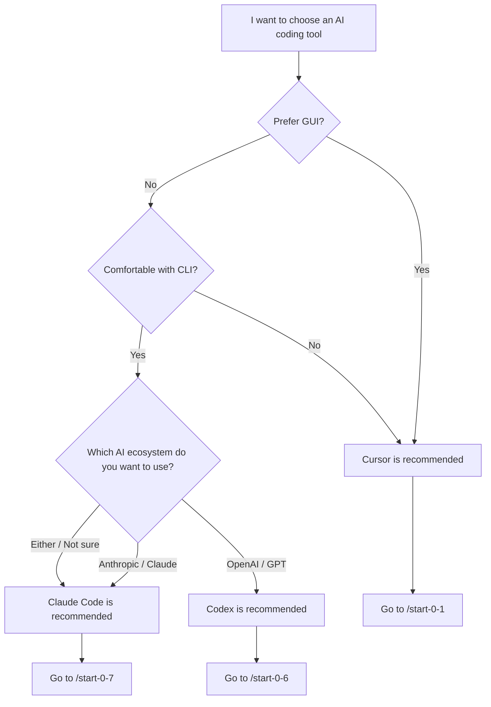

# Lesson 0-8: Tool Selection Guide

## Check Setup Progress

**Auto-run by AI:** Run `uv run python tools/setup_progress.py show` to display the current setup progress.

---

## What You'll Do

| Item | Details |
|------|---------|
| Goal | Understand the features of Cursor / Claude Code / Codex and choose the tool that suits you best |
| Duration | ~10 min |
| Prerequisites | None (can be taken first) |
| Course Page | (This lesson has no prerequisites. Setup is covered in each tool's dedicated lesson.) |

> **Hint**: Whichever tool you choose, you can take all lessons in this course. If unsure, we recommend starting with Cursor.

---

## Decision Flowchart

Use the following flowchart to find the tool that suits you.



---

## Tool Comparison Table

| Item | Cursor | Claude Code | Codex |
|------|--------|------------|-------|
| Interface | GUI (VS Code based) | CLI | CLI |
| AI Model | Claude / GPT / Gemini | Claude | GPT |
| Pricing | Pro $20/mo, Pro+ $60/mo, Ultra $200/mo | Pro $20/mo, Max $100/mo or API pay-per-use | Pro $10/mo, Pro+ $39/mo, Business $19/user/mo |
| Learning Curve | Low (VS Code based) | Moderate | Moderate |
| Strengths | Visual, rich extensions | Context understanding, autonomous execution | Sandbox, safety |
| Course Compatibility | ★★★ Smoothest | ★★★ Full support | ★★☆ Via skills |

> * Pricing is subject to change. Check each official site for the latest information.

---

## Recommendations by Use Case

### Beginners and Non-Engineers

We recommend **Cursor**.

- Operate with the familiar VS Code-based GUI
- File tree and editor are visually intuitive
- Rich extension ecosystem makes it easy to add features
- This course's commands (`/start-X-X`) work directly

### Frequent Terminal Users

We recommend **Claude Code**.

- Give instructions to AI directly from the terminal
- Automatically understands the entire project context
- Autonomously reads/writes files and executes commands
- Define project rules with CLAUDE.md

### Security-Focused Users

We recommend **Codex**.

- Run code safely in a sandbox environment
- Can operate with restricted network access
- Leverage OpenAI's security infrastructure

### Using Multiple Tools

You can also use multiple tools together. For example:

- **Cursor + Claude Code**: Verify visually in GUI while running autonomously via CLI
- **Cursor + Codex**: Primarily GUI, using Codex when safe execution is needed

---

## Path to Each Tool's Setup

**AskQuestion settings:**
```json
{
  "title": "Choose a tool and proceed to setup",
  "questions": [{
    "id": "tool_choice",
    "prompt": "Which tool would you like to start the course with?",
    "options": [
      {"id": "cursor", "label": "Cursor (GUI, recommended for beginners) -> /start-0-1"},
      {"id": "claude_code", "label": "Claude Code (CLI, autonomous execution) -> /start-0-7"},
      {"id": "codex", "label": "Codex (CLI, sandbox) -> /start-0-6"},
      {"id": "more_info", "label": "I'd like to learn more"}
    ]
  }]
}
```

(cursor -> Guide to /start-0-1)
(claude_code -> Guide to /start-0-7)
(codex -> Guide to /start-0-6)
(more_info -> Re-display the comparison table and use cases above)

---

## Commands to Run

```text
/start-0-8
```

This lesson is a tool selection guide. Present options with the following AskQuestion and guide to the appropriate setup lesson based on the response.

**AskQuestion settings:**
```json
{
  "title": "Start the Tool Selection Guide",
  "questions": [{
    "id": "start_action",
    "prompt": "Let's start the tool selection guide. What would you like to do?",
    "options": [
      {"id": "compare", "label": "Compare the three tools"},
      {"id": "flowchart", "label": "Diagnose with the flowchart"},
      {"id": "already_decided", "label": "I've already decided which tool to use"}
    ]
  }]
}
```

(compare -> Display tool comparison table and use cases)
(flowchart -> Display the decision flowchart)
(already_decided -> Go to the setup path section)

---

## Expected Output Example

```text
Tool Selection Guide

Recommendation based on your answers:
  -> Cursor (GUI, recommended for beginners)

Next step: Run /start-0-1 to begin setup
```

---

## Common Troubleshooting

- Don't know which tool to choose -> Follow the flowchart or choose Cursor if unsure
- Want to switch tools later -> You can run a different setup lesson (/start-0-1, /start-0-7, /start-0-6) at any time
- AI response stops -> Type "please continue"

---

## Checkpoint

- [ ] Understand the differences between the three tools (Cursor / Claude Code / Codex)
- [ ] Chose the tool that suits you
- [ ] Ready to proceed to the setup lesson for the chosen tool

---

## Next Steps

**AskQuestion settings:**
```json
{
  "title": "Choose Next Step",
  "questions": [{
    "id": "next_step",
    "prompt": "You've reviewed the tool selection guide. What would you like to do next?",
    "options": [
      {"id": "cursor_setup", "label": "Start Cursor setup (/start-0-1)"},
      {"id": "claude_setup", "label": "Start Claude Code setup (/start-0-7)"},
      {"id": "codex_setup", "label": "Start Codex setup (/start-0-6)"},
      {"id": "overview", "label": "Review the full course (/overview)"},
      {"id": "finish", "label": "Finish here"}
    ]
  }]
}
```

(cursor_setup -> Guide to /start-0-1)
(claude_setup -> Guide to /start-0-7)
(codex_setup -> Guide to /start-0-6)
(overview -> Guide to /overview)
(finish -> Display "Great work! You can start a setup lesson anytime")
