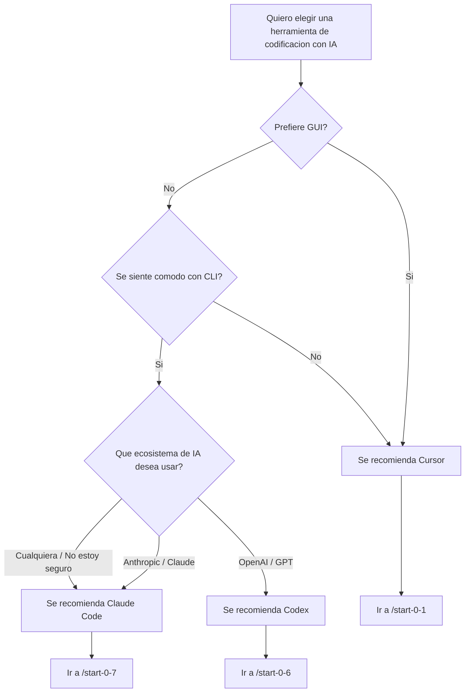

# Lección 0-8: Guía de selección de herramientas

## Verificar progreso de configuración

**Ejecución automática por IA:** Ejecute `uv run python tools/setup_progress.py show` para mostrar el progreso actual de la configuración.

---

## Lo que hará en esta sesión

| Elemento | Contenido |
|----------|-----------|
| Objetivo | Comprender las características de Cursor / Claude Code / Codex y elegir la herramienta que mejor se adapte a usted |
| Duración | ~10 min |
| Requisitos previos | Ninguno (puede tomarse primero) |
| Página del curso | (Esta lección no tiene requisitos previos. La configuración se cubre en la lección dedicada de cada herramienta.) |

> **Consejo**: Cualquiera que sea la herramienta que elija, puede tomar todas las lecciones de este curso. Si no está seguro, recomendamos comenzar con Cursor.

---

## Diagrama de flujo de decisión

Use el siguiente diagrama de flujo para encontrar la herramienta que se adapte a usted.



---

## Tabla comparativa de herramientas

| Elemento | Cursor | Claude Code | Codex |
|----------|--------|------------|-------|
| Interfaz | GUI (basado en VS Code) | CLI | CLI |
| Modelo de IA | Claude / GPT / Gemini | Claude | GPT |
| Precios | Pro $20/mes, Pro+ $60/mes, Ultra $200/mes | Pro $20/mes, Max $100/mes o API pago por uso | Pro $10/mes, Pro+ $39/mes, Business $19/usuario/mes |
| Curva de aprendizaje | Baja (basado en VS Code) | Moderada | Moderada |
| Fortalezas | Visual, extensiones ricas | Comprensión de contexto, ejecución autónoma | Sandbox, seguridad |
| Compatibilidad con el curso | ★★★ Más fluido | ★★★ Soporte completo | ★★☆ Via skills |

> * Los precios están sujetos a cambios. Consulte cada sitio oficial para la información más reciente.

---

## Recomendaciones por caso de uso

### Principiantes y no ingenieros

Recomendamos **Cursor**.

- Opere con la familiar interfaz GUI basada en VS Code
- El arbol de archivos y el editor son visualmente intuitivos
- El rico ecosistema de extensiones facilita agregar funciones
- Los comandos de este curso (`/start-X-X`) funcionan directamente

### Usuarios frecuentes de terminal

Recomendamos **Claude Code**.

- De instrucciones a la IA directamente desde la terminal
- Comprende automáticamente todo el contexto del proyecto
- Lee/escribe archivos y ejecuta comandos de forma autónoma
- Defina reglas del proyecto con CLAUDE.md

### Usuarios enfocados en seguridad

Recomendamos **Codex**.

- Ejecute código de forma segura en un entorno sandbox
- Puede operar con acceso de red restringido
- Aproveche la infraestructura de seguridad de OpenAI

### Uso de multiples herramientas

También puede usar multiples herramientas juntas. Por ejemplo:

- **Cursor + Claude Code**: Verificar visualmente en GUI mientras ejecuta de forma autónoma via CLI
- **Cursor + Codex**: Principalmente GUI, usando Codex cuando se necesita ejecución segura

---

## Ruta a la configuración de cada herramienta

**Configuración de AskQuestion:**
```json
{
  "title": "Elija una herramienta y proceda a la configuracion",
  "questions": [{
    "id": "tool_choice",
    "prompt": "Con que herramienta desea comenzar el curso?",
    "options": [
      {"id": "cursor", "label": "Cursor (GUI, recomendado para principiantes) -> /start-0-1"},
      {"id": "claude_code", "label": "Claude Code (CLI, ejecucion autonoma) -> /start-0-7"},
      {"id": "codex", "label": "Codex (CLI, sandbox) -> /start-0-6"},
      {"id": "more_info", "label": "Me gustaria saber mas"}
    ]
  }]
}
```

(cursor -> Guiar a /start-0-1)
(claude_code -> Guiar a /start-0-7)
(codex -> Guiar a /start-0-6)
(more_info -> Volver a mostrar la tabla comparativa y los casos de uso anteriores)

---

## Comandos a ejecutar

```text
/start-0-8
```

Esta lección es una guía de selección de herramientas. Presente opciones con el siguiente AskQuestion y guie a la lección de configuración apropiada según la respuesta.

**Configuración de AskQuestion:**
```json
{
  "title": "Iniciar la guia de seleccion de herramientas",
  "questions": [{
    "id": "start_action",
    "prompt": "Comencemos la guia de seleccion de herramientas. Que desea hacer?",
    "options": [
      {"id": "compare", "label": "Comparar las tres herramientas"},
      {"id": "flowchart", "label": "Diagnosticar con el diagrama de flujo"},
      {"id": "already_decided", "label": "Ya decidi que herramienta usar"}
    ]
  }]
}
```

(compare -> Mostrar tabla comparativa de herramientas y casos de uso)
(flowchart -> Mostrar el diagrama de flujo de decisión)
(already_decided -> Ir a la sección de ruta de configuración)

---

## Ejemplo de salida esperada

```text
Guia de seleccion de herramientas

Recomendacion basada en sus respuestas:
  -> Cursor (GUI, recomendado para principiantes)

Siguiente paso: Ejecute /start-0-1 para comenzar la configuracion
```

---

## Solución de problemas comunes

- No sabe que herramienta elegir -> Siga el diagrama de flujo o elija Cursor si no está seguro
- Quiere cambiar de herramienta después -> Puede ejecutar una lección de configuración diferente (/start-0-1, /start-0-7, /start-0-6) en cualquier momento
- La respuesta de la IA se detiene -> Escriba "por favor continua"

---

## Punto de verificación

- [ ] Comprende las diferencias entre las tres herramientas (Cursor / Claude Code / Codex)
- [ ] Eligio la herramienta que se adapta a usted
- [ ] Está listo para avanzar a la lección de configuración de la herramienta elegida

---

## Siguientes pasos

**Configuración de AskQuestion:**
```json
{
  "title": "Elegir siguiente paso",
  "questions": [{
    "id": "next_step",
    "prompt": "Ha revisado la guia de seleccion de herramientas. Que desea hacer a continuacion?",
    "options": [
      {"id": "cursor_setup", "label": "Comenzar configuracion de Cursor (/start-0-1)"},
      {"id": "claude_setup", "label": "Comenzar configuracion de Claude Code (/start-0-7)"},
      {"id": "codex_setup", "label": "Comenzar configuracion de Codex (/start-0-6)"},
      {"id": "overview", "label": "Revisar el curso completo (/overview)"},
      {"id": "finish", "label": "Terminar aqui"}
    ]
  }]
}
```

(cursor_setup -> Guiar a /start-0-1)
(claude_setup -> Guiar a /start-0-7)
(codex_setup -> Guiar a /start-0-6)
(overview -> Guiar a /overview)
(finish -> Mostrar "Excelente trabajo! Puede comenzar una lección de configuración en cualquier momento")
