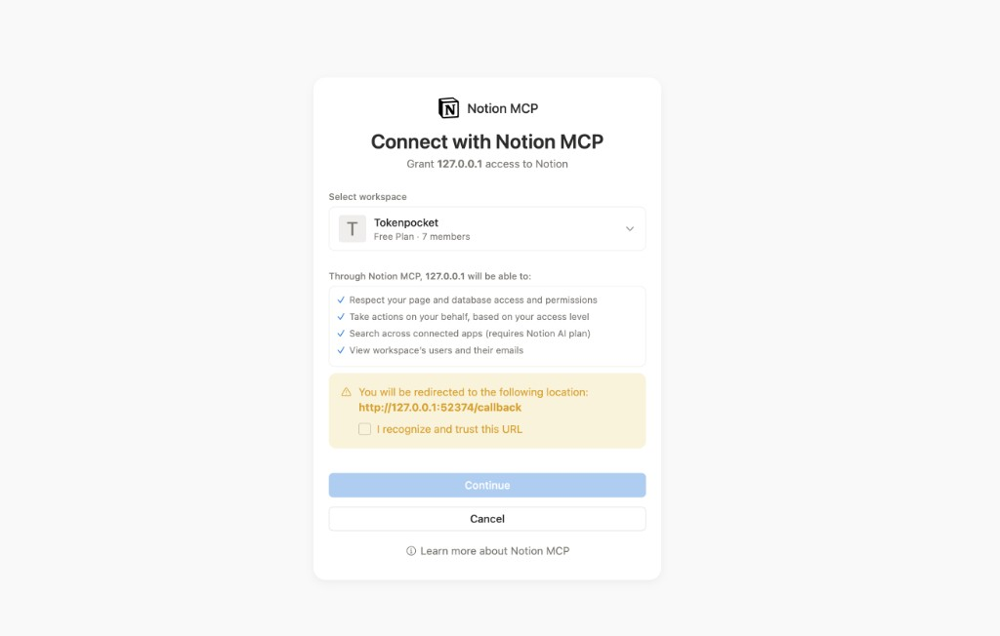

# 🎓 Lesson 12-3: Notion MCP接続とセットアップ

## 📍 このセッションでやること

**Lesson 12-3** へようこそ！

| 項目 | 内容 |
|------|------|
| ゴール | MCP/Notion APIでClaude CodeからNotionのページ・データベースを操作する |
| 所要時間 | 約30分 |
| 使うスキル | Notion API, MCP（Model Context Protocol） |
| 前提条件 | Notion アカウント、インテグレーション作成権限 |
| 教材ページ | [Module 12: Notion](https://ai-agent.camp/ja/course/module-12) を並行参照 |

**このセッションの流れ:**
1. Notionインテグレーション作成
2. APIキーとデータベースIDの取得
3. ページ・データベースの読み書き

セッション終了時には、Claude CodeからNotionを操作できるようになっています。

> **💡 ヒント**: AIの応答が途中で止まった場合は「続きを表示して」「止まってるよ」と入力すると再開します。これはCursorの仕様で、故障ではありません。

---

## レッスン開始時のブラウザ認証（Notion MCP）

`/start-12-3` を進めると、Notion 側の **「Connect with Notion MCP」** 画面がブラウザに開くことがあります。ローカルで動く MCP が `127.0.0.1` のコールバック URL でトークンを受け取る方式のときに表示されます。

**画面の操作ポイント:**

1. **タイトル**: 「Connect with Notion MCP」「Grant 127.0.0.1 access to Notion」のように、ローカルアプリへの接続であることが書かれます。
2. **Select workspace**: 接続するワークスペースをプルダウンで選びます。
3. **権限の説明**: ページ・データベースのアクセス尊重、あなたの権限に基づく操作、検索（プランによる）、ユーザー情報の表示などが列挙されます。
4. **黄色の注意枠**: リダイレクト先として **`http://127.0.0.1:<ポート>/callback`** のような URL が表示されます。**ポート番号は起動のたびに変わる**ことがあります。
5. **「I recognize and trust this URL。」**: このチェックを**入れないと** **Continue** が有効にならない／進めないことがあります。内容がローカルのコールバックであることを確認してからチェックします。
6. **Continue** で認証を完了し、エディタや MCP クライアント側に戻ります。

参考画面:



> **注意**: UI の文言や項目は Notion 側のアップデートで変わることがあります。表示内容が大きく異なる場合は、公式ヘルプやクラス最新手順を確認してください。

---

## 🎯 準備チェック

まずは準備が整っているか確認しましょう。

**AskQuestionの設定:**
```json
{
  "title": "🎯 セッション開始前の確認",
  "questions": [{
    "id": "readiness",
    "prompt": "準備はできていますか？",
    "options": [
      {"id": "ready", "label": "準備OK！始めましょう"},
      {"id": "check_prereq", "label": "前提条件を確認したい"},
      {"id": "view_html", "label": "先に教材ページを見たい"},
      {"id": "different_lesson", "label": "別のレッスンに移動したい"}
    ]
  }]
}
```

(ready → Step 1へ)
(check_prereq → 前提条件の確認を実行)
(view_html → 教材ページのパスを案内)
(different_lesson → モジュール一覧を表示)

---

## 🚀 Step 1: Notionインテグレーション作成

**前提条件:** Notion MCP サーバーが設定済みである必要があります。
未設定の場合は `/setup-notion` を先に実行してください。

**AIが自動で確認すること:**
1. MCP設定ファイルに `notion` サーバーが定義されているか確認:
   - Claude Code: `~/.claude/mcp_settings.json` を読み取り、`mcpServers.notion` の存在を確認
   - Cursor: `.cursor/mcp.json` を読み取り、`mcpServers.notion` の存在を確認
2. 設定済みの場合 → Step 2（MCP設定ファイル作成）へ進む
3. 未設定の場合 → `/setup-notion` の実行を案内

**AskQuestionの設定例:**
```json
{
  "title": "🚀 Step 1: Notionインテグレーション確認",
  "questions": [{
    "id": "step_action",
    "prompt": "NOTION_API_KEY の設定状況を確認します。",
    "options": [
      {"id": "check", "label": "設定状況を確認する"},
      {"id": "setup_notion", "label": "/setup-notion でセットアップする"},
      {"id": "skip", "label": "スキップする（設定済みの場合）"}
    ]
  }]
}
```

(check → MCP設定ファイルで notion エントリを確認。設定済みなら Step 2 へ)
(setup_notion → /setup-notion を案内)
(skip → Step 2 へ)

---

## 🚀 Step 2: MCP設定ファイル作成

AskUserQuestion（AskQuestion）で「このまま進める / 例だけ確認 / スキップ」を選べます。

**AskQuestionの設定例:**
```json
{
  "title": "🚀 Step 2: MCP設定ファイル作成",
  "questions": [{
    "id": "step_action",
    "prompt": "このステップをどうしますか？",
    "options": [
      {"id": "practice", "label": "このまま進める"},
      {"id": "review", "label": "例だけ確認する"},
      {"id": "skip", "label": "スキップする"}
    ]
  }]
}
```

**選択後の案内（例）**:
入力内容:
```
Claude Code用のMCP設定ファイルを作成してください。

ファイル: ~/.claude/mcp_settings.json

内容（NOTION_API_KEYは実際のトークンに置き換え）:
{
  "mcpServers": {
    "notion": {
      "command": "npx",
      "args": [
        "-y",
        "@notionhq/notion-mcp-server"
      ],
      "env": {
        "NOTION_API_KEY": "secret_your_token_here"
      }
    }
  }
}

ファイルを作成してください。
```

**期待される結果**: MCP設定ファイルが作成されます。実際のトークンは手動で置き換えてください。

---

## 🚀 Step 3: ワークスペースへのアクセス許可

ブラウザで **Connect with Notion MCP** が表示された場合は、このドキュメント冒頭の **「レッスン開始時のブラウザ認証（Notion MCP）」** に従い、リダイレクト URL の説明と **「I recognize and trust this URL。」** のチェックを済ませてから **Continue** してください。

AskUserQuestion（AskQuestion）で「このまま進める / 例だけ確認 / スキップ」を選べます。

**AskQuestionの設定例:**
```json
{
  "title": "🚀 Step 3: ワークスペースへのアクセス許可",
  "questions": [{
    "id": "step_action",
    "prompt": "このステップをどうしますか？",
    "options": [
      {"id": "practice", "label": "このまま進める"},
      {"id": "review", "label": "例だけ確認する"},
      {"id": "skip", "label": "スキップする"}
    ]
  }]
}
```

**選択後の案内（例）**:
入力内容:
```
Notionでインテグレーションにアクセス許可を与える方法を教えてください。

手順:
1. Notionでページを開く
2. 右上「...」メニュー > Connections
3. 作成したインテグレーション「Claude MCP Integration」を追加

注意: インテグレーションを追加したページ配下のみアクセス可能になります。
```

**期待される結果**: Notionページへのアクセス許可設定の手順が説明されます。

---

## 🚀 Step 4: 接続テスト

AskUserQuestion（AskQuestion）で「このまま進める / 例だけ確認 / スキップ」を選べます。

**AskQuestionの設定例:**
```json
{
  "title": "🚀 Step 4: 接続テスト",
  "questions": [{
    "id": "step_action",
    "prompt": "このステップをどうしますか？",
    "options": [
      {"id": "practice", "label": "このまま進める"},
      {"id": "review", "label": "例だけ確認する"},
      {"id": "skip", "label": "スキップする"}
    ]
  }]
}
```

**選択後の案内（例）**:
入力内容:
```
Notion MCPの接続テストを行います。

以下のことを確認してください：
1. MCP設定ファイル（~/.claude/mcp_settings.json）が存在するか
2. NOTION_API_KEYが設定されているか
3. Claude Codeを再起動してMCPが読み込まれるか

接続テストとして、Notionに接続してアクセス可能なページを一覧表示してください。
```

**期待される結果**: MCPが正しく設定されていれば、Notionページの一覧が表示されます。

---

## 🚀 Step 5: 基本操作テスト

AskUserQuestion（AskQuestion）で「このまま進める / 例だけ確認 / スキップ」を選べます。

**AskQuestionの設定例:**
```json
{
  "title": "🚀 Step 5: 基本操作テスト",
  "questions": [{
    "id": "step_action",
    "prompt": "このステップをどうしますか？",
    "options": [
      {"id": "practice", "label": "このまま進める"},
      {"id": "review", "label": "例だけ確認する"},
      {"id": "skip", "label": "スキップする"}
    ]
  }]
}
```

**選択後の案内（例）**:
入力内容:
```
Notionで以下の操作をテストしてください：

1. ページ作成テスト:
   - 「MCP接続テスト」という名前のページを作成
   - 内容に「Claude CodeからのMCP接続テスト成功！」と記載
   - 現在時刻も追記

2. ページ読み取りテスト:
   - 作成したページの内容を読み取って表示

3. ページ更新テスト:
   - ページに「更新日時: [現在時刻]」を追記

それぞれの操作結果を報告してください。
```

**期待される結果**: Notionページの作成、読み取り、更新がClaude Codeから実行できます。

---

## ⚠️ よくあるトラブルと解決方法

AskUserQuestion（AskQuestion）でトラブル内容を選んでもらい、押すだけで案内します。

**AskQuestionの設定例:**
```json
{
  "title": "トラブル内容を選択",
  "questions": [{
    "id": "trouble",
    "prompt": "当てはまる内容を1つ選んでください",
    "options": [
      {"id": "trouble_1", "label": "Could not connect to Notion"},
      {"id": "trouble_2", "label": "Insufficient permissions"},
      {"id": "trouble_3", "label": "MCPサーバーが起動しない"},
      {"id": "trouble_4", "label": "ページが見つからない"}
    ]
  }]
}
```


### トラブル1: 「Could not connect to Notion」
**原因**: APIキーが間違っている、またはMCP設定ファイルのパスが違う
**解決プロンプト**:
```
以下を確認してください：
1. ~/.claude/mcp_settings.json のパスが正しいか
2. NOTION_API_KEY の値が「secret_」で始まっているか
3. JSONの構文が正しいか（カンマ、括弧など）
```

### トラブル2: 「Insufficient permissions」
**原因**: インテグレーションがページに追加されていない
**解決プロンプト**:
```
Notionで対象ページを開き、右上「...」> Connections から
「Claude MCP Integration」が追加されているか確認してください。
親ページにインテグレーションを追加すると、子ページにもアクセスできます。
```

### トラブル3: MCPサーバーが起動しない
**原因**: Node.jsのバージョンが古い、またはnpxが使えない
**解決プロンプト**:
```
以下を確認してください：
1. node --version で v18以上か確認
2. npx --version でnpxが使えるか確認
3. npm install -g npx でnpxをインストール
```

### トラブル4: ページが見つからない
**原因**: インテグレーションにアクセス権限がない
**解決プロンプト**:
```
Notionワークスペースで、アクセスしたいページまたは親ページに
インテグレーションを追加してください。
ワークスペース全体にアクセスさせる場合は、トップレベルのページに追加します。
```

---

## ✅ チェックポイント
- [ ] Notionインテグレーションが作成されている
- [ ] シークレットトークンを取得している
- [ ] MCP設定ファイルが作成されている
- [ ] Notionページにインテグレーションが追加されている
- [ ] ページの作成・読み取り・更新ができる

---

## ✅ 完了チェック
以下をCursorのチャットに貼り付けて、完了状況を確認してください:

```
# 完了確認: output/ フォルダに期待される出力ファイルが生成されているか確認してください。
```

**期待される結果**: 完了/未完の判定と不足項目が表示されます。

---

## ➡️ 次のステップ

これでこのセクションは完了です。次のセクションを始めるか、新しいウィンドウを開いて、新しいセクションを開始してください。

AskUserQuestion（AskQuestion）で選べます。

**AskQuestionの設定例:**
```json
{
  "title": "次のステップを選択",
  "questions": [{
    "id": "next_step",
    "prompt": "次に進む操作を選んでください",
    "options": [
      {"id": "next_auto", "label": "次のセクションを開始（/next_lesson）"},
      {"id": "next_window", "label": "新しいウィンドウで開始（/start-12-4）"},
      {"id": "finish", "label": "ここで終了する"}
    ]
  }]
}
```

**選択後の案内（例）**:
- next_auto → /next_lesson
- next_window → 新しいウィンドウで /start-12-4
- finish → 終了
