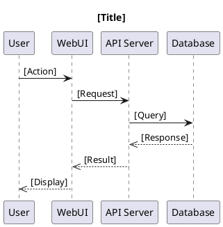
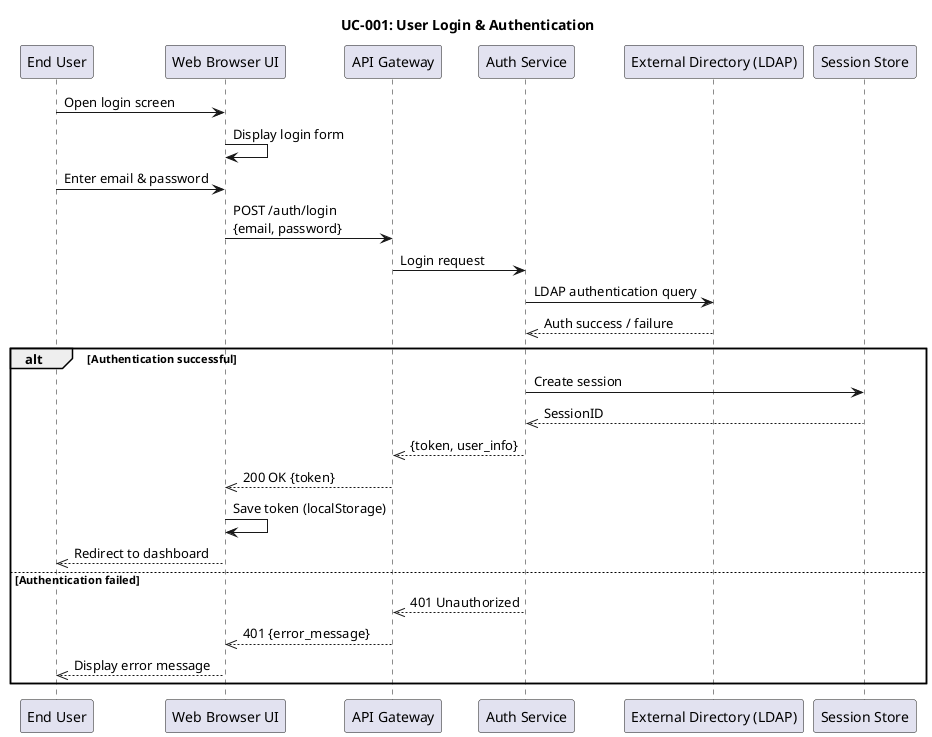
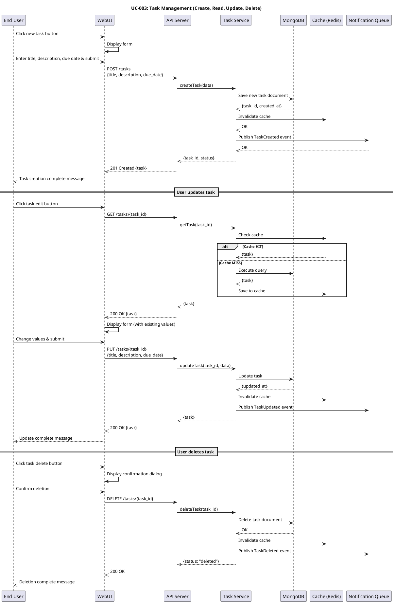
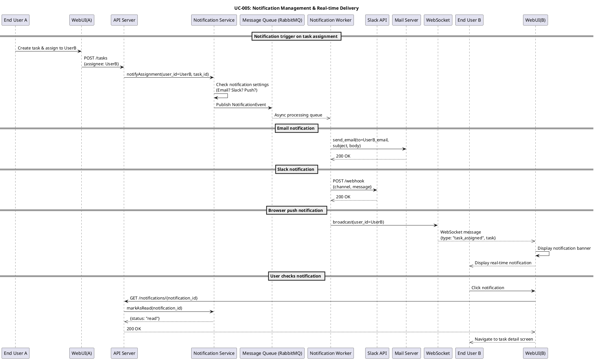

# 🎓 Lesson 18-6: Use Case Description & Sequence Diagrams

| Item | Details |
|------|------|
| Goal | Create TaskFlow use case descriptions and 3-5 PlantUML sequence diagrams |
| Duration | ~30 min |
| Skills Used | pm-toolkit skill, diagram-generator skill |
| Prerequisites | Lesson 18-5 completed、output/pm/requirements-spec.md exists |
| Lesson Page | [Module 18](https://ai-agent.camp/en/course/module-18) |

---

## 📍 Step 1: Actor Definition (Users, Administrators, External Systems)

In this step, define all actors (agents) that interact with the TaskFlow system. Actors are people or external systems outside the system boundary that interact with the system.

### Importance of Actor Definition
- Forms the foundation for creating use cases
- Becomes participants in sequence diagrams
- Helps prioritize requirements

### Question: Let's define TaskFlow's actors

```json
{
  "question": "Let's define the actors for TaskFlow",
  "type": "single_choice",
  "options": [
    {
      "label": "Basic 3 actors (User/Admin/System)",
      "value": "basic_actors"
    },
    {
      "label": "Custom definition",
      "value": "custom_actors"
    },
    {
      "label": "Get AI suggestions",
      "value": "ai_suggest"
    }
  ]
}
```

### Expected Output

Basic 3 actors (recommended):
- **End User**: An individual who manages tasks using the TaskFlow platform
- **System Administrator**: Manages users, permissions, and system settings
- **External Systems**: User directory (LDAP/AD), email, Slack integration

---

## 📍 Step 2: Main Use Case Description (Main Flow, Alternative Flow, Exception Flow)

Use case descriptions express specific goals that actors and the system achieve. Each use case is described in the following structure:

### Use Case Description Template

```text
# Use Case: [UC Name]

| Attribute | Content |
|------|------|
| UC ID | UC-[Number] |
| Name | [Concise name] |
| Description | [1-2 sentence description] |
| Actors | [Primary actor, related actors] |
| Preconditions | [Conditions that must be met before starting] |
| Postconditions | [State when use case succeeds] |

## Main Flow

1. [First step]
2. [Next step]
3. ...

## Alternative Flow

### A1: [Alternative flow name]
1. [Alternative step]
2. ...

## Exception Flow

### E1: [Exception flow name]
1. [Condition that triggers exception]
2. [System response]
```

### Question: Which use case will you describe first?

```json
{
  "question": "Which use case will you describe first?",
  "type": "single_choice",
  "options": [
    {
      "label": "Login/Authentication",
      "value": "login_auth"
    },
    {
      "label": "Task CRUD",
      "value": "task_crud"
    },
    {
      "label": "Dashboard Display",
      "value": "dashboard"
    },
    {
      "label": "Notification Management",
      "value": "notification"
    },
    {
      "label": "Let AI handle all",
      "value": "all_ai"
    }
  ]
}
```

### Use Case Creation Guidelines

Each use case must include the following elements:

**Main Flow**: The basic flow when the system operates normally
- Each step must be clear and actionable
- Explicitly show interactions between the system and actors

**Alternative Flow**: When different decisions or options exist during the main flow
- Example: "When logged in," "When not logged in"

**Exception Flow**: When errors or system failures occur
- Example: "Authentication failure," "Timeout," "Network error"

**Preconditions**: States that must be met when the use case begins
- Example: "The user can access the system"

**Postconditions**: The state of the system after the use case is completed
- Example: "The new task is saved in the database"

---

## 📍 Step 3: Generating PlantUML Sequence Diagrams (Authentication, Task CRUD, Notifications - 3 diagrams)

Sequence diagrams visualize the timeline of message exchanges between actors. Make them cross-referenceable with use case descriptions.

### PlantUML Sequence Diagram Basic Syntax



### Question: How will you create the sequence diagrams?

```json
{
  "question": "How will you create the sequence diagrams?",
  "type": "single_choice",
  "options": [
    {
      "label": "One at a time interactively",
      "value": "interactive"
    },
    {
      "label": "Generate all 3 with AI",
      "value": "ai_batch"
    },
    {
      "label": "Modify from template",
      "value": "template"
    }
  ]
}
```

### Sequence Diagrams to Generate

#### 1. sequence-auth.puml - User Authentication Flow



#### 2. sequence-task-crud.puml - Task Create/Update/Delete Flow



#### 3. sequence-notification.puml - Notification Management Flow



---

## 📍 Step 4: Use Case and Sequence Diagram Consistency Review

Ensuring consistency between use case descriptions and sequence diagrams is a critical process for guaranteeing system design quality.

### Review Checklist

- **Coverage**: Are all major use cases covered?
- **Completeness**: Are all steps in each sequence diagram described in the use case?
- **Consistency**: Are actor names and terminology used consistently?
- **Alignment**: Does the sequence diagram flow match the use case's main/alternative/exception flows?
- **Feasibility**: Is the described sequence implementable?

### Question: Select a review method

```json
{
  "question": "Select the review method",
  "type": "single_choice",
  "options": [
    {
      "label": "AI auto-review",
      "value": "auto_review"
    },
    {
      "label": "Interactive review",
      "value": "interactive_review"
    },
    {
      "label": "Verify with checklist",
      "value": "checklist_review"
    }
  ]
}
```

### Consistency Review Methods

**Automatic review**: AI automatically compares generated use case descriptions and sequence diagrams to detect inconsistencies

**Interactive review**: Review proceeds by comparing use cases and sequence diagrams while answering questions

**Checklist review**: Manually conduct the review following the provided checklist

---

## ✅ Deliverables

The following 4 files need to be generated in the `output/pm/` directory:

### 1. output/pm/usecases.md

Use case definition document:
- Use case diagram (text or visualization)
- Use case list (table format)
- Detailed description of each use case (UC-001 through UC-005 or more)
  - Use case ID, name, description
  - Actors, preconditions, postconditions
  - Main flow, alternative flow, exception flow

### 2. output/pm/sequence-auth.puml

User authentication flow:
- UC-001: Login & Authentication
- PlantUML @startuml ... @enduml format
- Includes end user, UI, API, authentication service, external directory
- Includes success flow and failure flow (exception handling)

### 3. output/pm/sequence-task-crud.puml

Task management (CRUD) flow:
- UC-003: Task create, read, update, delete
- PlantUML @startuml ... @enduml format
- Includes user, UI, API server, database, cache
- Includes Create, Read, Update, Delete flows

### 4. output/pm/sequence-notification.puml

Notification management flow:
- UC-005: Notification management & real-time delivery
- PlantUML @startuml ... @enduml format
- Includes user, UI, notification service, email, Slack, WebSocket, message queue
- Includes email, Slack, browser push notification channels

---

## ⚠️ Troubleshooting

### Common Problems and Solutions

#### Problem: Do not know how to write use cases

**Solution**:
- Refer to the template section
- The main flow should be described in approximately 5-10 steps
- Each step is an action performed by either an actor or the system
- Refer to PM skill documentation: `skills/pm-toolkit/docs/`

#### Problem: PlantUML syntax error

**Solution**:
- PlantUML is case-sensitive
- Use correct syntax such as `participant`, `->`, `-->>`, etc.
- Use `'` for comment lines: `' This is a comment`
- Refer to [PlantUML official documentation](http://plantuml.com/sequence-diagram)

#### Problem: Flow is too complex

**Solution**:
- Limit each sequence diagram to 5-8 participants
- Split complex flows into multiple smaller sequence diagrams
- Use `ref` frames (sub-flow references) to reference other diagrams

#### Problem: No requirements specification

**Solution**:
- Generate `output/pm/requirements-spec.md` in Lesson 18-5
- This lesson is based on that file
- Check the prerequisites

---

## ✅ Checkpoint

To complete this lesson, verify all of the following:

- [ ] **Actor definition**: At least 3 types of actors (user, administrator, external system) are defined
- [ ] **Number of use cases**: 5 or more use cases are described (login, task create/update/delete, dashboard, notifications, etc.)
- [ ] **Sequence diagrams**: At least 3 PlantUML sequence diagrams are generated
- [ ] **PlantUML syntax**: All sequence diagrams use correct PlantUML syntax
- [ ] **Document generation**: `output/pm/usecases.md` is generated
- [ ] **Consistency**: Use case descriptions and sequence diagrams are consistent


---

## 📋 Deliverables Preview

### Expected Output
```text
📁 output/pm/
└── usecases.md  (Use Case Definition)
```

### Verification Commands
```bash
# Check file existence and size
ls -lh output/pm/usecases.md

# Check the beginning (first 30 lines)
head -30 output/pm/usecases.md
```

> 💡 Full text: Run `cat output/pm/usecases.md` to display the full text

---

## ➡️ Next Lesson

Next, proceed to **18-7: Screen Transition Diagram & Wireframes**.

In this lesson:
- Design TaskFlow's user interface screens
- Create a screen transition diagram
- Create wireframes to design the layout of each screen
- Associate screens with use cases

**Skills**: ui-design skill, diagram-generator skill
**Deliverables**: screen-transitions.puml, wireframes.md, wireframe-*.svg

---

## 📝 Supplementary Materials

### Use Case Diagrams and UML Standards
- Actor: Stick figure (human) or box (system)
- Use case: Ellipse
- System boundary: Rectangle frame
- Association: Connected by lines

### PlantUML Symbol Explanation
- `->` : Synchronous message (call)
- `-->` : Message return
- `->>` : Asynchronous message (event)
- `-->>` : Asynchronous message return
- `alt`, `else`, `end` : Conditional branching

### TaskFlow Project Background
TaskFlow is a task and project management platform for distributed teams. It has the following characteristics:
- Real-time collaborative editing
- Multiple notification channel support (email, Slack, push)
- LDAP/Active Directory integration
- High scalability (microservices design)

The use cases and sequence diagrams defined in this lesson serve as specifications for the implementation team during development.
