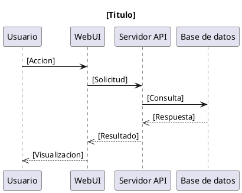
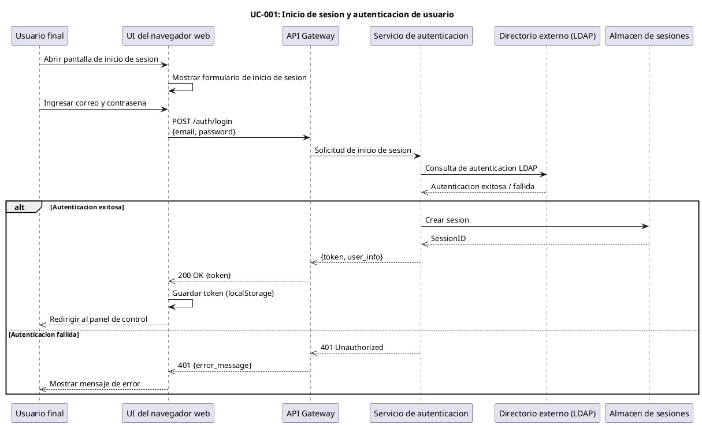
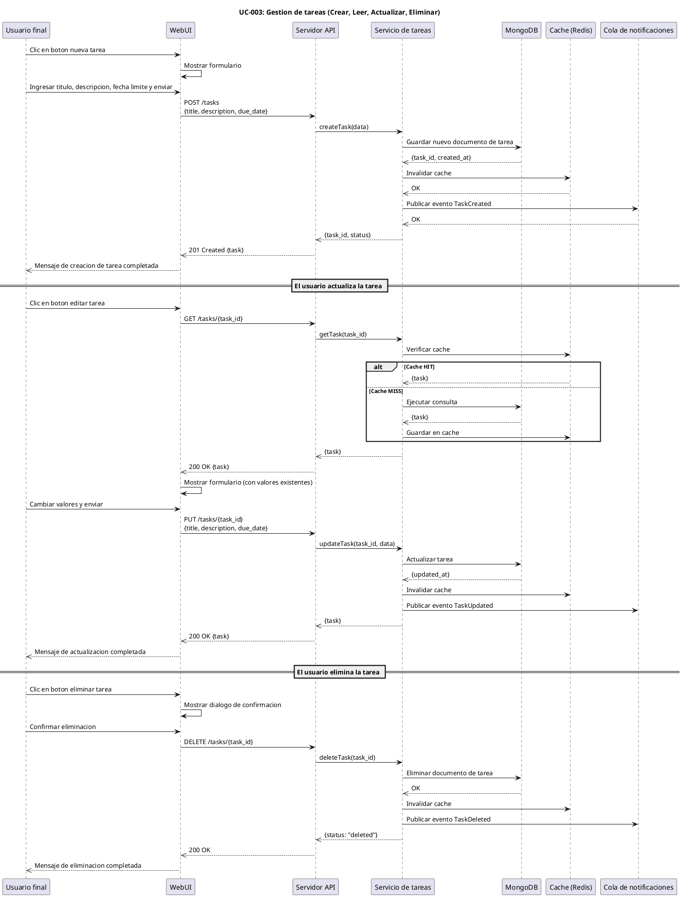
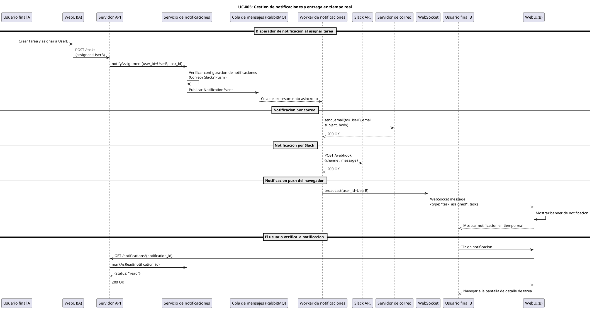

# 🎓 Lesson 18-6: Descripción de casos de uso y diagramas de secuencia

| Elemento | Detalles |
|------|------|
| Objetivo | Crear descripciones de casos de uso de TaskFlow y 3-5 diagramas de secuencia PlantUML |
| Duración | ~30 min |
| Habilidades utilizadas | habilidad pm-toolkit, habilidad diagram-generator |
| Requisitos previos | Lesson 18-5 completada、output/pm/requirements-spec.md existe |
| Página del material | [Module 18](https://ai-agent.camp/es/course/module-18) |

---

## 📍 Paso 1: Definición de actores (usuarios, administradores, sistemas externos)

En este paso, defina todos los actores (agentes) que interactuan con el sistema TaskFlow. Los actores son personas o sistemas externos fuera del límite del sistema que interactuan con el sistema.

### Importancia de la definición de actores
- Constituye la base para la creación de casos de uso
- Se convierten en participantes en los diagramas de secuencia
- Ayuda a priorizar los requisitos

### Pregunta: Definamos los actores de TaskFlow

```json
{
  "question": "Definamos los actores para TaskFlow",
  "type": "single_choice",
  "options": [
    {
      "label": "3 actores basicos (Usuario/Administrador/Sistema)",
      "value": "basic_actors"
    },
    {
      "label": "Definicion personalizada",
      "value": "custom_actors"
    },
    {
      "label": "Obtener sugerencias de IA",
      "value": "ai_suggest"
    }
  ]
}
```

### Salida esperada

3 actores basicos (recomendado):
- **Usuario final**: Una persona que gestiona tareas utilizando la plataforma TaskFlow
- **Administrador del sistema**: Gestiona usuarios, permisos y configuración del sistema
- **Sistemas externos**: Directorio de usuarios (LDAP/AD), correo electrónico, integración con Slack

---

## 📍 Paso 2: Descripción de casos de uso principales (flujo principal, flujo alternativo, flujo de excepción)

Las descripciones de casos de uso expresan objetivos específicos que los actores y el sistema logran. Cada caso de uso se describe con la siguiente estructura:

### Plantilla de descripción de caso de uso

```text
# Caso de uso: [Nombre UC]

| Atributo | Contenido |
|------|------|
| ID UC | UC-[Numero] |
| Nombre | [Nombre conciso] |
| Descripcion | [Descripcion de 1-2 oraciones] |
| Actores | [Actor principal, actores relacionados] |
| Precondiciones | [Condiciones que deben cumplirse antes de comenzar] |
| Postcondiciones | [Estado cuando el caso de uso tiene exito] |

## Flujo principal

1. [Primer paso]
2. [Siguiente paso]
3. ...

## Flujo alternativo

### A1: [Nombre del flujo alternativo]
1. [Paso alternativo]
2. ...

## Flujo de excepcion

### E1: [Nombre del flujo de excepcion]
1. [Condicion que desencadena la excepcion]
2. [Respuesta del sistema]
```

### Pregunta: Cual caso de uso describira primero?

```json
{
  "question": "Que caso de uso describira primero?",
  "type": "single_choice",
  "options": [
    {
      "label": "Inicio de sesion/Autenticacion",
      "value": "login_auth"
    },
    {
      "label": "CRUD de tareas",
      "value": "task_crud"
    },
    {
      "label": "Visualizacion del panel",
      "value": "dashboard"
    },
    {
      "label": "Gestion de notificaciones",
      "value": "notification"
    },
    {
      "label": "Dejar que la IA maneje todo",
      "value": "all_ai"
    }
  ]
}
```

### Directrices para la creación de casos de uso

Cada caso de uso debe incluir los siguientes elementos:

**Flujo principal**: El flujo básico cuando el sistema funciona normalmente
- Cada paso debe ser claro y ejecutable
- Mostrar explícitamente las interacciones entre el sistema y los actores

**Flujo alternativo**: Cuando existen diferentes decisiones u opciones durante el flujo principal
- Ejemplo: "Cuando esta conectado," "Cuando no esta conectado"

**Flujo de excepción**: Cuando ocurren errores o fallas del sistema
- Ejemplo: "Fallo de autenticación," "Tiempo de espera agotado," "Error de red"

**Precondiciones**: Estados que deben cumplirse cuando comienza el caso de uso
- Ejemplo: "El usuario puede acceder al sistema"

**Postcondiciones**: El estado del sistema después de completar el caso de uso
- Ejemplo: "La nueva tarea se ha guardado en la base de datos"

---

## 📍 Paso 3: Generación de diagramas de secuencia PlantUML (autenticación, CRUD de tareas, notificaciones - 3 diagramas)

Los diagramas de secuencia visualizan la línea de tiempo del intercambio de mensajes entre actores. Hagalos referenciables cruzadamente con las descripciones de casos de uso.

### Sintaxis básica del diagrama de secuencia PlantUML



### Pregunta: Como creará los diagramas de secuencia?

```json
{
  "question": "Como creara los diagramas de secuencia?",
  "type": "single_choice",
  "options": [
    {
      "label": "Uno a la vez de forma interactiva",
      "value": "interactive"
    },
    {
      "label": "Generar los 3 con IA",
      "value": "ai_batch"
    },
    {
      "label": "Modificar desde plantilla",
      "value": "template"
    }
  ]
}
```

### Diagramas de secuencia a generar

#### 1. sequence-auth.puml - Flujo de autenticación de usuario



#### 2. sequence-task-crud.puml - Flujo de creación/actualización/eliminación de tareas



#### 3. sequence-notification.puml - Flujo de gestión de notificaciones



---

## 📍 Paso 4: Revisión de consistencia de casos de uso y diagramas de secuencia

Asegurar la consistencia entre las descripciones de casos de uso y los diagramas de secuencia es un proceso crítico para garantizar la calidad del diseño del sistema.

### Lista de verificación de revisión

- **Cobertura**: Estan cubiertos todos los casos de uso principales?
- **Completitud**: Todos los pasos de cada diagrama de secuencia estan descritos en el caso de uso?
- **Consistencia**: Se usan los nombres de actores y la terminología de manera consistente?
- **Alineación**: El flujo del diagrama de secuencia coincide con los flujos principal/alternativo/de excepción del caso de uso?
- **Viabilidad**: Es implementable la secuencia descrita?

### Pregunta: Seleccione un método de revisión

```json
{
  "question": "Seleccione el metodo de revision",
  "type": "single_choice",
  "options": [
    {
      "label": "Revision automatica de IA",
      "value": "auto_review"
    },
    {
      "label": "Revision interactiva",
      "value": "interactive_review"
    },
    {
      "label": "Verificar con lista de verificacion",
      "value": "checklist_review"
    }
  ]
}
```

### Métodos de revisión de consistencia

**Revisión automática**: La IA compara automáticamente las descripciones de casos de uso y los diagramas de secuencia generados para detectar inconsistencias

**Revisión interactiva**: La revisión procede comparando los casos de uso y los diagramas de secuencia mientras responde preguntas

**Revisión por lista de verificación**: Realice la revisión manualmente siguiendo la lista de verificación proporcionada

---

## ✅ Entregables

Los siguientes 4 archivos deben generarse en el directorio `output/pm/`:

### 1. output/pm/usecases.md

Documento de definición de casos de uso:
- Diagrama de casos de uso (texto o visualización)
- Lista de casos de uso (formato de tabla)
- Descripción detallada de cada caso de uso (UC-001 a UC-005 o más)
  - ID de caso de uso, nombre, descripción
  - Actores, precondiciones, postcondiciones
  - Flujo principal, flujo alternativo, flujo de excepción

### 2. output/pm/sequence-auth.puml

Flujo de autenticación de usuario:
- UC-001: Inicio de sesión y autenticación
- Formato PlantUML @startuml ... @enduml
- Incluye usuario final, UI, API, servicio de autenticación, directorio externo
- Incluye flujo de éxito y flujo de fallo (manejo de excepciones)

### 3. output/pm/sequence-task-crud.puml

Flujo de gestión de tareas (CRUD):
- UC-003: Crear, leer, actualizar, eliminar tareas
- Formato PlantUML @startuml ... @enduml
- Incluye usuario, UI, servidor API, base de datos, cache
- Incluye flujos de Crear, Leer, Actualizar, Eliminar

### 4. output/pm/sequence-notification.puml

Flujo de gestión de notificaciones:
- UC-005: Gestión de notificaciones y entrega en tiempo real
- Formato PlantUML @startuml ... @enduml
- Incluye usuario, UI, servicio de notificaciones, correo electrónico, Slack, WebSocket, cola de mensajes
- Incluye canales de notificación por correo electrónico, Slack, push de navegador

---

## ⚠️ Solución de problemas

### Problemas comunes y soluciones

#### Problema: No sabe como escribir casos de uso

**Solución**:
- Consulte la sección de plantillas
- El flujo principal debe describirse en aproximadamente 5-10 pasos
- Cada paso es una acción realizada por un actor o el sistema
- Consulte la documentación de la habilidad PM: `skills/pm-toolkit/docs/`

#### Problema: Error de sintaxis PlantUML

**Solución**:
- PlantUML distingue entre mayúsculas y minúsculas
- Use la sintaxis correcta como `participant`, `->`, `-->>`, etc.
- Use `'` para líneas de comentario: `' Esto es un comentario`
- Consulte la [documentación oficial de PlantUML](http://plantuml.com/sequence-diagram)

#### Problema: El flujo es demasiado complejo

**Solución**:
- Límite cada diagrama de secuencia a 5-8 participantes
- Divida los flujos complejos en multiples diagramas de secuencia más pequeños
- Use marcos `ref` (referencias de sub-flujos) para hacer referencia a otros diagramas

#### Problema: No hay especificación de requisitos

**Solución**:
- Genere `output/pm/requirements-spec.md` en la Lección 18-5
- Esta lección se basa en ese archivo
- Verifique los requisitos previos

---

## ✅ Punto de control

Para completar esta lección, verifique todo lo siguiente:

- [ ] **Definición de actores**: Al menos 3 tipos de actores (usuario, administrador, sistema externo) estan definidos
- [ ] **Número de casos de uso**: Se describen 5 o más casos de uso (inicio de sesión, crear/actualizar/eliminar tareas, panel de control, notificaciones, etc.)
- [ ] **Diagramas de secuencia**: Se han generado al menos 3 diagramas de secuencia PlantUML
- [ ] **Sintaxis PlantUML**: Todos los diagramas de secuencia usan la sintaxis correcta de PlantUML
- [ ] **Generación de documentos**: Se ha generado `output/pm/usecases.md`
- [ ] **Consistencia**: Las descripciones de casos de uso y los diagramas de secuencia son consistentes


---

## 📋 Vista previa de entregables

### Salida esperada
```text
📁 output/pm/
└── usecases.md  (Definicion de casos de uso)
```

### Comandos de verificación
```bash
# Verificar existencia y tamano del archivo
ls -lh output/pm/usecases.md

# Verificar el inicio (primeras 30 lineas)
head -30 output/pm/usecases.md
```

> 💡 Texto completo: Ejecute `cat output/pm/usecases.md` para mostrar el texto completo

---

## ➡️ Siguiente lección

A continuación, proceda a **18-7: Diagrama de transición de pantallas y wireframes**.

En esta lección:
- Diseñe las pantallas de interfaz de usuario de TaskFlow
- Cree un diagrama de transición de pantallas
- Cree wireframes para disenar el diseño de cada pantalla
- Asocie las pantallas con los casos de uso

**Habilidades**: habilidad ui-design, habilidad diagram-generator
**Entregables**: screen-transitions.puml, wireframes.md, wireframe-*.svg

---

## 📝 Materiales complementarios

### Diagramas de casos de uso y estándares UML
- Actor: Figura de palo (humano) o caja (sistema)
- Caso de uso: Elipse
- Límite del sistema: Marco rectangular
- Asociación: Conectados por líneas

### Explicación de símbolos PlantUML
- `->` : Mensaje sincrono (llamada)
- `-->` : Retorno de mensaje
- `->>` : Mensaje asíncrono (evento)
- `-->>` : Retorno de mensaje asíncrono
- `alt`, `else`, `end` : Ramificación condicional

### Contexto del proyecto TaskFlow
TaskFlow es una plataforma de gestión de tareas y proyectos para equipos distribuidos. Tiene las siguientes características:
- Edición colaborativa en tiempo real
- Soporte para multiples canales de notificación (correo electrónico, Slack, push)
- Integración con LDAP/Active Directory
- Alta escalabilidad (diseño de microservicios)

Los casos de uso y diagramas de secuencia definidos en esta lección sirven como especificaciones para el equipo de implementación durante el desarrollo.
