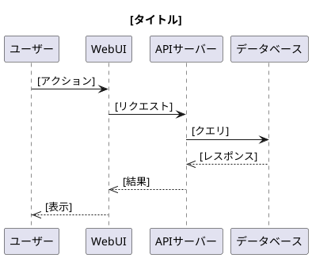
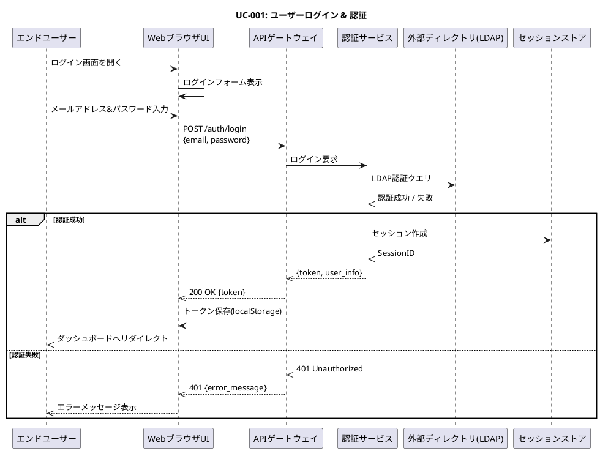
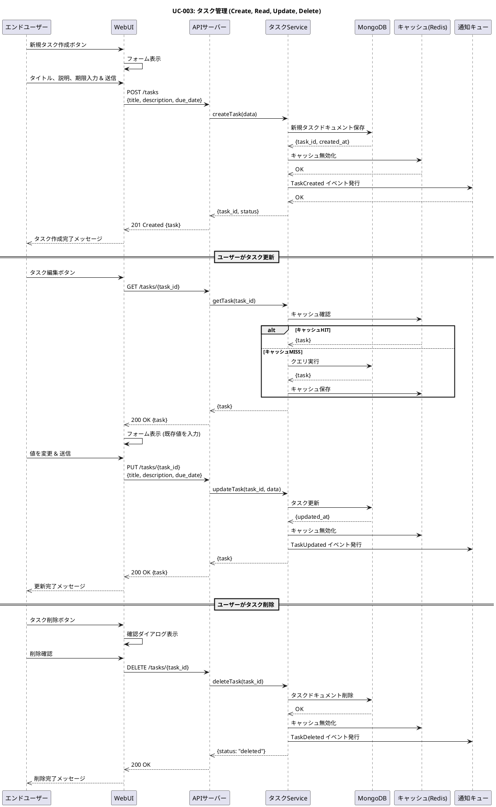
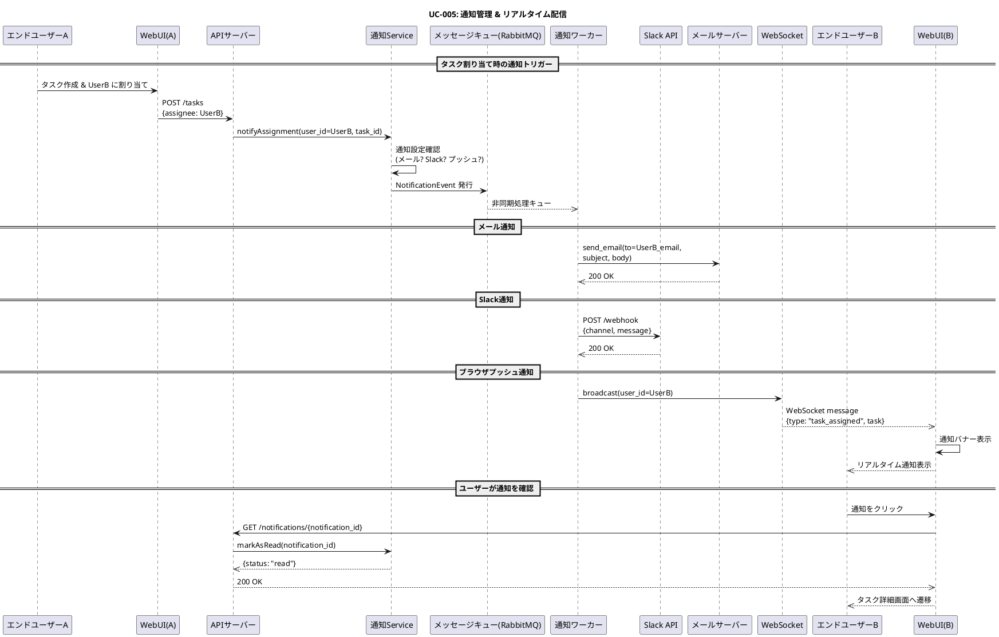

# 🎓 Lesson 18-6: ユースケース記述 & シーケンス図

| 項目 | 内容 |
|------|------|
| ゴール | TaskFlowのユースケース記述とPlantUMLシーケンス図3-5本を作成する |
| 所要時間 | 約30分 |
| 使うスキル | pm-toolkit スキル, diagram-generator スキル |
| 前提条件 | Lesson 18-5 完了、output/pm/requirements-spec.md が存在する |
| 教材ページ | [Module 18](https://ai-agent.camp/ja/course/module-18) |

---

## 📍 ステップ 1: アクター定義（ユーザー、管理者、外部システム）

このステップでは、TaskFlowシステムと相互作用するすべてのアクター（主体）を定義します。アクターはシステム境界の外にあり、システムと相互作用する人物または外部システムです。

### アクター定義の重要性
- ユースケース作成の基盤となります
- シーケンス図のパーティシパント（登場人物）になります
- 要件の優先順位付けに役立ちます

### 質問: TaskFlowのアクターを定義しましょう

```json
{
  "question": "TaskFlowのアクターを定義しましょう",
  "type": "single_choice",
  "options": [
    {
      "label": "基本3アクター（ユーザー/管理者/システム）",
      "value": "basic_actors"
    },
    {
      "label": "カスタム定義",
      "value": "custom_actors"
    },
    {
      "label": "AIに提案してもらう",
      "value": "ai_suggest"
    }
  ]
}
```

### 期待される出力

基本3アクター（推奨）:
- **エンドユーザー**: TaskFlowプラットフォームを使用してタスクを管理する個人
- **システム管理者**: ユーザー、権限、システム設定を管理する
- **外部システム**: ユーザーディレクトリ（LDAP/AD）、メール、Slack連携

---

## 📍 ステップ 2: 主要ユースケース記述（主フロー、代替フロー、例外フロー）

ユースケース記述は、アクターと システムが達成する具体的な目標を表現します。各ユースケースは以下の構造で記述されます：

### ユースケース記述テンプレート

```text
# ユースケース: [UC名]

| 属性 | 内容 |
|------|------|
| UC ID | UC-[番号] |
| 名称 | [日本語での簡潔な名称] |
| 説明 | [1-2文での説明] |
| アクター | [主アクター、関連アクター] |
| 前提条件 | [開始前に満たすべき条件] |
| 事後条件 | [ユースケース成功時の状態] |

## 主フロー

1. [最初のステップ]
2. [次のステップ]
3. ...

## 代替フロー

### A1: [代替フロー名]
1. [代替ステップ]
2. ...

## 例外フロー

### E1: [例外フロー名]
1. [例外が発生する条件]
2. [システムの対応]
```

### 質問: どのユースケースから記述しますか？

```json
{
  "question": "どのユースケースから記述しますか？",
  "type": "single_choice",
  "options": [
    {
      "label": "ログイン・認証",
      "value": "login_auth"
    },
    {
      "label": "タスクCRUD",
      "value": "task_crud"
    },
    {
      "label": "ダッシュボード表示",
      "value": "dashboard"
    },
    {
      "label": "通知管理",
      "value": "notification"
    },
    {
      "label": "すべてAIに任せる",
      "value": "all_ai"
    }
  ]
}
```

### ユースケース作成ガイドライン

各ユースケースについて、以下の要素を含める必要があります：

**主フロー**: システムが正常に動作する基本的な流れ
- 各ステップは明確で実行可能である必要があります
- システムとアクターの相互作用を明示します

**代替フロー**: 主フロー中に異なる判断や選択肢がある場合
- 例: 「ログイン済みの場合」「ログイン無しの場合」

**例外フロー**: エラーやシステム障害が発生した場合
- 例: 「認証失敗」「タイムアウト」「ネットワークエラー」

**前提条件**: ユースケース開始時に満たすべき状態
- 例: 「ユーザーがシステムにアクセス可能である」

**事後条件**: ユースケース完了後のシステムの状態
- 例: 「新規タスクがデータベースに保存されている」

---

## 📍 ステップ 3: PlantUMLシーケンス図の生成（認証、タスクCRUD、通知の3本）

シーケンス図はアクター間のメッセージ交換の時系列を視覚化します。ユースケース記述と相互参照できるようにします。

### PlantUML シーケンス図の基本構文



### 質問: シーケンス図をどう作りますか？

```json
{
  "question": "シーケンス図をどう作りますか？",
  "type": "single_choice",
  "options": [
    {
      "label": "1つずつ対話的に",
      "value": "interactive"
    },
    {
      "label": "3本まとめてAI生成",
      "value": "ai_batch"
    },
    {
      "label": "テンプレートから修正",
      "value": "template"
    }
  ]
}
```

### 生成すべきシーケンス図

#### 1. sequence-auth.puml - ユーザー認証フロー



#### 2. sequence-task-crud.puml - タスク作成・更新・削除フロー



#### 3. sequence-notification.puml - 通知管理フロー



---

## 📍 ステップ 4: ユースケースとシーケンス図の整合性レビュー

ユースケース記述とシーケンス図の整合性を確保することは、システム設計の品質を保証する重要なプロセスです。

### レビューチェックリスト

- **網羅性**: すべての主要なユースケースがカバーされているか？
- **完全性**: 各シーケンス図の全ステップがユースケースで記述されているか？
- **一貫性**: アクター名、用語の使用が一貫しているか？
- **整合性**: シーケンス図の流れはユースケースの主フロー/代替フロー/例外フローと一致しているか？
- **実装可能性**: 記述されたシーケンスは実装可能か？

### 質問: レビュー方法を選んでください

```json
{
  "question": "レビュー方法を選んでください",
  "type": "single_choice",
  "options": [
    {
      "label": "AIが自動レビュー",
      "value": "auto_review"
    },
    {
      "label": "対話的にレビュー",
      "value": "interactive_review"
    },
    {
      "label": "チェックリストで確認",
      "value": "checklist_review"
    }
  ]
}
```

### 整合性レビューの実施方法

**自動レビュー**: AIが生成したユースケース記述とシーケンス図を自動的に比較し、不整合を検出します

**対話的レビュー**: ユースケースとシーケンス図を見比べながら、質問に答える形でレビューを進めます

**チェックリストレビュー**: 提供されたチェックリストに従って、手動でレビューを実施します

---

## ✅ 成果物

以下の4つのファイルが `output/pm/` ディレクトリに生成される必要があります：

### 1. output/pm/usecases.md

ユースケース定義ドキュメント：
- ユースケース図（テキストまたは視覚化）
- ユースケース一覧（表形式）
- 各ユースケースの詳細記述（UC-001〜UC-005以上）
  - ユースケースID、名称、説明
  - アクター、前提条件、事後条件
  - 主フロー、代替フロー、例外フロー

### 2. output/pm/sequence-auth.puml

ユーザー認証フロー：
- UC-001: ログイン & 認証
- PlantUML @startuml ... @enduml 形式
- エンドユーザー、UI、API、認証サービス、外部ディレクトリを含む
- 成功フロー、失敗フロー（例外処理）を含む

### 3. output/pm/sequence-task-crud.puml

タスク管理（CRUD）フロー：
- UC-003: タスク作成、読み取り、更新、削除
- PlantUML @startuml ... @enduml 形式
- ユーザー、UI、APIサーバー、データベース、キャッシュを含む
- Create、Read、Update、Delete各フローを含む

### 4. output/pm/sequence-notification.puml

通知管理フロー：
- UC-005: 通知管理 & リアルタイム配信
- PlantUML @startuml ... @enduml 形式
- ユーザー、UI、通知サービス、メール、Slack、WebSocket、メッセージキューを含む
- メール、Slack、ブラウザプッシュ各通知チャネルを含む

---

## ⚠️ トラブルシューティング

### よくある問題と解決策

#### 問題: ユースケースの書き方がわからない

**解決策**:
- テンプレートセクションを参照してください
- 「主フロー」は5-10ステップで記述するのが目安です
- 各ステップはアクターまたはシステムのいずれかが実行するアクションです
- PMスキルのドキュメントを参照: `skills/pm-toolkit/docs/`

#### 問題: PlantUML構文エラー

**解決策**:
- PlantUMLは大文字小文字を区別します
- `participant`, `->`, `-->>` など正しい構文を使用してください
- コメント行には `'` を使用: `' これはコメント`
- [PlantUML公式ドキュメント](http://plantuml.com/sequence-diagram)を参照

#### 問題: フローが複雑すぎる

**解決策**:
- 1つのシーケンス図は参加者を5-8個までに制限してください
- 複雑なフローは複数の小さなシーケンス図に分割してください
- `ref` フレーム（サブフロー参照）を使用して他の図を参照できます

#### 問題: 要件定義書がない

**解決策**:
- 16-5で `output/pm/requirements-spec.md` を生成してください
- このレッスンはそのファイルに基づきます
- 前提条件を確認してください

---

## ✅ チェックポイント

このレッスンを完了するには、以下をすべて確認してください：

- [ ] **アクター定義**: 最低3種類のアクター（ユーザー、管理者、外部システム）が定義されている
- [ ] **ユースケース数**: 5つ以上のユースケースが記述されている（ログイン、タスク作成/更新/削除、ダッシュボード、通知など）
- [ ] **シーケンス図**: 最低3本の PlantUML シーケンス図が生成されている
- [ ] **PlantUML構文**: すべてのシーケンス図が正しい PlantUML 構文を使用している
- [ ] **ドキュメント生成**: `output/pm/usecases.md` が生成されている
- [ ] **整合性**: ユースケース記述とシーケンス図が整合している


---

## 📋 成果物プレビュー

### 期待される出力
```text
📁 output/pm/
└── usecases.md  (ユースケース定義)
```

### 確認コマンド
```bash
# ファイルの存在とサイズを確認
ls -lh output/pm/usecases.md

# 冒頭を確認（最初の30行）
head -30 output/pm/usecases.md
```

> 💡 全文を確認: `cat output/pm/usecases.md` で全文表示できます

---

## ➡️ 次のレッスン

次は **16-7: 画面遷移図 & ワイヤーフレーム** に進みます。

このレッスンでは：
- TaskFlowのユーザーインターフェース画面を設計します
- 画面遷移図（Screen Transition Diagram）を作成します
- ワイヤーフレーム（Wireframe）を作成して、各画面のレイアウトを設計します
- 画面とユースケースの関連付けを行います

**スキル**: ui-design スキル, diagram-generator スキル
**成果物**: screen-transitions.puml, wireframes.md, wireframe-*.svg

---

## 📝 補足資料

### ユースケース図と UML 標準
- アクター: スティックフィギュア（人間）、またはボックス（システム）
- ユースケース: 楕円形
- システム境界: 四角い枠
- 関連: 線で接続

### PlantUML 記号の説明
- `->` : 同期メッセージ（呼び出し）
- `-->` : メッセージの戻り（リターン）
- `->>` : 非同期メッセージ（イベント）
- `-->>` : 非同期メッセージの戻り
- `alt`, `else`, `end` : 条件分岐

### TaskFlow プロジェクトの背景
TaskFlowは、分散チーム向けのタスク・プロジェクト管理プラットフォームです。以下の特性があります：
- リアルタイム協働編集
- 複数の通知チャネル対応（メール、Slack、プッシュ）
- LDAP/Active Directory 統合
- 高スケーラビリティ（マイクロサービス設計）

このレッスンで定義するユースケースとシーケンス図は、実装チームが開発する際の仕様書となります。
