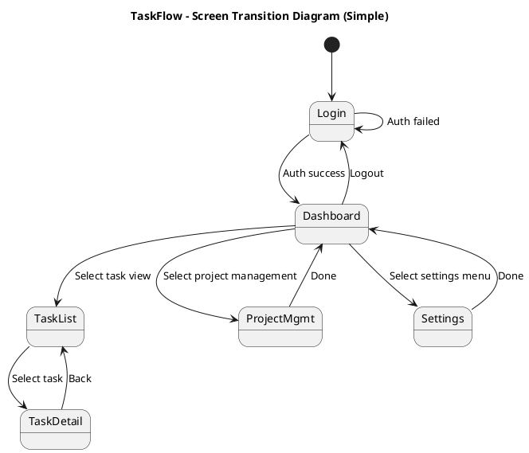
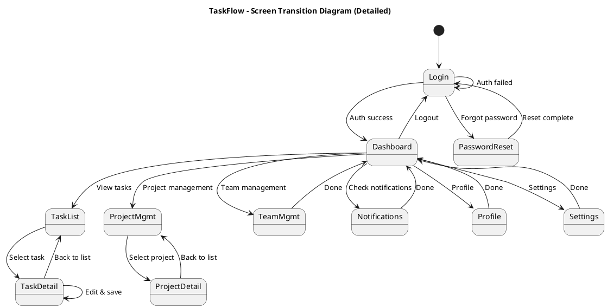

# 🎓 Lesson 18-7: Screen Transition Diagram & Wireframes

| Item | Details |
|------|------|
| Goal | Create TaskFlow screen transition diagrams (PlantUML state diagrams) and ASCII wireframes |
| Duration | ~25 min |
| Skills Used | diagram-generator skill |
| Prerequisites | Lesson 18-6 completed、output/pm/usecases.md exists |
| Lesson Page | [Module 18](https://ai-agent.camp/en/course/module-18) |

---

## 📍 Step 1: Identifying Screen List

First, identify the screens needed for the TaskFlow application. Determine which screens are required based on use cases and user flows.

```json
{
  "type": "AskQuestion",
  "question": "Select the screen configuration for TaskFlow",
  "options": [
    {
      "value": "basic",
      "label": "Basic (5 screens)",
      "description": "Minimum functionality"
    },
    {
      "value": "standard",
      "label": "Standard (8 screens)",
      "description": "Equivalent to a typical project management app"
    },
    {
      "value": "full",
      "label": "Full (12+ screens)",
      "description": "Including enterprise features"
    },
    {
      "value": "ask_ai",
      "label": "Get AI suggestions",
      "description": "Suggest optimal configuration from use cases"
    }
  ]
}
```

### 📋 Basic Configuration (5 Screens) Example

The following is the minimum screen list:

- **Login Screen**: Authentication and session management
- **Dashboard**: Main app screen. Project list, recent tasks, statistics
- **Task List**: Display, filter, and sort tasks within a project
- **Task Detail**: Task editing, comments, attachments
- **Settings Screen**: User settings, project settings

### 📋 Standard Configuration (8 Screens) Example

Add the following to the basic configuration:

- **Project Management Screen**: Project creation, editing, deletion
- **Team Management Screen**: Member addition, permission settings
- **Notification Screen**: System notifications and activity log
- **Profile Screen**: Personal information management

### 📋 Full Configuration (12+ Screens) Example

Add the following to the standard configuration:

- **Report & Analysis Screen**: Task completion rate, team productivity
- **Template Management**: Task templates, project templates
- **Integration Screen**: External service integration settings
- **Audit Log Screen**: Change history, permission change records

---

## 🚀 Step 2: Creating PlantUML State Transition Diagrams

Create screen transition diagrams using PlantUML state transition diagram notation.

```json
{
  "type": "AskQuestion",
  "question": "Select the screen transition diagram style",
  "options": [
    {
      "value": "simple",
      "label": "Simple (main flows only)",
      "description": "Only main flows like Login → Dashboard → Detail"
    },
    {
      "value": "detailed",
      "label": "Detailed (all transition paths)",
      "description": "Including all screen transition patterns"
    },
    {
      "value": "role_based",
      "label": "By user role",
      "description": "Display transitions by role: Admin/Manager/User"
    }
  ]
}
```

### 📋 PlantUML State Transition Diagram (Simple Version) Example



### 📋 PlantUML State Transition Diagram (Detailed Version) Example



---

## 🚀 Step 3: ASCII Wireframe Creation for Key Screens

Create wireframes for 3-5 key screens.

```json
{
  "type": "AskQuestion",
  "question": "Which screen wireframe will you create?",
  "options": [
    {
      "value": "dashboard",
      "label": "Dashboard",
      "description": "Display projects, tasks, and statistics"
    },
    {
      "value": "tasklist",
      "label": "Task List",
      "description": "Task display with filter and sort"
    },
    {
      "value": "taskdetail",
      "label": "Task Detail",
      "description": "Task editing, comments, attachments"
    },
    {
      "value": "login",
      "label": "Login",
      "description": "Authentication screen"
    },
    {
      "value": "all",
      "label": "All",
      "description": "Create wireframes for all 5 screens above"
    }
  ]
}
```

### 📋 Login Screen Wireframe

```text
╔════════════════════════════════════════╗
║                                        ║
║           TaskFlow Logo                ║
║                                        ║
║   ┌──────────────────────────────┐   ║
║   │ Login to TaskFlow            │   ║
║   └──────────────────────────────┘   ║
║                                        ║
║   ┌──────────────────────────────┐   ║
║   │ Email Address                 │   ║
║   │ [___________________________]  │   ║
║   └──────────────────────────────┘   ║
║                                        ║
║   ┌──────────────────────────────┐   ║
║   │ Password                     │   ║
║   │ [___________________________]  │   ║
║   └──────────────────────────────┘   ║
║                                        ║
║   ☐ Keep me logged in         ║
║                                        ║
║   ┌──────────────────────────────┐   ║
║   │     Login (blue button)       │   ║
║   └──────────────────────────────┘   ║
║                                        ║
║   Forgot your password?             ║
║                                        ║
╚════════════════════════════════════════╝
```

### 📋 Dashboard Screen Wireframe

```text
╔════════════════════════════════════════════════════╗
║ TaskFlow   [🔍 Search]     [🔔] [👤] [⋮]          ║
╠════════════════════════════════════════════════════╣
║                                                    ║
║ [Sidebar]              [Main Content]     ║
║                                                    ║
║ ▶ Dashboard        ┌──────────────────────┐ ║
║   Task List           │  Your Dashboard │ ║
║   Projects         └──────────────────────┘ ║
║   Team Management                                      ║
║   Settings                 ┌──────────────────────┐ ║
║                        │ Recent Tasks (5)    │ ║
║                        │                      │ ║
║                        │ □ Task 1 [Due: Tomorrow] │ ║
║                        │ □ Task 2 [Due: 3 days] │ ║
║                        │ □ Task 3 [Due: 1 week]│ ║
║                        │ □ Task 4              │ ║
║                        │ □ Task 5              │ ║
║                        └──────────────────────┘ ║
║                                                    ║
║                        ┌──────────────────────┐ ║
║                        │ Projects (3)    │ ║
║                        │ ■ Project A  50%     │ ║
║                        │ ■ Project B  75%     │ ║
║                        │ ■ Project C  25%     │ ║
║                        └──────────────────────┘ ║
║                                                    ║
║                        ┌──────────────────────┐ ║
║                        │ Statistics              │ ║
║                        │ Done: 42  In Progress: 15 │ ║
║                        │ Not Started: 8  Complete: 72% │ ║
║                        └──────────────────────┘ ║
║                                                    ║
╚════════════════════════════════════════════════════╝
```

### 📋 Task List Screen Wireframe

```text
╔════════════════════════════════════════════════════╗
║ TaskFlow   [🔍 Search]     [🔔] [👤] [⋮]          ║
╠════════════════════════════════════════════════════╣
║                                                    ║
║ ▶ Dashboard        ┌──────────────────────┐ ║
║   ▼ Task List         │ Task List                │ ║
║   Projects         │ Project: Project A │ ║
║   Team Management           └──────────────────────┘ ║
║   Settings                                            ║
║                        ┌──────────────────────┐ ║
║                        │ Filter             │ ║
║                        │ [Status▼] [Priority▼] [▼] │ ║
║                        │ [New Task] [Sort] │ ║
║                        └──────────────────────┘ ║
║                                                    ║
║                        ┌──────────────────────┐ ║
║                        │ № │Task Name │Status│Due │ ║
║                        ├──────────────────────┤ ║
║                        │1 │Task 1    │Done│1/15│ ║
║                        │2 │Task 2    │Prog│1/20│ ║
║                        │3 │Task 3    │Prog│1/25│ ║
║                        │4 │Task 4    │Todo│2/1 │ ║
║                        │5 │Task 5    │Todo│2/5 │ ║
║                        │6 │Task 6    │Done│1/18│ ║
║                        │7 │Task 7    │Prog│1/22│ ║
║                        │8 │Task 8    │Todo│2/3 │ ║
║                        └──────────────────────┘ ║
║                                                    ║
║                        [Prev] [1] [2] [3] [Next] ║
║                                                    ║
╚════════════════════════════════════════════════════╝
```

### 📋 Task Detail Screen Wireframe

```text
╔════════════════════════════════════════════════════╗
║ TaskFlow   [🔍 Search]     [🔔] [👤] [⋮]          ║
╠════════════════════════════════════════════════════╣
║                                                    ║
║ ▶ Dashboard        [← Back to list]            ║
║   ▼ Task List         ┌──────────────────────┐ ║
║   Projects         │ Task 2 - New Feature Development    │ ║
║   Team Management           └──────────────────────┘ ║
║   Settings                                            ║
║                        ┌──────────────────────┐ ║
║                        │ Basic Info              │ ║
║                        │ Status: [In Progress ▼]  │ ║
║                        │ Priority: [High  ▼]    │ ║
║                        │ Assignee: [Taro Tanaka ▼]  │ ║
║                        │ Due: 2024-01-20     │ ║
║                        │ Progress: 60%            │ ║
║                        └──────────────────────┘ ║
║                                                    ║
║                        ┌──────────────────────┐ ║
║                        │ Description             │ ║
║                        │ Detailed description of Task 2   │ ║
║                        │ Description text goes here │ ║
║                        └──────────────────────┘ ║
║                                                    ║
║                        ┌──────────────────────┐ ║
║                        │ Comments                │ ║
║                        │ [👤 Taro Yamada]        │ ║
║                        │ Content of comment 1    │ ║
║                        │ 2024-01-15 10:30    │ ║
║                        │                      │ ║
║                        │ [👤 Jiro Suzuki]        │ ║
║                        │ Content of comment 2    │ ║
║                        │ 2024-01-15 14:45    │ ║
║                        │                      │ ║
║                        │ [New comment input] │ ║
║                        │ [_____________] Send │ ║
║                        └──────────────────────┘ ║
║                                                    ║
║                        [Save] [Delete]            ║
║                                                    ║
╚════════════════════════════════════════════════════╝
```

### 📋 Settings Screen Wireframe

```text
╔════════════════════════════════════════════════════╗
║ TaskFlow   [🔍 Search]     [🔔] [👤] [⋮]          ║
╠════════════════════════════════════════════════════╣
║                                                    ║
║ ▶ Dashboard        ┌──────────────────────┐ ║
║   Task List           │ Settings               │ ║
║   Projects         └──────────────────────┘ ║
║   Team Management                                      ║
║   ▼ Settings           ┌──────────────────────┐ ║
║                        │ Account Settings         │ ║
║                        │ [Personal Info▼]          │ ║
║                        │ Name: [Taro Tanaka   ] │ ║
║                        │ Email: [t.tanaka@]  │ ║
║                        │ Language: [English    ▼] │ ║
║                        │ [Save]                │ ║
║                        └──────────────────────┘ ║
║                                                    ║
║                        ┌──────────────────────┐ ║
║                        │ Notification Settings              │ ║
║                        │ ☑ Email Notifications         │ ║
║                        │ ☑ In-app Notifications      │ ║
║                        │ ☐ SMS Notifications           │ ║
║                        │ [Save]                │ ║
║                        └──────────────────────┘ ║
║                                                    ║
║                        ┌──────────────────────┐ ║
║                        │ Security          │ ║
║                        │ [Change Password]  │ ║
║                        │ [2FA Settings]      │ ║
║                        │ [Login History]       │ ║
║                        └──────────────────────┘ ║
║                                                    ║
║                        ┌──────────────────────┐ ║
║                        │ Data Management            │ ║
║                        │ [Export Data]  │ ║
║                        │ [Delete Account]      │ ║
║                        └──────────────────────┘ ║
║                                                    ║
╚════════════════════════════════════════════════════╝
```

---

## ⚠️ Step 4: Reviewing Screen Flow

Review the created screen transitions and wireframes.

```json
{
  "type": "AskQuestion",
  "question": "Select the review perspective",
  "options": [
    {
      "value": "usability",
      "label": "Usability",
      "description": "Operability, clarity, efficiency"
    },
    {
      "value": "accessibility",
      "label": "Accessibility",
      "description": "Disability support, color blindness, keyboard operation"
    },
    {
      "value": "information_design",
      "label": "Information Architecture",
      "description": "Information hierarchy, priority, organization"
    },
    {
      "value": "all",
      "label": "All",
      "description": "Check all 3 perspectives above"
    }
  ]
}
```

### 📋 Usability Review Points

- Is the number of steps to reach each screen appropriate (5 steps or fewer is ideal)?
- Is the main operation flow (task creation → detail editing → completion) intuitive?
- Are back buttons and breadcrumbs placed appropriately?
- Are screen transitions predictable?

### 📋 Accessibility Review Points

- Is high contrast ratio used for color-blind accessibility?
- Is keyboard-only navigation possible?
- Screen reader support (alt text, labels)
- Are focus indicators clearly visible?

### 📋 Information Architecture Review Points

- Is the amount of information displayed on screen appropriate (cognitive load)?
- Is important information placed in prominent positions?
- Are categorization and section divisions logical?
- Has unnecessary information been removed?

---

## ✅ Step 5: Generating Deliverables

Generate the following files in the output/pm/ directory.

```json
{
  "type": "AskQuestion",
  "question": "Generate the deliverables?",
  "options": [
    {
      "value": "confirm",
      "label": "Yes, generate",
      "description": "Generate screen transition diagram and wireframes"
    },
    {
      "value": "review",
      "label": "Review once more first",
      "description": "Review the content once more"
    }
  ]
}
```

### 📋 Output File List

1. **output/pm/screen-transition.puml**
   - Screen transition diagram in PlantUML format
   - File contents: Complete definition from @startuml to @enduml

2. **output/pm/wireframes.md**
   - ASCII wireframes written in Markdown
   - Wireframes and descriptions for each screen

### 📋 Generation Example: screen-transition.puml

```text
@startuml TaskFlow_ScreenTransition
title TaskFlow - Screen Transition Diagram
[*] --> Login
Login --> Dashboard : Auth success
...
@enduml
```

### 📋 Generation Example: wireframes.md

```markdown
# TaskFlow Wireframes

## 1. Login Screen
[ASCII art wireframe...]

## 2. Dashboard Screen
[ASCII art wireframe...]

## 3. Task List Screen
[ASCII art wireframe...]

...
```

---

## 🔧 Troubleshooting

### Problem: Do not understand PlantUML state transition diagram syntax

**Cause**: Unfamiliar with PlantUML @startuml state notation

**Solution:**
1. Refer to [PlantUML official documentation](http://plantuml.com/)
2. Basic notation:
   - `state "Name" as state_id` : State definition
   - `state1 --> state2 : Label` : Transition
   - `[*] --> state1` : Start state
   - `stateN --> [*]` : End state

### Problem: ASCII Art Is Broken

**Cause**: Font is proportional, and spaces are not recognized correctly

**Solution:**
1. View the file in Markdown or a text editor
2. Set the display font to a monospaced font such as "Courier New" or "Consolas"
3. Install the VSCode extension "Monospace"

### Problem: Too Many Screens to Manage

**Cause**: Full configuration (12+ screens) was selected

**Solution:**
1. Set high-priority screens (login, dashboard, task list, task detail) as Phase 1
2. Split other screens (settings, notifications, management screens, etc.) into Phase 2 and 3
3. By progressively detailing, create only the detailed transition diagram in the current phase

### Problem: Use Case Mapping Is Unclear

**Cause**: Use cases and screen transitions are not directly linked

**Solution:**
1. Check output/pm/usecases.md
2. Map each use case to which screen transition realizes it
3. Example: "Create a task within a project" use case
   → Dashboard → Project Management → Task List → [New Task] Screen

---

## ✓ Checkpoint

This lesson is complete when all of the following items are achieved:

- [ ] 5 or more screens are defined
- [ ] PlantUML state transition diagram has been created (@startuml ~ @enduml)
- [ ] Wireframes for 3 or more screens have been created (ASCII art)
- [ ] screen-transition.puml file has been generated
- [ ] wireframes.md file has been generated
- [ ] Use case mapping has been verified
- [ ] Review from review perspectives (usability/accessibility/information architecture) has been completed


---

## 📋 Deliverables Preview

### Expected Output
```text
📁 output/pm/
└── wbs.md  (WBS (Work Breakdown Structure))
```

### Verification Commands
```bash
# Check file existence and size
ls -lh output/pm/wbs.md

# Check the beginning (first 30 lines)
head -30 output/pm/wbs.md
```

> 💡 Full text: Run `cat output/pm/wbs.md` to display the full text

---

## ➡️ Next Steps

In Lesson 18-8, you will perform database design for TaskFlow.

→ **[/start-18-8 (DB Design)](./start-18-8.md)**

Using the screen transition diagrams and wireframes created in this lesson as reference, define the required data entities and relationships.
