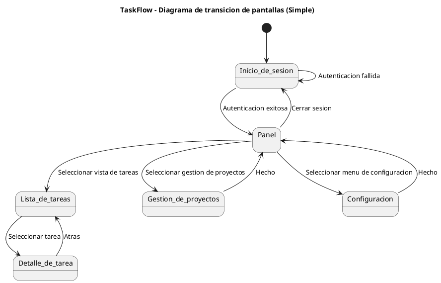
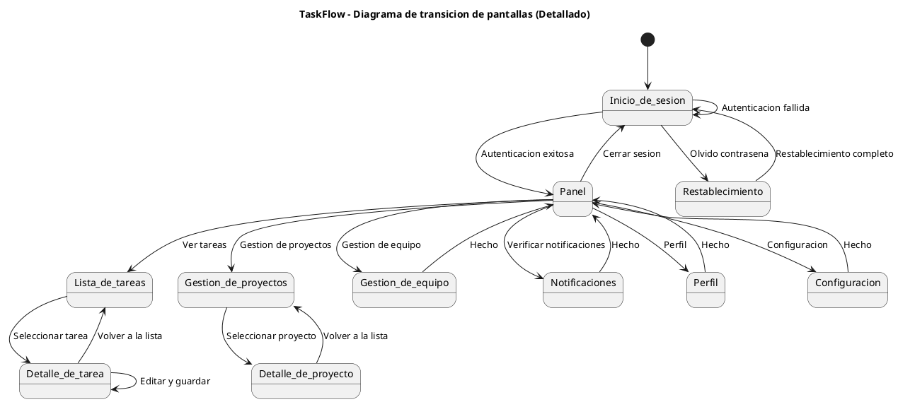

# 🎓 Lesson 18-7: Diagrama de transición de pantallas y wireframes

| Elemento | Detalles |
|------|------|
| Objetivo | Crear diagramas de transición de pantalla de TaskFlow (diagramas de estado PlantUML) y wireframes ASCII |
| Duración | ~25 min |
| Habilidades utilizadas | habilidad diagram-generator |
| Requisitos previos | Lesson 18-6 completada、output/pm/usecases.md existe |
| Página del material | [Module 18](https://ai-agent.camp/es/course/module-18) |

---

## 📍 Paso 1: Identificación de la lista de pantallas

Primero, identifique las pantallas necesarias para la aplicación TaskFlow. Determine que pantallas se requieren basandose en los casos de uso y flujos de usuario.

```json
{
  "type": "AskQuestion",
  "question": "Seleccione la configuracion de pantallas para TaskFlow",
  "options": [
    {
      "value": "basic",
      "label": "Basica (5 pantallas)",
      "description": "Funcionalidad minima"
    },
    {
      "value": "standard",
      "label": "Estandar (8 pantallas)",
      "description": "Equivalente a una aplicacion tipica de gestion de proyectos"
    },
    {
      "value": "full",
      "label": "Completa (12+ pantallas)",
      "description": "Incluyendo funciones empresariales"
    },
    {
      "value": "ask_ai",
      "label": "Obtener sugerencias de IA",
      "description": "Sugerir configuracion optima a partir de casos de uso"
    }
  ]
}
```

### 📋 Ejemplo de configuración básica (5 pantallas)

La siguiente es la lista mínima de pantallas:

- **Pantalla de inicio de sesión**: Autenticación y gestión de sesiones
- **Panel de control**: Pantalla principal de la aplicación. Lista de proyectos, tareas recientes, estadísticas
- **Lista de tareas**: Mostrar, filtrar y ordenar tareas dentro de un proyecto
- **Detalle de tarea**: Edición de tareas, comentarios, archivos adjuntos
- **Pantalla de configuración**: Configuración de usuario, configuración de proyecto

### 📋 Ejemplo de configuración estándar (8 pantallas)

Agregue lo siguiente a la configuración básica:

- **Pantalla de gestión de proyectos**: Creación, edición, eliminación de proyectos
- **Pantalla de gestión de equipos**: Adición de miembros, configuración de permisos
- **Pantalla de notificaciones**: Notificaciones del sistema y registro de actividad
- **Pantalla de perfil**: Gestión de información personal

### 📋 Ejemplo de configuración completa (12+ pantallas)

Agregue lo siguiente a la configuración estándar:

- **Pantalla de informes y análisis**: Tasa de finalización de tareas, productividad del equipo
- **Gestión de plantillas**: Plantillas de tareas, plantillas de proyectos
- **Pantalla de integración**: Configuración de integración de servicios externos
- **Pantalla de registro de auditoría**: Historial de cambios, registros de cambios de permisos

---

## 🚀 Paso 2: Creación de diagramas de transición de estado PlantUML

Cree diagramas de transición de pantallas utilizando la notación de diagramas de transición de estado de PlantUML.

```json
{
  "type": "AskQuestion",
  "question": "Seleccione el estilo del diagrama de transicion de pantallas",
  "options": [
    {
      "value": "simple",
      "label": "Simple (solo flujos principales)",
      "description": "Solo flujos principales como Inicio de sesion → Panel → Detalle"
    },
    {
      "value": "detailed",
      "label": "Detallado (todas las rutas de transicion)",
      "description": "Incluyendo todos los patrones de transicion de pantallas"
    },
    {
      "value": "role_based",
      "label": "Por rol de usuario",
      "description": "Mostrar transiciones por rol: Admin/Manager/User"
    }
  ]
}
```

### 📋 Ejemplo de diagrama de transición de estado PlantUML (versión simple)



### 📋 Ejemplo de diagrama de transición de estado PlantUML (versión detallada)



---

## 🚀 Paso 3: Creación de wireframes ASCII para pantallas clave

Cree wireframes para 3-5 pantallas clave.

```json
{
  "type": "AskQuestion",
  "question": "Que wireframe de pantalla creara?",
  "options": [
    {
      "value": "dashboard",
      "label": "Panel de control",
      "description": "Mostrar proyectos, tareas y estadisticas"
    },
    {
      "value": "tasklist",
      "label": "Lista de tareas",
      "description": "Visualizacion de tareas con filtro y ordenacion"
    },
    {
      "value": "taskdetail",
      "label": "Detalle de tarea",
      "description": "Edicion de tareas, comentarios, archivos adjuntos"
    },
    {
      "value": "login",
      "label": "Inicio de sesion",
      "description": "Pantalla de autenticacion"
    },
    {
      "value": "all",
      "label": "Todos",
      "description": "Crear wireframes para las 5 pantallas anteriores"
    }
  ]
}
```

### 📋 Wireframe de pantalla de inicio de sesión

```text
╔════════════════════════════════════════╗
║                                        ║
║           Logo TaskFlow                ║
║                                        ║
║   ┌──────────────────────────────┐   ║
║   │ Iniciar sesion en TaskFlow            │   ║
║   └──────────────────────────────┘   ║
║                                        ║
║   ┌──────────────────────────────┐   ║
║   │ Direccion de correo                 │   ║
║   │ [___________________________]  │   ║
║   └──────────────────────────────┘   ║
║                                        ║
║   ┌──────────────────────────────┐   ║
║   │ Contrasena                     │   ║
║   │ [___________________________]  │   ║
║   └──────────────────────────────┘   ║
║                                        ║
║   ☐ Mantener sesion iniciada         ║
║                                        ║
║   ┌──────────────────────────────┐   ║
║   │     Iniciar sesion (boton azul)       │   ║
║   └──────────────────────────────┘   ║
║                                        ║
║   Olvido su contrasena?              ║
║                                        ║
╚════════════════════════════════════════╝
```

### 📋 Wireframe de pantalla de panel de control

```text
╔════════════════════════════════════════════════════╗
║ TaskFlow   [🔍 Buscar]     [🔔] [👤] [⋮]          ║
╠════════════════════════════════════════════════════╣
║                                                    ║
║ [Barra lateral]        [Contenido principal]     ║
║                                                    ║
║ ▶ Panel de control        ┌──────────────────────┐ ║
║   Lista de tareas           │  Su panel de control │ ║
║   Proyectos         └──────────────────────┘ ║
║   Gestion de equipo                                      ║
║   Configuracion                 ┌──────────────────────┐ ║
║                        │ Tareas recientes (5)    │ ║
║                        │                      │ ║
║                        │ □ Task 1 [Vencimiento: Manana] │ ║
║                        │ □ Task 2 [Vencimiento: 3 dias] │ ║
║                        │ □ Task 3 [Vencimiento: 1 semana]│ ║
║                        │ □ Task 4              │ ║
║                        │ □ Task 5              │ ║
║                        └──────────────────────┘ ║
║                                                    ║
║                        ┌──────────────────────┐ ║
║                        │ Proyectos (3)    │ ║
║                        │ ■ Project A  50%     │ ║
║                        │ ■ Project B  75%     │ ║
║                        │ ■ Project C  25%     │ ║
║                        └──────────────────────┘ ║
║                                                    ║
║                        ┌──────────────────────┐ ║
║                        │ Estadisticas              │ ║
║                        │ Completado: 42  En progreso: 15 │ ║
║                        │ Sin iniciar: 8  Completado: 72% │ ║
║                        └──────────────────────┘ ║
║                                                    ║
╚════════════════════════════════════════════════════╝
```

### 📋 Wireframe de pantalla de lista de tareas

```text
╔════════════════════════════════════════════════════╗
║ TaskFlow   [🔍 Buscar]     [🔔] [👤] [⋮]          ║
╠════════════════════════════════════════════════════╣
║                                                    ║
║ ▶ Panel de control        ┌──────────────────────┐ ║
║   ▼ Lista de tareas         │ Lista de tareas          │ ║
║   Proyectos         │ Proyecto: Project A │ ║
║   Gestion de equipo           └──────────────────────┘ ║
║   Configuracion                                            ║
║                        ┌──────────────────────┐ ║
║                        │ Filtro             │ ║
║                        │ [Estado▼] [Prioridad▼] [▼] │ ║
║                        │ [Nueva tarea] [Ordenar] │ ║
║                        └──────────────────────┘ ║
║                                                    ║
║                        ┌──────────────────────┐ ║
║                        │ № │Nombre    │Estado│Venc │ ║
║                        ├──────────────────────┤ ║
║                        │1 │Task 1    │Comp│1/15│ ║
║                        │2 │Task 2    │Prog│1/20│ ║
║                        │3 │Task 3    │Prog│1/25│ ║
║                        │4 │Task 4    │Pend│2/1 │ ║
║                        │5 │Task 5    │Pend│2/5 │ ║
║                        │6 │Task 6    │Comp│1/18│ ║
║                        │7 │Task 7    │Prog│1/22│ ║
║                        │8 │Task 8    │Pend│2/3 │ ║
║                        └──────────────────────┘ ║
║                                                    ║
║                        [Ant] [1] [2] [3] [Sig] ║
║                                                    ║
╚════════════════════════════════════════════════════╝
```

### 📋 Wireframe de pantalla de detalle de tarea

```text
╔════════════════════════════════════════════════════╗
║ TaskFlow   [🔍 Buscar]     [🔔] [👤] [⋮]          ║
╠════════════════════════════════════════════════════╣
║                                                    ║
║ ▶ Panel de control        [← Volver a la lista]            ║
║   ▼ Lista de tareas         ┌──────────────────────┐ ║
║   Proyectos         │ Tarea 2 - Desarrollo de nueva funcion    │ ║
║   Gestion de equipo           └──────────────────────┘ ║
║   Configuracion                                            ║
║                        ┌──────────────────────┐ ║
║                        │ Informacion basica              │ ║
║                        │ Estado: [En progreso ▼]  │ ║
║                        │ Prioridad: [Alta  ▼]    │ ║
║                        │ Responsable: [Taro Tanaka▼]  │ ║
║                        │ Vencimiento: 2024-01-20     │ ║
║                        │ Progreso: 60%            │ ║
║                        └──────────────────────┘ ║
║                                                    ║
║                        ┌──────────────────────┐ ║
║                        │ Descripcion             │ ║
║                        │ Descripcion detallada de la Tarea 2   │ ║
║                        │ El texto de descripcion va aqui │ ║
║                        └──────────────────────┘ ║
║                                                    ║
║                        ┌──────────────────────┐ ║
║                        │ Comentarios             │ ║
║                        │ [👤 Taro Yamada]        │ ║
║                        │ Contenido del comentario 1    │ ║
║                        │ 2024-01-15 10:30    │ ║
║                        │                      │ ║
║                        │ [👤 Jiro Suzuki]        │ ║
║                        │ Contenido del comentario 2    │ ║
║                        │ 2024-01-15 14:45    │ ║
║                        │                      │ ║
║                        │ [Entrada de nuevo comentario] │ ║
║                        │ [_____________] Enviar │ ║
║                        └──────────────────────┘ ║
║                                                    ║
║                        [Guardar] [Eliminar]            ║
║                                                    ║
╚════════════════════════════════════════════════════╝
```

### 📋 Wireframe de pantalla de configuración

```text
╔════════════════════════════════════════════════════╗
║ TaskFlow   [🔍 Buscar]     [🔔] [👤] [⋮]          ║
╠════════════════════════════════════════════════════╣
║                                                    ║
║ ▶ Panel de control        ┌──────────────────────┐ ║
║   Lista de tareas           │ Configuracion          │ ║
║   Proyectos         └──────────────────────┘ ║
║   Gestion de equipo                                      ║
║   ▼ Configuracion      ┌──────────────────────┐ ║
║                        │ Configuracion de cuenta         │ ║
║                        │ [Informacion personal▼]          │ ║
║                        │ Nombre: [Taro Tanaka  ] │ ║
║                        │ Correo: [t.tanaka@]  │ ║
║                        │ Idioma: [Espanol      ▼] │ ║
║                        │ [Guardar]                │ ║
║                        └──────────────────────┘ ║
║                                                    ║
║                        ┌──────────────────────┐ ║
║                        │ Configuracion de notificaciones              │ ║
║                        │ ☑ Notificaciones por correo         │ ║
║                        │ ☑ Notificaciones en la aplicacion      │ ║
║                        │ ☐ Notificaciones SMS           │ ║
║                        │ [Guardar]                │ ║
║                        └──────────────────────┘ ║
║                                                    ║
║                        ┌──────────────────────┐ ║
║                        │ Seguridad          │ ║
║                        │ [Cambiar contrasena] │ ║
║                        │ [Configuracion 2FA]      │ ║
║                        │ [Historial de inicio de sesion]       │ ║
║                        └──────────────────────┘ ║
║                                                    ║
║                        ┌──────────────────────┐ ║
║                        │ Gestion de datos            │ ║
║                        │ [Exportar datos]  │ ║
║                        │ [Eliminar cuenta]      │ ║
║                        └──────────────────────┘ ║
║                                                    ║
╚════════════════════════════════════════════════════╝
```

---

## ⚠️ Step 4: Revisión del flujo de pantallas

Revise las transiciones de pantalla y wireframes creados.

```json
{
  "type": "AskQuestion",
  "question": "Seleccione la perspectiva de revision",
  "options": [
    {
      "value": "usability",
      "label": "Usabilidad",
      "description": "Operabilidad, claridad, eficiencia"
    },
    {
      "value": "accessibility",
      "label": "Accesibilidad",
      "description": "Soporte para discapacidad, daltonismo, operacion con teclado"
    },
    {
      "value": "information_design",
      "label": "Arquitectura de informacion",
      "description": "Jerarquia de informacion, prioridad, organizacion"
    },
    {
      "value": "all",
      "label": "Todos",
      "description": "Verificar las 3 perspectivas anteriores"
    }
  ]
}
```

### 📋 Puntos de revisión de usabilidad

- Es apropiado el número de pasos para llegar a cada pantalla (5 pasos o menos es lo ideal)?
- Es intuitivo el flujo de operación principal (creación de tarea → edición de detalle → finalización)?
- Estan colocados adecuadamente los botones de retroceso y migas de pan?
- Son predecibles las transiciones de pantalla?

### 📋 Puntos de revisión de accesibilidad

- Se utiliza una relación de contraste alta para la accesibilidad con daltonismo?
- Es posible la navegación solo con teclado?
- Soporte para lectores de pantalla (texto alt, etiquetas)
- Son claramente visibles los indicadores de enfoque?

### 📋 Puntos de revisión de arquitectura de información

- Es apropiada la cantidad de información mostrada en pantalla (carga cognitiva)?
- Esta la información importante colocada en posiciones destacadas?
- Son logicas la categorización y división de secciones?
- Se ha eliminado la información innecesaria?

---

## ✅ Paso 5: Generación de entregables

Genere los siguientes archivos en el directorio output/pm/.

```json
{
  "type": "AskQuestion",
  "question": "Generar los entregables?",
  "options": [
    {
      "value": "confirm",
      "label": "Si, generar",
      "description": "Generar diagrama de transicion de pantallas y wireframes"
    },
    {
      "value": "review",
      "label": "Revisar una vez mas primero",
      "description": "Revisar el contenido una vez mas"
    }
  ]
}
```

### 📋 Lista de archivos de salida

1. **output/pm/screen-transition.puml**
   - Diagrama de transición de pantallas en formato PlantUML
   - Contenido del archivo: Definición completa desde @startuml hasta @enduml

2. **output/pm/wireframes.md**
   - Wireframes ASCII escritos en Markdown
   - Wireframes y descripciones para cada pantalla

### 📋 Ejemplo de generación: screen-transition.puml

```text
@startuml TaskFlow_ScreenTransition
title TaskFlow - Diagrama de transicion de pantallas
[*] --> Inicio_de_sesion
Inicio_de_sesion --> Panel : Autenticacion exitosa
...
@enduml
```

### 📋 Ejemplo de generación: wireframes.md

```markdown
# Wireframes de TaskFlow

## 1. Pantalla de inicio de sesion
[ASCII art wireframe...]

## 2. Pantalla del panel de control
[ASCII art wireframe...]

## 3. Pantalla de lista de tareas
[ASCII art wireframe...]

...
```

---

## 🔧 Solución de problemas

### Problema: No entiende la sintaxis del diagrama de transición de estado PlantUML

**Causa**: No esta familiarizado con la notación de estado @startuml de PlantUML

**Solución:**
1. Consulte la [documentación oficial de PlantUML](http://plantuml.com/)
2. Notación básica:
   - `state "Nombre" as state_id` : Definición de estado
   - `state1 --> state2 : Etiqueta` : Transición
   - `[*] --> state1` : Estado inicial
   - `stateN --> [*]` : Estado final

### Problema: El arte ASCII se rompe

**Causa**: La fuente es proporcional y los espacios no se reconocen correctamente

**Solución:**
1. Ver el archivo en Markdown o un editor de texto
2. Configurar la fuente de visualización a una fuente monoespaciada como "Courier New" o "Consolas"
3. Instalar la extensión de VSCode "Monospace"

### Problema: Demasiadas pantallas para gestionar

**Causa**: Se selecciono la configuración completa (12+ pantallas)

**Solución:**
1. Establecer las pantallas de alta prioridad (inicio de sesión, panel de control, lista de tareas, detalle de tarea) como Fase 1
2. Dividir otras pantallas (configuración, notificaciones, pantallas de gestión, etc.) en Fase 2 y 3
3. Mediante la elaboración progresiva, crear solo el diagrama de transición detallado en la fase actual

### Problema: El mapeo de casos de uso no esta claro

**Causa**: Los casos de uso y las transiciones de pantalla no estan vinculados directamente

**Solución:**
1. Verificar output/pm/usecases.md
2. Mapear cada caso de uso a la transición de pantalla que lo realiza
3. Ejemplo: Caso de uso "Crear una tarea dentro de un proyecto"
   → Panel de control → Gestión de proyectos → Lista de tareas → Pantalla [Nueva tarea]

---

## ✓ Punto de control

Esta lección se completa cuando se logran todos los siguientes elementos:

- [ ] Se han definido 5 o más pantallas
- [ ] Se ha creado el diagrama de transición de estado PlantUML (@startuml ~ @enduml)
- [ ] Se han creado wireframes para 3 o más pantallas (arte ASCII)
- [ ] Se ha generado el archivo screen-transition.puml
- [ ] Se ha generado el archivo wireframes.md
- [ ] Se ha verificado el mapeo con los casos de uso
- [ ] Se ha completado la revisión desde las perspectivas de revisión (usabilidad/accesibilidad/arquitectura de información)


---

## 📋 Vista previa de entregables

### Salida esperada
```text
📁 output/pm/
└── wbs.md  (WBS (Work Breakdown Structure))
```

### Comandos de verificación
```bash
# Verificar existencia y tamano del archivo
ls -lh output/pm/wbs.md

# Verificar el inicio (primeras 30 lineas)
head -30 output/pm/wbs.md
```

> 💡 Texto completo: Ejecute `cat output/pm/wbs.md` para mostrar el texto completo

---

## ➡️ Siguientes pasos

En la Lección 18-8, realizará el diseño de base de datos de TaskFlow.

→ **[/start-18-8 (Diseño de BD)](./start-18-8.md)**

Utilizando los diagramas de transición de pantallas y wireframes creados en esta lección como referencia, defina las entidades de datos y relaciones necesarias.
