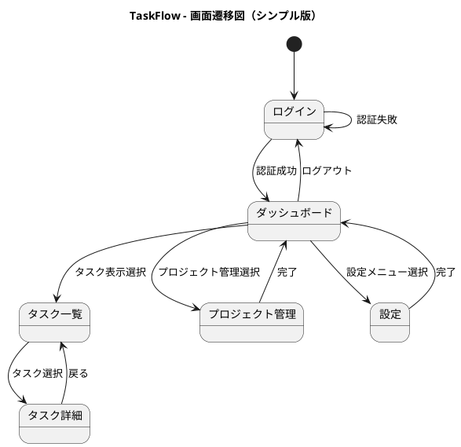
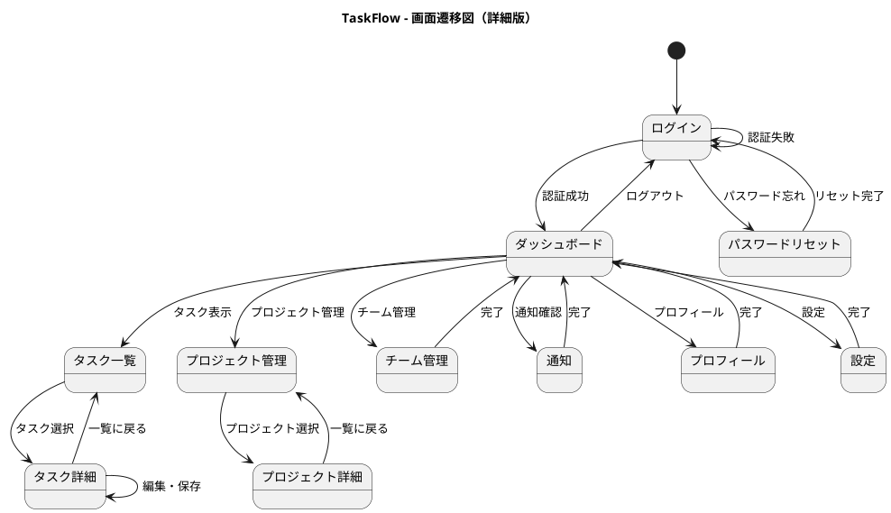

# 🎓 Lesson 18-7: 画面遷移図 & ワイヤーフレーム

| 項目 | 内容 |
|------|------|
| ゴール | TaskFlowの画面遷移図（PlantUML状態遷移図）とASCIIワイヤーフレームを作成する |
| 所要時間 | 約25分 |
| 使うスキル | diagram-generator スキル |
| 前提条件 | Lesson 18-6 完了、output/pm/usecases.md が存在する |
| 教材ページ | [Module 18](https://ai-agent.camp/ja/course/module-18) |

---

## 📍 Step 1: 画面一覧の洗い出し

まず、TaskFlowアプリケーションに必要な画面を洗い出します。ユースケースやユーザーフローから、どの画面が必要かを特定しましょう。

```json
{
  "type": "AskQuestion",
  "question": "TaskFlowの画面構成を選んでください",
  "options": [
    {
      "value": "basic",
      "label": "基本構成（5画面）",
      "description": "最小限の機能で構成"
    },
    {
      "value": "standard",
      "label": "標準構成（8画面）",
      "description": "一般的なプロジェクト管理アプリ相当"
    },
    {
      "value": "full",
      "label": "フル構成（12画面以上）",
      "description": "エンタープライズ機能を含む"
    },
    {
      "value": "ask_ai",
      "label": "AIに提案してもらう",
      "description": "ユースケースから最適な構成を提案"
    }
  ]
}
```

### 📋 基本構成（5画面）の例

以下は最小限の画面リストです：

- **ログイン画面**：認証とセッション管理
- **ダッシュボード**：アプリのメイン画面。プロジェクト一覧、最近のタスク、統計情報
- **タスク一覧**：プロジェクト内のタスク表示・フィルター・ソート
- **タスク詳細**：タスク編集、コメント、添付ファイル
- **設定画面**：ユーザー設定、プロジェクト設定

### 📋 標準構成（8画面）の例

基本構成に以下を追加：

- **プロジェクト管理画面**：プロジェクト作成・編集・削除
- **チーム管理画面**：メンバー追加・権限設定
- **通知画面**：システム通知とアクティビティログ
- **プロフィール画面**：個人情報の管理

### 📋 フル構成（12画面以上）の例

標準構成に以下を追加：

- **レポート・分析画面**：タスク完了率、チーム生産性
- **テンプレート管理**：タスクテンプレート、プロジェクトテンプレート
- **統合画面**：外部サービス連携の設定
- **監査ログ画面**：変更履歴・権限変更の記録

---

## 🚀 Step 2: PlantUML状態遷移図の作成

画面遷移図を作成します。PlantUML の状態遷移図記法を使用します。

```json
{
  "type": "AskQuestion",
  "question": "画面遷移図のスタイルを選んでください",
  "options": [
    {
      "value": "simple",
      "label": "シンプル（主要フローのみ）",
      "description": "ログイン→ダッシュボード→詳細などの主要な流れのみ"
    },
    {
      "value": "detailed",
      "label": "詳細（全遷移パス）",
      "description": "すべての画面遷移パターンを含む"
    },
    {
      "value": "role_based",
      "label": "ユーザーロール別",
      "description": "Admin/Manager/User などロール別の遷移を表示"
    }
  ]
}
```

### 📋 PlantUML 状態遷移図（シンプル版）の例



### 📋 PlantUML 状態遷移図（詳細版）の例



---

## 🚀 Step 3: 主要画面のASCIIワイヤーフレーム作成

主要な3～5画面のワイヤーフレームを作成します。

```json
{
  "type": "AskQuestion",
  "question": "どの画面のワイヤーフレームを作りますか？",
  "options": [
    {
      "value": "dashboard",
      "label": "ダッシュボード",
      "description": "プロジェクト・タスク・統計情報を表示"
    },
    {
      "value": "tasklist",
      "label": "タスク一覧",
      "description": "フィルター・ソート機能付きタスク表示"
    },
    {
      "value": "taskdetail",
      "label": "タスク詳細",
      "description": "タスク編集・コメント・添付ファイル"
    },
    {
      "value": "login",
      "label": "ログイン",
      "description": "認証画面"
    },
    {
      "value": "all",
      "label": "すべて",
      "description": "上記5画面すべてのワイヤーフレーム作成"
    }
  ]
}
```

### 📋 ログイン画面のワイヤーフレーム

```text
╔════════════════════════════════════════╗
║                                        ║
║           TaskFlow ロゴ                ║
║                                        ║
║   ┌──────────────────────────────┐   ║
║   │ TaskFlow にログイン            │   ║
║   └──────────────────────────────┘   ║
║                                        ║
║   ┌──────────────────────────────┐   ║
║   │ メールアドレス                 │   ║
║   │ [___________________________]  │   ║
║   └──────────────────────────────┘   ║
║                                        ║
║   ┌──────────────────────────────┐   ║
║   │ パスワード                     │   ║
║   │ [___________________________]  │   ║
║   └──────────────────────────────┘   ║
║                                        ║
║   ☐ ログイン状態を保持する         ║
║                                        ║
║   ┌──────────────────────────────┐   ║
║   │     ログイン（青ボタン）       │   ║
║   └──────────────────────────────┘   ║
║                                        ║
║   パスワードをお忘れですか？          ║
║                                        ║
╚════════════════════════════════════════╝
```

### 📋 ダッシュボード画面のワイヤーフレーム

```text
╔════════════════════════════════════════════════════╗
║ TaskFlow   [🔍 検索]       [🔔] [👤] [⋮]          ║
╠════════════════════════════════════════════════════╣
║                                                    ║
║ 【サイドバー】          【メインコンテンツ】     ║
║                                                    ║
║ ▶ ダッシュボード        ┌──────────────────────┐ ║
║   タスク一覧           │  あなたのダッシュボード │ ║
║   プロジェクト         └──────────────────────┘ ║
║   チーム管理                                      ║
║   設定                 ┌──────────────────────┐ ║
║                        │ 最近のタスク（5件）    │ ║
║                        │                      │ ║
║                        │ □ Task 1 [期限: 明日] │ ║
║                        │ □ Task 2 [期限: 3日] │ ║
║                        │ □ Task 3 [期限: 1週間]│ ║
║                        │ □ Task 4              │ ║
║                        │ □ Task 5              │ ║
║                        └──────────────────────┘ ║
║                                                    ║
║                        ┌──────────────────────┐ ║
║                        │ プロジェクト（3件）    │ ║
║                        │ ■ Project A  50%     │ ║
║                        │ ■ Project B  75%     │ ║
║                        │ ■ Project C  25%     │ ║
║                        └──────────────────────┘ ║
║                                                    ║
║                        ┌──────────────────────┐ ║
║                        │ 統計情報              │ ║
║                        │ 完了: 42  進行中: 15 │ ║
║                        │ 未着手: 8  完了率: 72% │ ║
║                        └──────────────────────┘ ║
║                                                    ║
╚════════════════════════════════════════════════════╝
```

### 📋 タスク一覧画面のワイヤーフレーム

```text
╔════════════════════════════════════════════════════╗
║ TaskFlow   [🔍 検索]       [🔔] [👤] [⋮]          ║
╠════════════════════════════════════════════════════╣
║                                                    ║
║ ▶ ダッシュボード        ┌──────────────────────┐ ║
║   ▼ タスク一覧         │ タスク一覧              │ ║
║   プロジェクト         │ プロジェクト: Project A │ ║
║   チーム管理           └──────────────────────┘ ║
║   設定                                            ║
║                        ┌──────────────────────┐ ║
║                        │ フィルター             │ ║
║                        │ [状態▼] [優先度▼] [▼] │ ║
║                        │ [新規タスク] [並べ替え] │ ║
║                        └──────────────────────┘ ║
║                                                    ║
║                        ┌──────────────────────┐ ║
║                        │ № │タスク名  │状態│期限 │ ║
║                        ├──────────────────────┤ ║
║                        │1 │Task 1    │完了│1/15│ ║
║                        │2 │Task 2    │進行│1/20│ ║
║                        │3 │Task 3    │進行│1/25│ ║
║                        │4 │Task 4    │未着│2/1 │ ║
║                        │5 │Task 5    │未着│2/5 │ ║
║                        │6 │Task 6    │完了│1/18│ ║
║                        │7 │Task 7    │進行│1/22│ ║
║                        │8 │Task 8    │未着│2/3 │ ║
║                        └──────────────────────┘ ║
║                                                    ║
║                        [前へ] [1] [2] [3] [次へ] ║
║                                                    ║
╚════════════════════════════════════════════════════╝
```

### 📋 タスク詳細画面のワイヤーフレーム

```text
╔════════════════════════════════════════════════════╗
║ TaskFlow   [🔍 検索]       [🔔] [👤] [⋮]          ║
╠════════════════════════════════════════════════════╣
║                                                    ║
║ ▶ ダッシュボード        [← 一覧に戻る]            ║
║   ▼ タスク一覧         ┌──────────────────────┐ ║
║   プロジェクト         │ Task 2 - 新機能開発    │ ║
║   チーム管理           └──────────────────────┘ ║
║   設定                                            ║
║                        ┌──────────────────────┐ ║
║                        │ 基本情報              │ ║
║                        │ 状態: [進行中    ▼]  │ ║
║                        │ 優先度: [高   ▼]    │ ║
║                        │ 割当: [田中太郎   ▼]  │ ║
║                        │ 期限: 2024-01-20     │ ║
║                        │ 進捗: 60%            │ ║
║                        └──────────────────────┘ ║
║                                                    ║
║                        ┌──────────────────────┐ ║
║                        │ 説明                  │ ║
║                        │ タスク 2 の詳細説明   │ ║
║                        │ ここに説明文が入ります │ ║
║                        └──────────────────────┘ ║
║                                                    ║
║                        ┌──────────────────────┐ ║
║                        │ コメント              │ ║
║                        │ [👤 山田太郎]        │ ║
║                        │ コメント 1 の内容    │ ║
║                        │ 2024-01-15 10:30    │ ║
║                        │                      │ ║
║                        │ [👤 鈴木次郎]        │ ║
║                        │ コメント 2 の内容    │ ║
║                        │ 2024-01-15 14:45    │ ║
║                        │                      │ ║
║                        │ [新規コメント入力欄] │ ║
║                        │ [_____________] 送信 │ ║
║                        └──────────────────────┘ ║
║                                                    ║
║                        [保存] [削除]            ║
║                                                    ║
╚════════════════════════════════════════════════════╝
```

### 📋 設定画面のワイヤーフレーム

```text
╔════════════════════════════════════════════════════╗
║ TaskFlow   [🔍 検索]       [🔔] [👤] [⋮]          ║
╠════════════════════════════════════════════════════╣
║                                                    ║
║ ▶ ダッシュボード        ┌──────────────────────┐ ║
║   タスク一覧           │ 設定                   │ ║
║   プロジェクト         └──────────────────────┘ ║
║   チーム管理                                      ║
║   ▼ 設定               ┌──────────────────────┐ ║
║                        │ アカウント設定         │ ║
║                        │ [個人情報▼]          │ ║
║                        │ 名前: [田中太郎    ] │ ║
║                        │ メール: [t.tanaka@]  │ ║
║                        │ 言語: [日本語      ▼] │ ║
║                        │ [保存]                │ ║
║                        └──────────────────────┘ ║
║                                                    ║
║                        ┌──────────────────────┐ ║
║                        │ 通知設定              │ ║
║                        │ ☑ メール通知         │ ║
║                        │ ☑ アプリ内通知      │ ║
║                        │ ☐ SMS通知           │ ║
║                        │ [保存]                │ ║
║                        └──────────────────────┘ ║
║                                                    ║
║                        ┌──────────────────────┐ ║
║                        │ セキュリティ          │ ║
║                        │ [パスワード変更]     │ ║
║                        │ [2要素認証設定]      │ ║
║                        │ [ログイン履歴]       │ ║
║                        └──────────────────────┘ ║
║                                                    ║
║                        ┌──────────────────────┐ ║
║                        │ データ管理            │ ║
║                        │ [データをエクスポート]  │ ║
║                        │ [アカウント削除]      │ ║
║                        └──────────────────────┘ ║
║                                                    ║
╚════════════════════════════════════════════════════╝
```

---

## ⚠️ Step 4: 画面フローのレビュー

作成した画面遷移とワイヤーフレームをレビューします。

```json
{
  "type": "AskQuestion",
  "question": "レビュー観点を選んでください",
  "options": [
    {
      "value": "usability",
      "label": "ユーザビリティ",
      "description": "操作性・分かりやすさ・効率性"
    },
    {
      "value": "accessibility",
      "label": "アクセシビリティ",
      "description": "障害者対応・色覚異常・キーボード操作"
    },
    {
      "value": "information_design",
      "label": "情報設計",
      "description": "情報の階層構造・優先度・整理"
    },
    {
      "value": "all",
      "label": "すべて",
      "description": "上記3つの観点をすべて確認"
    }
  ]
}
```

### 📋 ユーザビリティレビューのポイント

- 各画面への到達ステップ数は適切か（5ステップ以内が目安）
- メインの操作フロー（タスク作成 → 詳細編集 → 完了）が直感的か
- 戻るボタンやパンくずリストが配置されているか
- 画面遷移が予想可能か

### 📋 アクセシビリティレビューのポイント

- 高コントラスト比で色盲でも区別可能か
- キーボードのみでナビゲーション可能か
- スクリーンリーダー対応（alt テキスト、ラベル）
- フォーカスインジケータが見やすいか

### 📋 情報設計レビューのポイント

- 画面内に表示される情報量は適切か（認知負荷）
- 重要な情報が目立つ位置に配置されているか
- カテゴリー分けやセクション分けが論理的か
- 不要な情報は削除されているか

---

## ✅ Step 5: 成果物の生成

以下のファイルを output/pm/ ディレクトリに生成します。

```json
{
  "type": "AskQuestion",
  "question": "成果物を生成しますか？",
  "options": [
    {
      "value": "confirm",
      "label": "はい、生成する",
      "description": "画面遷移図とワイヤーフレームを生成"
    },
    {
      "value": "review",
      "label": "もう一度確認してから",
      "description": "内容をもう一度見直す"
    }
  ]
}
```

### 📋 出力ファイル一覧

1. **output/pm/screen-transition.puml**
   - PlantUML形式の画面遷移図
   - ファイル内容：@startuml から @enduml までの完全な定義

2. **output/pm/wireframes.md**
   - Markdownで記述されたASCIIワイヤーフレーム
   - 各画面のワイヤーフレームと説明

### 📋 生成例：screen-transition.puml

```text
@startuml TaskFlow_ScreenTransition
title TaskFlow - 画面遷移図
[*] --> ログイン
ログイン --> ダッシュボード : 認証成功
...
@enduml
```

### 📋 生成例：wireframes.md

```markdown
# TaskFlow ワイヤーフレーム

## 1. ログイン画面
[ASCII art wireframe...]

## 2. ダッシュボード画面
[ASCII art wireframe...]

## 3. タスク一覧画面
[ASCII art wireframe...]

...
```

---

## 🔧 トラブルシューティング

### 問題: PlantUML状態遷移図の構文がわからない

**原因**：PlantUML の @startuml state 記法に不慣れ

**解決方法**：
1. [PlantUML 公式ドキュメント](http://plantuml.com/)を参照
2. 基本的な記法：
   - `state "名前" as state_id` : 状態の定義
   - `state1 --> state2 : ラベル` : 遷移
   - `[*] --> state1` : 開始状態
   - `stateN --> [*]` : 終了状態

### 問題: ASCIIアートが崩れる

**原因**：フォントがプロポーショナルフォントで、スペースが正しく認識されない

**解決方法**：
1. ファイルはMarkdownまたはテキストエディタで閲覧
2. 表示フォントを「Courier New」「Consolas」などの等幅フォントに設定
3. VSCodeの拡張機能「Monospace」を導入

### 問題: 画面数が多すぎて管理が大変

**原因**：フル構成（12画面以上）を選択した場合

**解決方法**：
1. 優先度の高い画面（ログイン、ダッシュボード、タスク一覧、タスク詳細）をフェーズ1とする
2. その他の画面（設定、通知、管理画面など）をフェーズ2・3に分割
3. 段階的に詳細化することで、現在のフェーズでは詳細版の遷移図のみ作成

### 問題: ユースケースとの紐付けが不明

**原因**：ユースケースと画面遷移が直接結びついていない

**解決方法**：
1. output/pm/usecases.md を確認
2. 各ユースケースが、どの画面遷移で実現されるか対応付け
3. 例：「プロジェクト内でタスクを作成する」ユースケース
   → ダッシュボード → プロジェクト管理 → タスク一覧 → [新規タスク] 画面

---

## ✓ チェックポイント

以下の項目をすべて達成したら、このレッスンは完了です：

- [ ] 画面5つ以上が定義されている
- [ ] PlantUML状態遷移図が作成済み（@startuml ～ @enduml）
- [ ] ワイヤーフレーム3画面以上が作成済み（ASCII art）
- [ ] screen-transition.puml ファイルが生成済み
- [ ] wireframes.md ファイルが生成済み
- [ ] ユースケースとの紐付けが確認済み
- [ ] レビュー観点（ユーザビリティ/アクセシビリティ/情報設計）で確認済み


---

## 📋 成果物プレビュー

### 期待される出力
```text
📁 output/pm/
└── wbs.md  (WBS (Work Breakdown Structure))
```

### 確認コマンド
```bash
# ファイルの存在とサイズを確認
ls -lh output/pm/wbs.md

# 冒頭を確認（最初の30行）
head -30 output/pm/wbs.md
```

> 💡 全文を確認: `cat output/pm/wbs.md` で全文表示できます

---

## ➡️ 次のステップ

Lesson 18-8 では、TaskFlow のデータベース設計を行います。

→ **[/start-18-8（DB設計）](./start-18-8.md)**

このレッスンで作成した画面遷移図とワイヤーフレームを参考に、必要なデータエンティティと関係を定義していきます。
