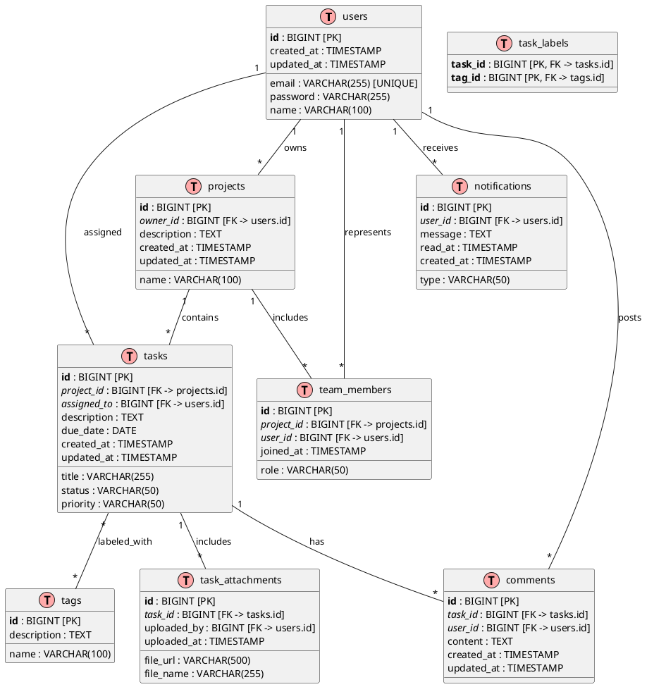

# 🎓 Lesson 18-8: DB Design

| Item | Details |
|------|------|
| Goal | Create TaskFlow ER diagrams (PlantUML) and entity specification documents |
| Duration | ~25 min |
| Skills Used | diagram-generator skill |
| Prerequisites | Lesson 18-7 completed、output/pm/usecases.md, requirements-spec.md exists |
| Lesson Page | [Module 18](https://ai-agent.camp/en/course/module-18) |

## 📍 Step 1: Identifying Entities

As the first step in TaskFlow's data model design, identify the required entities (tables). Refer to use cases and requirements specifications to determine the level of detail for the data model design.

```json
{
  "type": "AskQuestion",
  "question": "Select the complexity of TaskFlow's data model",
  "options": [
    "Simple (4 tables)",
    "Standard (7 tables)",
    "Detailed (10+ tables)",
    "Get AI suggestions"
  ],
  "context": "Determine the number of tables needed for a project/task management tool.",
  "store_as": "complexity_level"
}
```

### 🎓 Entity Candidate List

The following core entities are required for TaskFlow:

| Entity Name | Description | Purpose |
|---|---|---|
| users | User information (auth/profile) | Authentication, ownership management |
| projects | Projects | Unit for tasks and teams |
| tasks | Tasks | Items within a project |
| comments | Comments/discussions | Feedback on tasks |
| notifications | Notification log | Notification history for users |
| tags | Tag master | Task classification |
| task_labels | Task-tag junction table | N:M relationship resolution |
| team_members | Project members | Access rights management |
| task_attachments | File attachments | Document management |
| activity_log | Audit log | Operation history tracking |

**Simple configuration (4 tables):**
- users, projects, tasks, comments

**Standard configuration (7 tables):**
- users, projects, tasks, comments, notifications, tags, task_labels

**Detailed configuration (10+ tables):**
- In addition to the above: team_members, task_attachments, activity_log, etc.

---

## 🚀 Step 2: Creating the ER Diagram (PlantUML)

Represent relationships between entities in a diagram. Visualize the database design using PlantUML.

```json
{
  "type": "AskQuestion",
  "question": "Select the ER diagram notation",
  "options": [
    "PlantUML Standard",
    "IE Notation (Crow's Foot)",
    "Simple Notation"
  ],
  "context": "Select the relationship representation method for the ER diagram.",
  "store_as": "er_notation"
}
```

### 🎓 PlantUML ER Diagram Basic Syntax

The following syntax is used for ER diagrams with PlantUML:



### 📍 IE Notation (Crow's Foot) Example

In IE notation, cardinality is expressed as follows:

```text
1:1  → ── or ──o
1:N  → ──< (Crow's Foot)
N:M  → >──<
```

---

## ⚠️ Step 3: Entity Specification (Column Definitions)

Create detailed column definitions for each table. By specifying data types, constraints, and default values, this serves as a guide for the development team during implementation.

```json
{
  "type": "AskQuestion",
  "question": "Select the specification detail level",
  "options": [
    "Column name + type only",
    "+ Constraints",
    "+ Indexes + Default values",
    "Full spec"
  ],
  "context": "Select the level of detail to include in the entity specification.",
  "store_as": "spec_detail_level"
}
```

### 🎓 Entity Specification Template

Document the specification for each table in the following format:

```markdown
### Table: users
User information and profile management

| # | Column Name | Data Type | NULL | Default Value | Constraint | Index | Description |
|---|---|---|---|---|---|---|---|
| 1 | id | BIGINT | NO | AUTO_INCREMENT | PK | PRIMARY | User ID |
| 2 | email | VARCHAR(255) | NO | - | UNIQUE | UNIQUE | Email address |
| 3 | password | VARCHAR(255) | NO | - | - | - | Password hash |
| 4 | name | VARCHAR(100) | YES | NULL | - | - | User name |
| 5 | created_at | TIMESTAMP | NO | CURRENT_TIMESTAMP | - | - | Created at |
| 6 | updated_at | TIMESTAMP | NO | CURRENT_TIMESTAMP | - | - | Updated at |

---

### Table: projects
Project information

| # | Column Name | Data Type | NULL | Default Value | Constraint | Index | Description |
|---|---|---|---|---|---|---|---|
| 1 | id | BIGINT | NO | AUTO_INCREMENT | PK | PRIMARY | Project ID |
| 2 | owner_id | BIGINT | NO | - | FK(users.id) | INDEX | Owner user ID |
| 3 | name | VARCHAR(100) | NO | - | - | INDEX | Project name |
| 4 | description | TEXT | YES | NULL | - | - | Project description |
| 5 | created_at | TIMESTAMP | NO | CURRENT_TIMESTAMP | - | - | Created at |
| 6 | updated_at | TIMESTAMP | NO | CURRENT_TIMESTAMP | - | - | Updated at |

---

### Table: tasks
Task items

| # | Column Name | Data Type | NULL | Default Value | Constraint | Index | Description |
|---|---|---|---|---|---|---|---|
| 1 | id | BIGINT | NO | AUTO_INCREMENT | PK | PRIMARY | Task ID |
| 2 | project_id | BIGINT | NO | - | FK(projects.id) | INDEX | Project ID |
| 3 | assigned_to | BIGINT | YES | NULL | FK(users.id) | INDEX | Assignee user ID |
| 4 | title | VARCHAR(255) | NO | - | - | INDEX | Task title |
| 5 | description | TEXT | YES | NULL | - | - | Task details |
| 6 | status | VARCHAR(50) | NO | 'todo' | CHECK IN ('todo','in_progress','done','blocked') | INDEX | Status |
| 7 | priority | VARCHAR(50) | NO | 'medium' | CHECK IN ('low','medium','high','critical') | INDEX | Priority |
| 8 | due_date | DATE | YES | NULL | - | INDEX | Due date |
| 9 | created_at | TIMESTAMP | NO | CURRENT_TIMESTAMP | - | - | Created at |
| 10 | updated_at | TIMESTAMP | NO | CURRENT_TIMESTAMP | - | - | Updated at |

---

### Table: comments
Comments and discussions

| # | Column Name | Data Type | NULL | Default Value | Constraint | Index | Description |
|---|---|---|---|---|---|---|---|
| 1 | id | BIGINT | NO | AUTO_INCREMENT | PK | PRIMARY | Comment ID |
| 2 | task_id | BIGINT | NO | - | FK(tasks.id) | INDEX | Task ID |
| 3 | user_id | BIGINT | NO | - | FK(users.id) | INDEX | Author user ID |
| 4 | content | TEXT | NO | - | - | - | Comment content |
| 5 | created_at | TIMESTAMP | NO | CURRENT_TIMESTAMP | - | - | Created at |
| 6 | updated_at | TIMESTAMP | NO | CURRENT_TIMESTAMP | - | - | Updated at |

---

### Table: notifications
Notification log

| # | Column Name | Data Type | NULL | Default Value | Constraint | Index | Description |
|---|---|---|---|---|---|---|---|
| 1 | id | BIGINT | NO | AUTO_INCREMENT | PK | PRIMARY | Notification ID |
| 2 | user_id | BIGINT | NO | - | FK(users.id) | INDEX | User ID |
| 3 | type | VARCHAR(50) | NO | - | CHECK IN ('task_assigned','comment','mention','deadline') | INDEX | Notification type |
| 4 | message | TEXT | NO | - | - | - | Notification message |
| 5 | read_at | TIMESTAMP | YES | NULL | - | INDEX | Read at |
| 6 | created_at | TIMESTAMP | NO | CURRENT_TIMESTAMP | - | INDEX | Created at |

---

### Table: tags
Tags/labels master

| # | Column Name | Data Type | NULL | Default Value | Constraint | Index | Description |
|---|---|---|---|---|---|---|---|
| 1 | id | BIGINT | NO | AUTO_INCREMENT | PK | PRIMARY | Tag ID |
| 2 | name | VARCHAR(100) | NO | - | UNIQUE | UNIQUE | Tag name |
| 3 | description | TEXT | YES | NULL | - | - | Tag description |

---

### Table: task_labels
Task-tag association (N:M relationship resolution)

| # | Column Name | Data Type | NULL | Default Value | Constraint | Index | Description |
|---|---|---|---|---|---|---|---|
| 1 | task_id | BIGINT | NO | - | PK, FK(tasks.id) | PRIMARY | Task ID |
| 2 | tag_id | BIGINT | NO | - | PK, FK(tags.id) | PRIMARY | Tag ID |

**Composite primary key:** (task_id, tag_id)

---

### Table: team_members
Project member and access management

| # | Column Name | Data Type | NULL | Default Value | Constraint | Index | Description |
|---|---|---|---|---|---|---|---|
| 1 | id | BIGINT | NO | AUTO_INCREMENT | PK | PRIMARY | Member record ID |
| 2 | project_id | BIGINT | NO | - | FK(projects.id) | INDEX | Project ID |
| 3 | user_id | BIGINT | NO | - | FK(users.id) | INDEX | User ID |
| 4 | role | VARCHAR(50) | NO | 'member' | CHECK IN ('owner','admin','member','viewer') | INDEX | Role |
| 5 | joined_at | TIMESTAMP | NO | CURRENT_TIMESTAMP | - | - | Joined at |

**Composite unique:** (project_id, user_id)

---

### Table: task_attachments
File attachment and document management

| # | Column Name | Data Type | NULL | Default Value | Constraint | Index | Description |
|---|---|---|---|---|---|---|---|
| 1 | id | BIGINT | NO | AUTO_INCREMENT | PK | PRIMARY | Attachment ID |
| 2 | task_id | BIGINT | NO | - | FK(tasks.id) | INDEX | Task ID |
| 3 | file_url | VARCHAR(500) | NO | - | - | - | File URL |
| 4 | file_name | VARCHAR(255) | NO | - | - | - | File name |
| 5 | uploaded_by | BIGINT | NO | - | FK(users.id) | INDEX | Uploader user ID |
| 6 | uploaded_at | TIMESTAMP | NO | CURRENT_TIMESTAMP | - | INDEX | Uploaded at |
```

---

## ✅ Step 4: Normalization Review

Verify the normalization level of the database design and balance performance with maintainability.

```json
{
  "type": "AskQuestion",
  "question": "Select the normalization level",
  "options": [
    "Verify up to 3NF",
    "Consider denormalization",
    "Decide based on performance"
  ],
  "context": "Select the normalization strategy for database design.",
  "store_as": "normalization_level"
}
```

### 🎓 Normalization Checklist

**First Normal Form (1NF) verification:**
- [ ] Are all columns atomic (indivisible)?
- [ ] Are there no repeating groups?
- [ ] Does each table have a primary key?

**Second Normal Form (2NF) verification:**
- [ ] Does it satisfy 1NF?
- [ ] Are all non-key attributes fully functionally dependent on the entire primary key?
- [ ] Are there no partial functional dependencies?

**Third Normal Form (3NF) verification:**
- [ ] Does it satisfy 2NF?
- [ ] Are there no non-key attributes functionally dependent on anything other than the primary key?
- [ ] Are there no transitive functional dependencies?

### 📍 TaskFlow Normalization Analysis

**users table → 3NF achieved**
```text
PK: id
email, password, name are all functionally dependent on id
No transitive functional dependency ✓
```

**projects table → 3NF achieved**
```text
PK: id
owner_id, name, description are functionally dependent on id
owner_id is a foreign key reference to the users table ✓
```

**tasks table → 3NF achieved**
```text
PK: id
project_id, assigned_to are functionally dependent on id
status, priority are directly functionally dependent on id (state attributes) ✓
```

**task_labels table → Proper resolution of N:M relationship**
```text
Composite PK: (task_id, tag_id)
Normalization maintained with junction table ✓
```

### ⚠️ Denormalization Considerations

**Considerations for query performance optimization:**

1. **Denormalization of tasks.status_name**
   - Consideration: ENUM/CHECK constraints are sufficient for the status column
   - Recommendation: Denormalization not needed (reference table is small)

2. **Denormalization of projects.team_count**
   - Consideration: When member count is frequently displayed
   - Recommendation: Handle with aggregate queries or caching

3. **Denormalization of tasks.comment_count**
   - Consideration: When comment count is frequently displayed
   - Recommendation: Handle with aggregate queries or event-based updates

---

## ➡️ Creating Deliverables

The deliverables to create in this lesson are as follows:

### 📍 output/pm/er-diagram.puml

An ER diagram file in PlantUML format. Create it according to the selected level of detail, referring to the PlantUML ER diagram basic syntax above.

**File should contain:**
- `@startuml` / `@enduml` tags
- All entity definitions
- PK, FK, and constraints clearly specified
- Relationship definitions
- Comments (description of each entity)

### 📍 output/pm/entity-spec.md

An entity specification document in Markdown format. Document the column definitions, data types, constraints, and descriptions for each table in table format.

**File should contain:**
- Overview description of each table
- Column list table (column name, data type, nullable, default value, constraints, description)
- Index strategy
- Normalization verification notes

---

## 🚀 Implementation Guidelines

### PlantUML Generation Checkpoint

```json
{
  "type": "AskQuestion",
  "question": "Generate ER diagram with diagram-generator skill?",
  "options": [
    "Yes, auto-generate",
    "I will create manually",
    "Copy template and modify"
  ],
  "context": "Select how to create the PlantUML ER diagram.",
  "store_as": "diagram_generation_method"
}
```

**diagram-generator skill execution command example:**
```bash
/diagram-generator \
  --type er \
  --format puml \
  --entities users,projects,tasks,comments,notifications,tags,task_labels,team_members,task_attachments \
  --output output/pm/er-diagram.puml
```

### Entity Specification Creation Checkpoint

1. **5 or more tables created** ✓
2. **ER diagram relationship definition complete** ✓
3. **Column specifications (data types, constraints) documented** ✓
4. **Normalization verification (1NF/2NF/3NF analysis) complete** ✓

---

## ⚠️ Troubleshooting

### Q: I don't understand PlantUML ER diagram syntax

**A:** Refer to the PlantUML documentation:
- [PlantUML Entity Diagram](https://plantuml.com/en/entity-diagram)
- The basic syntax is `entity table_name { column definitions }`, and relationships are expressed with `--, --|>, etc`

### Q: Relationship expressions are complex

**A:** Think about it in these 3 steps:
1. Which tables are related? (edges)
2. What is the cardinality? (1:1, 1:N, N:M)
3. Are N:M relationships resolved with junction tables?

**Example:** tasks and tags N:M relationship → resolved with task_labels table

### Q: Too many tables

**A:** Consider merging from the following perspectives:
- Are attributes belonging to the same entity in the same table?
- Are there too many foreign key references?
- Can infrequently used tables be managed separately?

### Q: I don't understand the normalization criteria

**A:** Judge by the following questions:
1. **1NF**: Are all columns single values? (No lists or arrays?)
2. **2NF**: Are non-key attributes dependent on all parts of the primary key?
3. **3NF**: Are non-key attributes not dependent on other non-key attributes?

---

## ✅ Checkpoint

Verification items upon completion:

- [ ] **5 or more entities created** - users, projects, tasks, comments, notifications, tags, task_labels, etc.
- [ ] **ER diagram relationships defined** - Including 1:N, N:M, FK
- [ ] **Column specifications created** - Data types, constraints, default values, descriptions documented
- [ ] **Normalization verified** - 1NF/2NF/3NF levels confirmed
- [ ] **er-diagram.puml generated** - Placed in output/pm/ directory
- [ ] **entity-spec.md generated** - Placed in output/pm/ directory


---

## 📋 Deliverables Preview

### Expected Output
```text
📁 output/pm/
└── er-diagram.puml  (ER Diagram (PlantUML))
```

### Verification Commands
```bash
# Check file existence and size
ls -lh output/pm/er-diagram.puml

# Check the beginning (first 30 lines)
head -30 output/pm/er-diagram.puml
```

> 💡 Full text: Run `cat output/pm/er-diagram.puml` to display the full text

---

## ➡️ Next Steps

When this lesson is complete, proceed to the following step:

**→ [/start-18-9 (System Architecture & API Design)](start-18-9.md)**

Create system architecture diagrams (C4 model), API design (REST/GraphQL), and endpoint specifications.

---

## 📍 Related Materials

- [Module 18: PM - System Definition](https://ai-agent.camp/en/course/module-18)
- [18-7: Screen Transition Diagram & Wireframes](start-18-7.md)
- PlantUML documentation: https://plantuml.com/
- DB design best practices: https://en.wikipedia.org/wiki/Database_normalization
