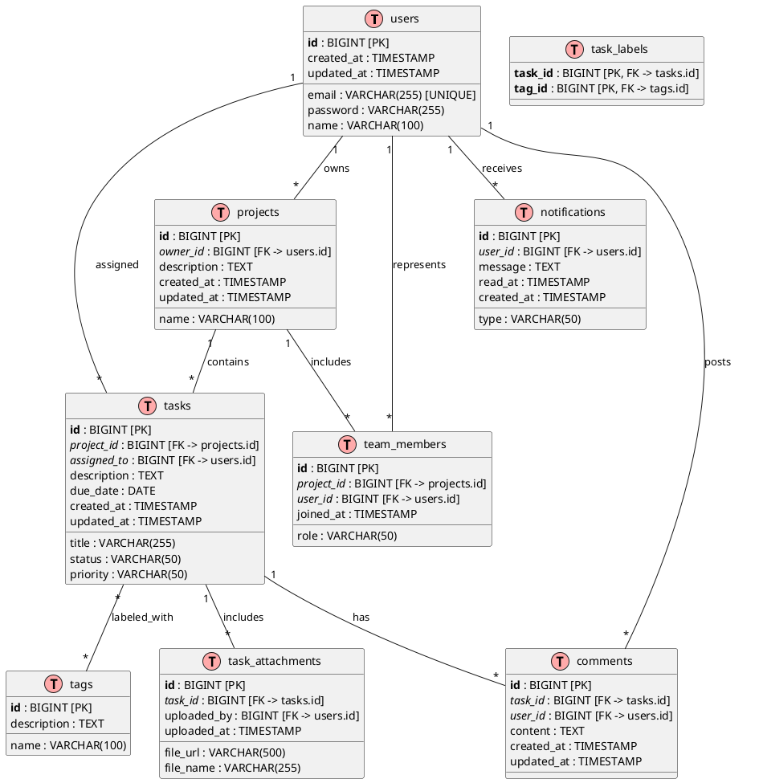

# 🎓 Lesson 18-8: Diseño de BD

| Elemento | Detalles |
|------|------|
| Objetivo | Crear diagramas ER de TaskFlow (PlantUML) y documentos de especificación de entidades |
| Duración | ~25 min |
| Habilidades utilizadas | habilidad diagram-generator |
| Requisitos previos | Lesson 18-7 completada、output/pm/usecases.md, requirements-spec.md existe |
| Página del material | [Module 18](https://ai-agent.camp/es/course/module-18) |

## 📍 Paso 1: Identificación de entidades

Como primer paso en el diseño del modelo de datos de TaskFlow, identifique las entidades (tablas) necesarias. Consulte los casos de uso y las especificaciones de requisitos para determinar el nivel de detalle del diseño del modelo de datos.

```json
{
  "type": "AskQuestion",
  "question": "Seleccione la complejidad del modelo de datos de TaskFlow",
  "options": [
    "Simple (4 tablas)",
    "Estandar (7 tablas)",
    "Detallado (10+ tablas)",
    "Obtener sugerencias de IA"
  ],
  "context": "Determine el numero de tablas necesarias para una herramienta de gestion de proyectos/tareas.",
  "store_as": "complexity_level"
}
```

### 🎓 Lista de entidades candidatas

Las siguientes entidades principales son necesarias para TaskFlow:

| Nombre de entidad | Descripción | Propósito |
|---|---|---|
| users | Información de usuario (autenticación/perfil) | Autenticación, gestión de propiedad |
| projects | Proyectos | Unidad de tareas y equipos |
| tasks | Tareas | Elementos dentro de un proyecto |
| comments | Comentarios/discusiones | Retroalimentación sobre tareas |
| notifications | Registro de notificaciones | Historial de notificaciones para usuarios |
| tags | Maestro de etiquetas | Clasificación de tareas |
| task_labels | Tabla intermedia tarea-etiqueta | Resolución de relación N:M |
| team_members | Miembros del proyecto | Gestión de derechos de acceso |
| task_attachments | Archivos adjuntos | Gestión de documentos |
| activity_log | Registro de auditoría | Seguimiento de historial de operaciones |

**Configuración simple (4 tablas):**
- users, projects, tasks, comments

**Configuración estándar (7 tablas):**
- users, projects, tasks, comments, notifications, tags, task_labels

**Configuración detallada (10+ tablas):**
- Además de lo anterior: team_members, task_attachments, activity_log, etc.

---

## 🚀 Paso 2: Creación del diagrama ER (PlantUML)

Represente las relaciones entre entidades en un diagrama. Visualice el diseño de la base de datos usando PlantUML.

```json
{
  "type": "AskQuestion",
  "question": "Seleccione la notacion del diagrama ER",
  "options": [
    "PlantUML Estandar",
    "Notacion IE (Pata de cuervo)",
    "Notacion simple"
  ],
  "context": "Seleccione el metodo de representacion de relaciones para el diagrama ER.",
  "store_as": "er_notation"
}
```

### 🎓 Sintaxis básica del diagrama ER PlantUML

La siguiente sintaxis se utiliza para diagramas ER con PlantUML:



### 📍 Ejemplo de notación IE (pata de cuervo)

En la notación IE, la cardinalidad se expresa de la siguiente manera:

```text
1:1  → ── or ──o
1:N  → ──< (Pata de cuervo)
N:M  → >──<
```

---

## ⚠️ Paso 3: Especificación de entidades (definición de columnas)

Cree definiciones detalladas de columnas para cada tabla. Al especificar tipos de datos, restricciones y valores predeterminados, esto sirve como guía para el equipo de desarrollo durante la implementación.

```json
{
  "type": "AskQuestion",
  "question": "Seleccione el nivel de detalle de la especificacion",
  "options": [
    "Solo nombre de columna + tipo",
    "+ Restricciones",
    "+ Indices + Valores predeterminados",
    "Especificacion completa"
  ],
  "context": "Seleccione el nivel de detalle a incluir en la especificacion de la entidad.",
  "store_as": "spec_detail_level"
}
```

### 🎓 Plantilla de especificación de entidades

Documente la especificación de cada tabla en el siguiente formato:

```markdown
### Tabla: users
Informacion de usuario y gestion de perfil

| # | Nombre de columna | Tipo de dato | NULL | Valor predeterminado | Restriccion | Indice | Descripcion |
|---|---|---|---|---|---|---|---|
| 1 | id | BIGINT | NO | AUTO_INCREMENT | PK | PRIMARY | ID de usuario |
| 2 | email | VARCHAR(255) | NO | - | UNIQUE | UNIQUE | Direccion de correo electronico |
| 3 | password | VARCHAR(255) | NO | - | - | - | Hash de contrasena |
| 4 | name | VARCHAR(100) | YES | NULL | - | - | Nombre de usuario |
| 5 | created_at | TIMESTAMP | NO | CURRENT_TIMESTAMP | - | - | Fecha de creacion |
| 6 | updated_at | TIMESTAMP | NO | CURRENT_TIMESTAMP | - | - | Fecha de actualizacion |

---

### Tabla: projects
Informacion del proyecto

| # | Nombre de columna | Tipo de dato | NULL | Valor predeterminado | Restriccion | Indice | Descripcion |
|---|---|---|---|---|---|---|---|
| 1 | id | BIGINT | NO | AUTO_INCREMENT | PK | PRIMARY | ID del proyecto |
| 2 | owner_id | BIGINT | NO | - | FK(users.id) | INDEX | ID del usuario propietario |
| 3 | name | VARCHAR(100) | NO | - | - | INDEX | Nombre del proyecto |
| 4 | description | TEXT | YES | NULL | - | - | Descripcion del proyecto |
| 5 | created_at | TIMESTAMP | NO | CURRENT_TIMESTAMP | - | - | Fecha de creacion |
| 6 | updated_at | TIMESTAMP | NO | CURRENT_TIMESTAMP | - | - | Fecha de actualizacion |

---

### Tabla: tasks
Elementos de tarea

| # | Nombre de columna | Tipo de dato | NULL | Valor predeterminado | Restriccion | Indice | Descripcion |
|---|---|---|---|---|---|---|---|
| 1 | id | BIGINT | NO | AUTO_INCREMENT | PK | PRIMARY | ID de tarea |
| 2 | project_id | BIGINT | NO | - | FK(projects.id) | INDEX | ID del proyecto |
| 3 | assigned_to | BIGINT | YES | NULL | FK(users.id) | INDEX | ID del usuario responsable |
| 4 | title | VARCHAR(255) | NO | - | - | INDEX | Titulo de la tarea |
| 5 | description | TEXT | YES | NULL | - | - | Detalles de la tarea |
| 6 | status | VARCHAR(50) | NO | 'todo' | CHECK IN ('todo','in_progress','done','blocked') | INDEX | Estado |
| 7 | priority | VARCHAR(50) | NO | 'medium' | CHECK IN ('low','medium','high','critical') | INDEX | Prioridad |
| 8 | due_date | DATE | YES | NULL | - | INDEX | Fecha de vencimiento |
| 9 | created_at | TIMESTAMP | NO | CURRENT_TIMESTAMP | - | - | Fecha de creacion |
| 10 | updated_at | TIMESTAMP | NO | CURRENT_TIMESTAMP | - | - | Fecha de actualizacion |

---

### Tabla: comments
Comentarios y discusiones

| # | Nombre de columna | Tipo de dato | NULL | Valor predeterminado | Restriccion | Indice | Descripcion |
|---|---|---|---|---|---|---|---|
| 1 | id | BIGINT | NO | AUTO_INCREMENT | PK | PRIMARY | ID del comentario |
| 2 | task_id | BIGINT | NO | - | FK(tasks.id) | INDEX | ID de tarea |
| 3 | user_id | BIGINT | NO | - | FK(users.id) | INDEX | ID del usuario autor |
| 4 | content | TEXT | NO | - | - | - | Contenido del comentario |
| 5 | created_at | TIMESTAMP | NO | CURRENT_TIMESTAMP | - | - | Fecha de creacion |
| 6 | updated_at | TIMESTAMP | NO | CURRENT_TIMESTAMP | - | - | Fecha de actualizacion |

---

### Tabla: notifications
Registro de notificaciones

| # | Nombre de columna | Tipo de dato | NULL | Valor predeterminado | Restriccion | Indice | Descripcion |
|---|---|---|---|---|---|---|---|
| 1 | id | BIGINT | NO | AUTO_INCREMENT | PK | PRIMARY | ID de notificacion |
| 2 | user_id | BIGINT | NO | - | FK(users.id) | INDEX | ID de usuario |
| 3 | type | VARCHAR(50) | NO | - | CHECK IN ('task_assigned','comment','mention','deadline') | INDEX | Tipo de notificacion |
| 4 | message | TEXT | NO | - | - | - | Mensaje de notificacion |
| 5 | read_at | TIMESTAMP | YES | NULL | - | INDEX | Fecha de lectura |
| 6 | created_at | TIMESTAMP | NO | CURRENT_TIMESTAMP | - | INDEX | Fecha de creacion |

---

### Tabla: tags
Maestro de etiquetas

| # | Nombre de columna | Tipo de dato | NULL | Valor predeterminado | Restriccion | Indice | Descripcion |
|---|---|---|---|---|---|---|---|
| 1 | id | BIGINT | NO | AUTO_INCREMENT | PK | PRIMARY | ID de etiqueta |
| 2 | name | VARCHAR(100) | NO | - | UNIQUE | UNIQUE | Nombre de etiqueta |
| 3 | description | TEXT | YES | NULL | - | - | Descripcion de la etiqueta |

---

### Tabla: task_labels
Asociacion tarea-etiqueta (resolucion de relacion N:M)

| # | Nombre de columna | Tipo de dato | NULL | Valor predeterminado | Restriccion | Indice | Descripcion |
|---|---|---|---|---|---|---|---|
| 1 | task_id | BIGINT | NO | - | PK, FK(tasks.id) | PRIMARY | ID de tarea |
| 2 | tag_id | BIGINT | NO | - | PK, FK(tags.id) | PRIMARY | ID de etiqueta |

**Clave primaria compuesta:** (task_id, tag_id)

---

### Tabla: team_members
Gestion de miembros y acceso del proyecto

| # | Nombre de columna | Tipo de dato | NULL | Valor predeterminado | Restriccion | Indice | Descripcion |
|---|---|---|---|---|---|---|---|
| 1 | id | BIGINT | NO | AUTO_INCREMENT | PK | PRIMARY | ID del registro de miembro |
| 2 | project_id | BIGINT | NO | - | FK(projects.id) | INDEX | ID del proyecto |
| 3 | user_id | BIGINT | NO | - | FK(users.id) | INDEX | ID de usuario |
| 4 | role | VARCHAR(50) | NO | 'member' | CHECK IN ('owner','admin','member','viewer') | INDEX | Rol |
| 5 | joined_at | TIMESTAMP | NO | CURRENT_TIMESTAMP | - | - | Fecha de ingreso |

**Unico compuesto:** (project_id, user_id)

---

### Tabla: task_attachments
Gestion de archivos adjuntos y documentos

| # | Nombre de columna | Tipo de dato | NULL | Valor predeterminado | Restriccion | Indice | Descripcion |
|---|---|---|---|---|---|---|---|
| 1 | id | BIGINT | NO | AUTO_INCREMENT | PK | PRIMARY | ID del archivo adjunto |
| 2 | task_id | BIGINT | NO | - | FK(tasks.id) | INDEX | ID de tarea |
| 3 | file_url | VARCHAR(500) | NO | - | - | - | URL del archivo |
| 4 | file_name | VARCHAR(255) | NO | - | - | - | Nombre del archivo |
| 5 | uploaded_by | BIGINT | NO | - | FK(users.id) | INDEX | ID del usuario que cargo |
| 6 | uploaded_at | TIMESTAMP | NO | CURRENT_TIMESTAMP | - | INDEX | Fecha de carga |
```

---

## ✅ Paso 4: Revisión de normalización

Verifique el nivel de normalización del diseño de la base de datos y equilibre el rendimiento con la mantenibilidad.

```json
{
  "type": "AskQuestion",
  "question": "Seleccione el nivel de normalizacion",
  "options": [
    "Verificar hasta 3FN",
    "Considerar desnormalizacion",
    "Decidir basandose en el rendimiento"
  ],
  "context": "Seleccione la estrategia de normalizacion para el diseno de base de datos.",
  "store_as": "normalization_level"
}
```

### 🎓 Lista de verificación de normalización

**Verificación de la Primera Forma Normal (1NF):**
- [ ] Son todas las columnas atomicas (indivisibles)?
- [ ] No hay grupos repetitivos?
- [ ] Cada tabla tiene una clave primaria?

**Verificación de la Segunda Forma Normal (2NF):**
- [ ] Cumple con la 1NF?
- [ ] Todos los atributos no clave dependen funcionalmente de toda la clave primaria?
- [ ] No hay dependencias funcionales parciales?

**Verificación de la Tercera Forma Normal (3NF):**
- [ ] Cumple con la 2NF?
- [ ] No hay atributos no clave funcionalmente dependientes de algo distinto a la clave primaria?
- [ ] No hay dependencias funcionales transitivas?

### 📍 Análisis de normalización de TaskFlow

**tabla users → 3NF lograda**
```text
PK: id
email, password, name son todos funcionalmente dependientes de id
Sin dependencia funcional transitiva ✓
```

**tabla projects → 3NF lograda**
```text
PK: id
owner_id, name, description son funcionalmente dependientes de id
owner_id es una referencia de clave foranea a la tabla users ✓
```

**tabla tasks → 3NF lograda**
```text
PK: id
project_id, assigned_to son funcionalmente dependientes de id
status, priority son directamente funcionalmente dependientes de id (atributos de estado) ✓
```

**tabla task_labels → Resolución adecuada de la relación N:M**
```text
PK compuesta: (task_id, tag_id)
Normalizacion mantenida con tabla intermedia ✓
```

### ⚠️ Consideraciones de desnormalización

**Consideraciones para la optimización del rendimiento de consultas:**

1. **Desnormalización de tasks.status_name**
   - Consideración: Las restricciones ENUM/CHECK son suficientes para la columna de estado
   - Recomendación: No se necesita desnormalización (la tabla de referencia es pequeña)

2. **Desnormalización de projects.team_count**
   - Consideración: Cuando el recuento de miembros se muestra con frecuencia
   - Recomendación: Manejar con consultas agregadas o almacenamiento en cache

3. **Desnormalización de tasks.comment_count**
   - Consideración: Cuando el recuento de comentarios se muestra con frecuencia
   - Recomendación: Manejar con consultas agregadas o actualizaciones basadas en eventos

---

## ➡️ Creación de entregables

Los entregables a crear en esta lección son los siguientes:

### 📍 output/pm/er-diagram.puml

Un archivo de diagrama ER en formato PlantUML. Creelo según el nivel de detalle seleccionado, consultando la sintaxis básica del diagrama ER PlantUML anterior.

**El archivo debe contener:**
- Etiquetas `@startuml` / `@enduml`
- Todas las definiciones de entidades
- PK, FK y restricciones claramente especificadas
- Definiciones de relaciones
- Comentarios (descripción de cada entidad)

### 📍 output/pm/entity-spec.md

Un documento de especificación de entidades en formato Markdown. Documente las definiciones de columnas, tipos de datos, restricciones y descripciones de cada tabla en formato de tabla.

**El archivo debe contener:**
- Descripción general de cada tabla
- Tabla de lista de columnas (nombre de columna, tipo de dato, nulable, valor predeterminado, restricciones, descripción)
- Estrategia de índices
- Notas de verificación de normalización

---

## 🚀 Directrices de implementación

### Punto de control de generación PlantUML

```json
{
  "type": "AskQuestion",
  "question": "Generar diagrama ER con la habilidad diagram-generator?",
  "options": [
    "Si, generar automaticamente",
    "Creare manualmente",
    "Copiar plantilla y modificar"
  ],
  "context": "Seleccione como crear el diagrama ER PlantUML.",
  "store_as": "diagram_generation_method"
}
```

**Ejemplo de comando de ejecución de la habilidad diagram-generator:**
```bash
/diagram-generator \
  --type er \
  --format puml \
  --entities users,projects,tasks,comments,notifications,tags,task_labels,team_members,task_attachments \
  --output output/pm/er-diagram.puml
```

### Punto de control de creación de especificación de entidades

1. **5 o más tablas creadas** ✓
2. **Definición de relaciones del diagrama ER completada** ✓
3. **Especificaciones de columnas (tipos de datos, restricciones) documentadas** ✓
4. **Verificación de normalización (análisis 1NF/2NF/3NF) completada** ✓

---

## ⚠️ Solución de problemas

### P: No entiendo la sintaxis del diagrama ER de PlantUML

**R:** Consulte la documentación de PlantUML:
- [PlantUML Entity Diagram](https://plantuml.com/en/entity-diagram)
- La sintaxis básica es `entity nombre_tabla { definiciones_columnas }`, y las relaciones se expresan con `--, --|>, etc`

### P: Las expresiones de relaciones son complejas

**R:** Pienselo en estos 3 pasos:
1. Que tablas estan relacionadas? (aristas)
2. Cual es la cardinalidad? (1:1, 1:N, N:M)
3. Las relaciones N:M se resuelven con tablas intermedias?

**Ejemplo:** relación N:M de tasks y tags → resuelta con tabla task_labels

### P: Demasiadas tablas

**R:** Considere fusionar desde las siguientes perspectivas:
- Los atributos que pertenecen a la misma entidad estan en la misma tabla?
- Hay demasiadas referencias de claves foraneas?
- Se pueden gestionar por separado las tablas de uso poco frecuente?

### P: No entiendo los criterios de normalización

**R:** Juzgue con las siguientes preguntas:
1. **1NF**: Todas las columnas son valores unicos? (Sin listas ni matrices?)
2. **2NF**: Los atributos no clave dependen de todas las partes de la clave primaria?
3. **3NF**: Los atributos no clave no dependen de otros atributos no clave?

---

## ✅ Punto de control

Elementos de verificación al finalizar:

- [ ] **5 o más entidades creadas** - users, projects, tasks, comments, notifications, tags, task_labels, etc.
- [ ] **Relaciones del diagrama ER definidas** - Incluyendo 1:N, N:M, FK
- [ ] **Especificaciones de columnas creadas** - Tipos de datos, restricciones, valores predeterminados, descripciones documentadas
- [ ] **Normalización verificada** - Niveles 1NF/2NF/3NF confirmados
- [ ] **er-diagram.puml generado** - Colocado en el directorio output/pm/
- [ ] **entity-spec.md generado** - Colocado en el directorio output/pm/


---

## 📋 Vista previa de entregables

### Salida esperada
```text
📁 output/pm/
└── er-diagram.puml  (Diagrama ER (PlantUML))
```

### Comandos de verificación
```bash
# Verificar existencia y tamano del archivo
ls -lh output/pm/er-diagram.puml

# Verificar el inicio (primeras 30 lineas)
head -30 output/pm/er-diagram.puml
```

> 💡 Texto completo: Ejecute `cat output/pm/er-diagram.puml` para mostrar el texto completo

---

## ➡️ Siguientes pasos

Cuando esta lección se complete, proceda al siguiente paso:

**→ [/start-18-9 (Arquitectura del sistema y diseño de API)](start-18-9.md)**

Cree diagramas de arquitectura del sistema (modelo C4), diseño de API (REST/GraphQL) y especificaciones de endpoints.

---

## 📍 Materiales relacionados

- [Module 18: PM - Definición de sistema](https://ai-agent.camp/es/course/module-18)
- [18-7: Diagrama de transición de pantallas y wireframes](start-18-7.md)
- Documentación de PlantUML: https://plantuml.com/
- Mejores prácticas de diseño de BD: https://en.wikipedia.org/wiki/Database_normalization
