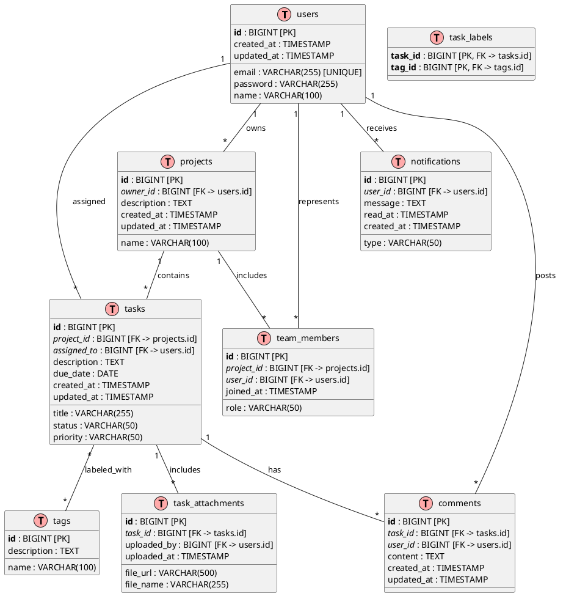

# 🎓 Lesson 18-8: DB設計

| 項目 | 内容 |
|------|------|
| ゴール | TaskFlowのER図（PlantUML）とエンティティ仕様書を作成する |
| 所要時間 | 約25分 |
| 使うスキル | diagram-generator スキル |
| 前提条件 | Lesson 18-7 完了、output/pm/usecases.md, requirements-spec.md が存在する |
| 教材ページ | [Module 18](https://ai-agent.camp/ja/course/module-18) |

## 📍 Step 1: エンティティの洗い出し

TaskFlowのデータモデル設計の最初のステップとして、必要なエンティティ（テーブル）を特定します。ユースケースと要件定義書を参考に、どのレベルの詳細度でデータモデルを設計するかを決定しましょう。

```json
{
  "type": "AskQuestion",
  "question": "TaskFlowのデータモデルの複雑さを選んでください",
  "options": [
    "シンプル（4テーブル）",
    "標準（7テーブル）",
    "詳細（10テーブル以上）",
    "AIに提案してもらう"
  ],
  "context": "プロジェクト管理タスク管理ツールに必要なテーブル数を決定します。",
  "store_as": "complexity_level"
}
```

### 🎓 エンティティの候補一覧

以下のコアエンティティがTaskFlowに必要です：

| エンティティ名 | 説明 | 用途 |
|---|---|---|
| users | ユーザー情報（認証・プロフィール） | 認証、所有権管理 |
| projects | プロジェクト | タスク・チームの単位 |
| tasks | タスク | プロジェクト内のアイテム |
| comments | コメント・議論 | タスクへのフィードバック |
| notifications | 通知ログ | ユーザーへの通知履歴 |
| tags | タグマスタ | タスク分類 |
| task_labels | タスク・タグの中間テーブル | N:M 関係解決 |
| team_members | プロジェクトメンバー | アクセス権管理 |
| task_attachments | ファイル添付 | ドキュメント管理 |
| activity_log | 監査ログ | 操作履歴トラッキング |

**シンプル構成（4テーブル）:**
- users, projects, tasks, comments

**標準構成（7テーブル）:**
- users, projects, tasks, comments, notifications, tags, task_labels

**詳細構成（10テーブル以上）:**
- 上記に加えて：team_members, task_attachments, activity_log など

---

## 🚀 Step 2: ER図の作成（PlantUML）

エンティティ間のリレーションシップを図で表現します。PlantUML を使用して、データベース設計を可視化しましょう。

```json
{
  "type": "AskQuestion",
  "question": "ER図の記法を選んでください",
  "options": [
    "PlantUML標準",
    "IE記法（カラス足）",
    "簡易表記"
  ],
  "context": "ER図のリレーションシップ表現方法を選択します。",
  "store_as": "er_notation"
}
```

### 🎓 PlantUML ER図の基本構文

PlantUML を使用した ER 図には以下の構文を使用します：



### 📍 IE記法（カラス足）の例

IE記法では、カーディナリティを以下のように表現します：

```text
1:1  → ── or ──o
1:N  → ──< (カラス足)
N:M  → >──<
```

---

## ⚠️ Step 3: エンティティ仕様書（カラム定義）

各テーブルの詳細なカラム定義を作成します。データ型、制約条件、デフォルト値などを明記することで、開発チームが実装する際の指針になります。

```json
{
  "type": "AskQuestion",
  "question": "仕様書の詳細レベルを選んでください",
  "options": [
    "カラム名+型のみ",
    "+制約条件",
    "+インデックス+初期値",
    "フルスペック"
  ],
  "context": "エンティティ仕様書に含める情報の詳細度を選択します。",
  "store_as": "spec_detail_level"
}
```

### 🎓 エンティティ仕様書テンプレート

各テーブルについて、以下の形式で仕様を記載します：

```markdown
### テーブル: users
ユーザー情報とプロフィール管理

| # | カラム名 | データ型 | NULL | デフォルト値 | 制約 | インデックス | 説明 |
|---|---|---|---|---|---|---|---|
| 1 | id | BIGINT | NO | AUTO_INCREMENT | PK | PRIMARY | ユーザーID |
| 2 | email | VARCHAR(255) | NO | - | UNIQUE | UNIQUE | メールアドレス |
| 3 | password | VARCHAR(255) | NO | - | - | - | パスワードハッシュ |
| 4 | name | VARCHAR(100) | YES | NULL | - | - | ユーザー名 |
| 5 | created_at | TIMESTAMP | NO | CURRENT_TIMESTAMP | - | - | 作成日時 |
| 6 | updated_at | TIMESTAMP | NO | CURRENT_TIMESTAMP | - | - | 更新日時 |

---

### テーブル: projects
プロジェクト情報

| # | カラム名 | データ型 | NULL | デフォルト値 | 制約 | インデックス | 説明 |
|---|---|---|---|---|---|---|---|
| 1 | id | BIGINT | NO | AUTO_INCREMENT | PK | PRIMARY | プロジェクトID |
| 2 | owner_id | BIGINT | NO | - | FK(users.id) | INDEX | 所有者ユーザーID |
| 3 | name | VARCHAR(100) | NO | - | - | INDEX | プロジェクト名 |
| 4 | description | TEXT | YES | NULL | - | - | プロジェクト説明 |
| 5 | created_at | TIMESTAMP | NO | CURRENT_TIMESTAMP | - | - | 作成日時 |
| 6 | updated_at | TIMESTAMP | NO | CURRENT_TIMESTAMP | - | - | 更新日時 |

---

### テーブル: tasks
タスク・アイテム

| # | カラム名 | データ型 | NULL | デフォルト値 | 制約 | インデックス | 説明 |
|---|---|---|---|---|---|---|---|
| 1 | id | BIGINT | NO | AUTO_INCREMENT | PK | PRIMARY | タスクID |
| 2 | project_id | BIGINT | NO | - | FK(projects.id) | INDEX | プロジェクトID |
| 3 | assigned_to | BIGINT | YES | NULL | FK(users.id) | INDEX | 担当者ユーザーID |
| 4 | title | VARCHAR(255) | NO | - | - | INDEX | タスクタイトル |
| 5 | description | TEXT | YES | NULL | - | - | タスク詳細 |
| 6 | status | VARCHAR(50) | NO | 'todo' | CHECK IN ('todo','in_progress','done','blocked') | INDEX | ステータス |
| 7 | priority | VARCHAR(50) | NO | 'medium' | CHECK IN ('low','medium','high','critical') | INDEX | 優先度 |
| 8 | due_date | DATE | YES | NULL | - | INDEX | 期限 |
| 9 | created_at | TIMESTAMP | NO | CURRENT_TIMESTAMP | - | - | 作成日時 |
| 10 | updated_at | TIMESTAMP | NO | CURRENT_TIMESTAMP | - | - | 更新日時 |

---

### テーブル: comments
コメント・議論

| # | カラム名 | データ型 | NULL | デフォルト値 | 制約 | インデックス | 説明 |
|---|---|---|---|---|---|---|---|
| 1 | id | BIGINT | NO | AUTO_INCREMENT | PK | PRIMARY | コメントID |
| 2 | task_id | BIGINT | NO | - | FK(tasks.id) | INDEX | タスクID |
| 3 | user_id | BIGINT | NO | - | FK(users.id) | INDEX | 投稿者ユーザーID |
| 4 | content | TEXT | NO | - | - | - | コメント内容 |
| 5 | created_at | TIMESTAMP | NO | CURRENT_TIMESTAMP | - | - | 作成日時 |
| 6 | updated_at | TIMESTAMP | NO | CURRENT_TIMESTAMP | - | - | 更新日時 |

---

### テーブル: notifications
通知ログ

| # | カラム名 | データ型 | NULL | デフォルト値 | 制約 | インデックス | 説明 |
|---|---|---|---|---|---|---|---|
| 1 | id | BIGINT | NO | AUTO_INCREMENT | PK | PRIMARY | 通知ID |
| 2 | user_id | BIGINT | NO | - | FK(users.id) | INDEX | ユーザーID |
| 3 | type | VARCHAR(50) | NO | - | CHECK IN ('task_assigned','comment','mention','deadline') | INDEX | 通知タイプ |
| 4 | message | TEXT | NO | - | - | - | 通知メッセージ |
| 5 | read_at | TIMESTAMP | YES | NULL | - | INDEX | 既読日時 |
| 6 | created_at | TIMESTAMP | NO | CURRENT_TIMESTAMP | - | INDEX | 作成日時 |

---

### テーブル: tags
タグ・ラベルマスタ

| # | カラム名 | データ型 | NULL | デフォルト値 | 制約 | インデックス | 説明 |
|---|---|---|---|---|---|---|---|
| 1 | id | BIGINT | NO | AUTO_INCREMENT | PK | PRIMARY | タグID |
| 2 | name | VARCHAR(100) | NO | - | UNIQUE | UNIQUE | タグ名 |
| 3 | description | TEXT | YES | NULL | - | - | タグ説明 |

---

### テーブル: task_labels
タスク・タグ関連付け（N:M関係の解決）

| # | カラム名 | データ型 | NULL | デフォルト値 | 制約 | インデックス | 説明 |
|---|---|---|---|---|---|---|---|
| 1 | task_id | BIGINT | NO | - | PK, FK(tasks.id) | PRIMARY | タスクID |
| 2 | tag_id | BIGINT | NO | - | PK, FK(tags.id) | PRIMARY | タグID |

**複合主キー:** (task_id, tag_id)

---

### テーブル: team_members
プロジェクトメンバー・アクセス権管理

| # | カラム名 | データ型 | NULL | デフォルト値 | 制約 | インデックス | 説明 |
|---|---|---|---|---|---|---|---|
| 1 | id | BIGINT | NO | AUTO_INCREMENT | PK | PRIMARY | メンバーレコードID |
| 2 | project_id | BIGINT | NO | - | FK(projects.id) | INDEX | プロジェクトID |
| 3 | user_id | BIGINT | NO | - | FK(users.id) | INDEX | ユーザーID |
| 4 | role | VARCHAR(50) | NO | 'member' | CHECK IN ('owner','admin','member','viewer') | INDEX | ロール |
| 5 | joined_at | TIMESTAMP | NO | CURRENT_TIMESTAMP | - | - | 参加日時 |

**複合ユニーク:** (project_id, user_id)

---

### テーブル: task_attachments
ファイル添付・ドキュメント管理

| # | カラム名 | データ型 | NULL | デフォルト値 | 制約 | インデックス | 説明 |
|---|---|---|---|---|---|---|---|
| 1 | id | BIGINT | NO | AUTO_INCREMENT | PK | PRIMARY | 添付ファイルID |
| 2 | task_id | BIGINT | NO | - | FK(tasks.id) | INDEX | タスクID |
| 3 | file_url | VARCHAR(500) | NO | - | - | - | ファイルURL |
| 4 | file_name | VARCHAR(255) | NO | - | - | - | ファイル名 |
| 5 | uploaded_by | BIGINT | NO | - | FK(users.id) | INDEX | アップロード者ユーザーID |
| 6 | uploaded_at | TIMESTAMP | NO | CURRENT_TIMESTAMP | - | INDEX | アップロード日時 |
```

---

## ✅ Step 4: 正規化レビュー

データベース設計の正規化レベルを確認し、パフォーマンスと保守性のバランスを取ります。

```json
{
  "type": "AskQuestion",
  "question": "正規化レベルを選んでください",
  "options": [
    "第3正規形まで確認",
    "非正規化も検討",
    "パフォーマンス重視で判断"
  ],
  "context": "データベース設計の正規化戦略を選択します。",
  "store_as": "normalization_level"
}
```

### 🎓 正規化チェックリスト

**第1正規形（1NF）の確認:**
- [ ] すべてのカラムが原子値（分割不可能）か
- [ ] 重複するグループがないか
- [ ] 各テーブルに主キーがあるか

**第2正規形（2NF）の確認:**
- [ ] 1NFをクリアしているか
- [ ] 非キー属性がすべての主キーに完全関数従属しているか
- [ ] 部分関数従属がないか

**第3正規形（3NF）の確認:**
- [ ] 2NFをクリアしているか
- [ ] 非キー属性が主キー以外に関数従属していないか
- [ ] 推移関数従属がないか

### 📍 TaskFlowの正規化分析

**users テーブル → 3NF達成**
```text
PK: id
email, password, name はすべて id に関数従属
推移関数従属なし ✓
```

**projects テーブル → 3NF達成**
```text
PK: id
owner_id, name, description は id に関数従属
owner_id は users テーブルへの外部キー参照 ✓
```

**tasks テーブル → 3NF達成**
```text
PK: id
project_id, assigned_to は id に関数従属
status, priority は id に直接関数従属（状態属性）✓
```

**task_labels テーブル → N:M関係の適切な解決**
```text
複合PK: (task_id, tag_id)
中間テーブルで正規化を維持 ✓
```

### ⚠️ 非正規化検討

**クエリ性能最適化のための検討:**

1. **tasks.status_name の非正規化**
   - 考慮: status カラムは ENUM/CHECK制約で十分
   - 推奨: 非正規化不要（参照テーブルが小さい）

2. **projects の team_count の非正規化**
   - 考慮: メンバー数が頻繁に表示される場合
   - 推奨: 集計クエリまたはキャッシュで対応

3. **tasks の comment_count の非正規化**
   - 考慮: コメント数が頻繁に表示される場合
   - 推奨: 集計クエリまたはイベントベースの更新

---

## ➡️ 成果物の作成

このレッスンで作成すべき成果物は以下の通りです：

### 📍 output/pm/er-diagram.puml

PlantUML 形式の ER 図ファイルです。上記の PlantUML ER図の基本構文を参考に、選択した詳細度に応じて作成してください。

**ファイルの含むべき内容:**
- `@startuml` / `@enduml` タグ
- すべてのエンティティ定義
- PK, FK, 制約の明記
- リレーションシップ定義
- コメント（各エンティティの説明）

### 📍 output/pm/entity-spec.md

マークダウン形式のエンティティ仕様書です。各テーブルのカラム定義、データ型、制約、説明を表形式で記載してください。

**ファイルの含むべき内容:**
- 各テーブルの概要説明
- カラム一覧表（カラム名、データ型、NULL可否、デフォルト値、制約、説明）
- インデックス戦略
- 正規化確認メモ

---

## 🚀 実装ガイドライン

### PlantUML生成時のチェックポイント

```json
{
  "type": "AskQuestion",
  "question": "diagram-generatorスキルでER図を生成しますか？",
  "options": [
    "はい、自動生成してください",
    "手動で作成します",
    "テンプレートをコピーして修正します"
  ],
  "context": "PlantUML ER図の作成方法を選択します。",
  "store_as": "diagram_generation_method"
}
```

**diagram-generatorスキル実行コマンド例:**
```bash
/diagram-generator \
  --type er \
  --format puml \
  --entities users,projects,tasks,comments,notifications,tags,task_labels,team_members,task_attachments \
  --output output/pm/er-diagram.puml
```

### エンティティ仕様書作成のチェックポイント

1. **テーブル5つ以上作成済み** ✓
2. **ER図のリレーション定義完了** ✓
3. **カラム仕様書（データ型、制約）記載済み** ✓
4. **正規化確認（1NF/2NF/3NF分析）完了** ✓

---

## ⚠️ トラブルシューティング

### Q: PlantUML ER図の構文がわかりません

**A:** PlantUML のドキュメントを参照してください：
- [PlantUML Entity Diagram](https://plantuml.com/en/entity-diagram)
- 基本は `entity テーブル名 { カラム定義 }` で、リレーションは `--, --|>, etc` で表現

### Q: リレーションシップの表現が複雑です

**A:** 以下の3つのステップに分けて考えましょう：
1. どのテーブルとどのテーブルが関連するか？（エッジ）
2. カーディナリティはいくつか？（1:1, 1:N, N:M）
3. N:M関係は中間テーブルで解決済みか？

**例:** tasks と tags の N:M 関係 → task_labels テーブルで解決

### Q: テーブル数が多すぎます

**A:** 以下の観点でマージを検討：
- 同じエンティティに属する属性は同じテーブルか？
- 外部キー参照が多すぎないか？
- 使用頻度の低いテーブルは別に管理できないか？

### Q: 正規化の判断基準がわかりません

**A:** 以下の質問で判断：
1. **1NF**: すべてのカラムが単一の値か？（リストや配列がないか？）
2. **2NF**: 非キー属性がすべての主キー部分に依存しているか？
3. **3NF**: 非キー属性が他の非キー属性に依存していないか？

---

## ✅ チェックポイント

完了時の確認項目：

- [ ] **エンティティ5つ以上作成済み** - users, projects, tasks, comments, notifications, tags, task_labels など
- [ ] **ER図のリレーション定義済み** - 1:N, N:M, FK を含む
- [ ] **カラム仕様書作成済み** - データ型、制約、デフォルト値、説明を記載
- [ ] **正規化確認済み** - 1NF/2NF/3NF レベルを確認
- [ ] **er-diagram.puml生成済み** - output/pm/ ディレクトリに配置
- [ ] **entity-spec.md生成済み** - output/pm/ ディレクトリに配置


---

## 📋 成果物プレビュー

### 期待される出力
```text
📁 output/pm/
└── er-diagram.puml  (ER図 (PlantUML))
```

### 確認コマンド
```bash
# ファイルの存在とサイズを確認
ls -lh output/pm/er-diagram.puml

# 冒頭を確認（最初の30行）
head -30 output/pm/er-diagram.puml
```

> 💡 全文を確認: `cat output/pm/er-diagram.puml` で全文表示できます

---

## ➡️ 次のステップ

このレッスンが完了したら、以下のステップに進みます：

**→ [/start-18-9（システム構成図 & API設計）](start-18-9.md)**

システム構成図（C4モデル）、API設計（REST/GraphQL）、エンドポイント仕様書を作成します。

---

## 📍 関連教材

- [Module 18: PM - システム定義](https://ai-agent.camp/ja/course/module-18)
- [16-7: 画面遷移図 & ワイヤーフレーム](start-18-7.md)
- PlantUML ドキュメント: https://plantuml.com/
- DB設計ベストプラクティス: https://en.wikipedia.org/wiki/Database_normalization
