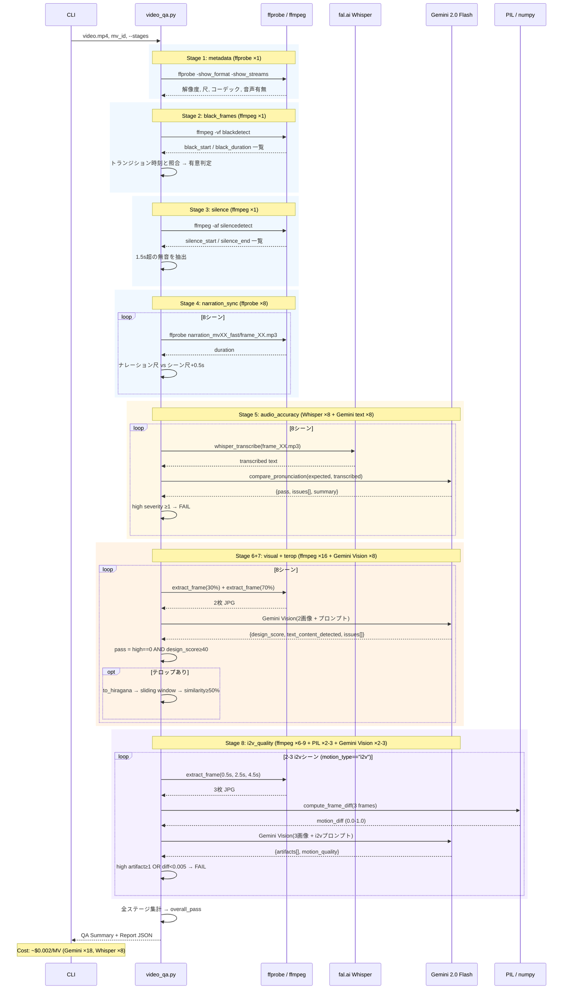

# Video QA パイプライン — シーケンス図

## 全体フロー

## 呼出回数サマリー

| 外部サービス | Stage | 呼出/MV | 備考 |
|-------------|-------|---------|------|
| ffprobe | 1, 4 | 9 | metadata ×1 + narration ×8 |
| ffmpeg | 2, 3, 6-7, 8 | 19-22 | blackdetect ×1 + silencedetect ×1 + frame抽出 ×16 + i2v frame抽出 ×6-9 |
| fal.ai Whisper | 5 | 8 | シーンごとに1回 |
| Gemini text | 5 | 8 | 発音比較（pykakasi + Gemini Flash） |
| Gemini Vision | 6-7, 8 | 10-11 | 映像品質 ×8 + i2v ×2-3 |
| PIL/numpy | 8 | 2-3 | フレーム差分計算 |
| **合計API** | | **26-27** | **~$0.002/MV** |

## pass/fail 判定ルール（Python側で一元管理）

| チェック | FAIL条件 |
|---------|---------|
| metadata | 尺差 ≥ 2.0s or 音声なし |
| black_frames | トランジション外の1.0s超黒フレーム ≥ 1 |
| silence | 1.5s超の無音 ≥ 1 |
| narration_sync | ナレーション超過 > 0.5s |
| audio_accuracy | high severity 発音エラー ≥ 1 |
| terop_verify | テロップ一致率 < 50%（スライディングウィンドウ部分一致） |
| visual | design_score < 40 or high issue ≥ 1 |
| i2v_quality | high severity artifact ≥ 1 or モーション量 < 0.005 |
