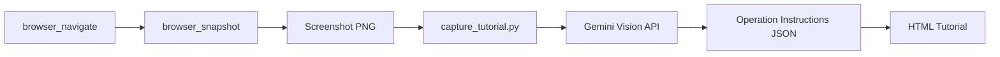

# Capture Tutorial - Generate Operation Tutorials from Screenshots

This command captures screenshots with Cursor Browser and uses the Gemini Vision API to automatically generate operation tutorials explaining "what to do on this screen."

## Features

- Capture screenshots using Cursor Browser's `browser_snapshot`
- Analyze screens with the Gemini Vision API
- Generate operation instructions such as "which button to click" or "where to enter what"
- Output in HTML tutorial format

## Steps

1. **Open the page in Cursor Browser**:
   Navigate to the target page using the `browser_navigate` tool.

2. **Take a screenshot**:
   Execute the `browser_snapshot` tool.
   The screenshot image is saved in the `.playwright-mcp/` folder.

3. **Get the latest image file**:
   Retrieve the latest PNG image from the `.playwright-mcp/` folder.
   ```bash
   ls -t .playwright-mcp/*.png | head -1
   ```

4. **Generate the tutorial**:
   ```bash
   uv run python tools/capture_tutorial.py "{screenshot_path}" --output "{output_path}"
   ```

5. **Verify results**:
   - Open the generated HTML file with Live Server.

## Usage Examples

### Basic usage
```
/capture-tutorial
```
Captures a screenshot of the page currently displayed in Cursor Browser and generates an operation tutorial.

### Generate from an existing screenshot
```
/capture-tutorial .playwright-mcp/google_homepage.png
```

### Specify output destination
```
/capture-tutorial --output docs/tutorials/login_guide.html
```

## Processing Flow



## Output Content

The generated HTML includes the following:

- **Screen overview**: What this screen is for
- **Screenshot**: The original image
- **Operation steps**:
  - Step number
  - Specific action (e.g., click the "Login" button)
  - Detailed description
  - Element location
- **Tips**: Notes and tips for performing operations

## Notes

- Requires `GEMINI_API_KEY` to be set in environment variables (or `.env`).
- Supports PNG, JPG, and JPEG image formats.
- The output HTML is in a format that can be immediately viewed with VS Code Live Server.

## Related Tools

- `tools/capture_tutorial.py` - Main Python script
- `tools/bootcamp_utils.py` - HTML generation utility
- `tools/annotate_screenshot.py` - Annotation tool (optional)
