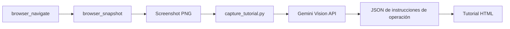

# Capture Tutorial - Generar tutoriales de operación a partir de capturas de pantalla

Este comando captura capturas de pantalla con Cursor Browser y utiliza la Gemini Vision API para generar automáticamente tutoriales de operación que explican "qué hacer en esta pantalla."

## Funcionalidades

- Capturar capturas de pantalla usando `browser_snapshot` de Cursor Browser
- Analizar pantallas con la Gemini Vision API
- Generar instrucciones de operación como "qué botón hacer clic" o "dónde ingresar qué"
- Salida en formato de tutorial HTML

## Pasos

1. **Abrir la página en Cursor Browser**:
   Navegue a la página objetivo usando la herramienta `browser_navigate`.

2. **Tomar una captura de pantalla**:
   Ejecute la herramienta `browser_snapshot`.
   La imagen de la captura de pantalla se guarda en la carpeta `.playwright-mcp/`.

3. **Obtener el archivo de imagen más reciente**:
   Obtenga la imagen PNG más reciente de la carpeta `.playwright-mcp/`.
   ```bash
   ls -t .playwright-mcp/*.png | head -1
   ```

4. **Generar el tutorial**:
   ```bash
   uv run python tools/capture_tutorial.py "{ruta_captura}" --output "{ruta_salida}"
   ```

5. **Verificar resultados**:
   - Abra el archivo HTML generado con Live Server.

## Ejemplos de uso

### Uso básico
```
/capture-tutorial
```
Captura una captura de pantalla de la página actualmente mostrada en Cursor Browser y genera un tutorial de operación.

### Generar a partir de una captura de pantalla existente
```
/capture-tutorial .playwright-mcp/google_homepage.png
```

### Especificar destino de salida
```
/capture-tutorial --output docs/tutorials/login_guide.html
```

## Flujo de procesamiento



## Contenido de salida

El HTML generado incluye lo siguiente:

- **Descripción general de la pantalla**: Para qué es esta pantalla
- **Captura de pantalla**: La imagen original
- **Pasos de operación**:
  - Número de paso
  - Acción específica (ej.: hacer clic en el botón "Iniciar sesión")
  - Descripción detallada
  - Ubicación del elemento
- **Consejos**: Notas y consejos para realizar las operaciones

## Notas

- Requiere que `GEMINI_API_KEY` esté configurada en las variables de entorno (o `.env`).
- Compatible con formatos de imagen PNG, JPG y JPEG.
- El HTML de salida está en un formato que se puede ver inmediatamente con VS Code Live Server.

## Herramientas relacionadas

- `tools/capture_tutorial.py` - Script principal de Python
- `tools/bootcamp_utils.py` - Utilidad de generación de HTML
- `tools/annotate_screenshot.py` - Herramienta de anotación (opcional)
