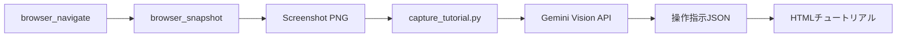

# Capture Tutorial - スクリーンショットから操作チュートリアル生成

このコマンドは、Cursor Browserでスクリーンショットを撮影し、Gemini Vision APIを使用して「この画面で何をすべきか」という操作チュートリアルを自動生成します。

## 機能

- Cursor Browser の `browser_snapshot` でスクリーンショットを取得
- Gemini Vision API で画面を解析
- 「どのボタンをクリックするか」「どこに何を入力するか」といった操作指示を生成
- HTMLチュートリアル形式で出力

## 実行手順

1. **Cursor Browserでページを開く**:
   `browser_navigate` ツールで対象ページに移動します。

2. **スクリーンショットを撮影**:
   `browser_snapshot` ツールを実行します。
   スクリーンショット画像は `.playwright-mcp/` フォルダに保存されます。

3. **最新の画像ファイルを取得**:
   `.playwright-mcp/` フォルダから最新のPNG画像を取得します。
   ```bash
   ls -t .playwright-mcp/*.png | head -1
   ```

4. **チュートリアルを生成**:
   ```bash
   uv run python tools/capture_tutorial.py "{スクリーンショットパス}" --output "{出力パス}"
   ```

5. **結果の確認**:
   - 生成されたHTMLファイルをLive Serverで開きます。

## 使用例

### 基本的な使用
```
/capture-tutorial
```
→ Cursor Browserで現在表示中のページのスクリーンショットを撮影し、操作チュートリアルを生成

### 既存のスクリーンショットから生成
```
/capture-tutorial .playwright-mcp/google_homepage.png
```

### 出力先を指定
```
/capture-tutorial --output docs/tutorials/login_guide.html
```

## 処理フロー



## 出力内容

生成されるHTMLには以下が含まれます：

- **画面の概要**: この画面は何をするための画面か
- **スクリーンショット**: 元の画像
- **操作手順**: 
  - ステップ番号
  - 具体的なアクション（例: 「ログイン」ボタンをクリック）
  - 詳細説明
  - 要素の場所
- **ヒント**: 操作時の注意点やTips

## 注意事項

- 実行には `GEMINI_API_KEY` が環境変数（または `.env`）に設定されている必要があります。
- 画像ファイルはPNG、JPG、JPEG形式に対応しています。
- 出力HTMLはVS Code Live Serverで即座に確認可能な形式です。

## 関連ツール

- `tools/capture_tutorial.py` - メインのPythonスクリプト
- `tools/bootcamp_utils.py` - HTML生成ユーティリティ
- `tools/annotate_screenshot.py` - 注釈追加ツール（オプション）