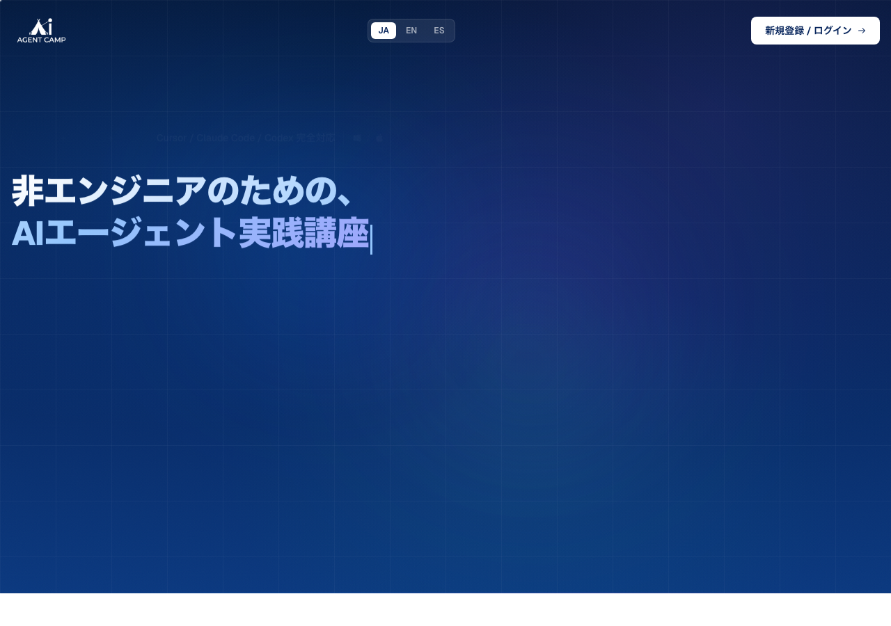

[English](README.md) | [日本語](README.ja.md) | [Español](README.es.md)

# ai-agent-camp

**AI Agent Training for Non-Engineers - Complete Guide to Claude Code / Cursor / Codex**

[](https://github.com/minicoohei/ai-agent-camp)
[](https://github.com/minicoohei/ai-agent-camp/releases)
[](https://www.python.org/)

## Table of Contents

- [Project Overview](#project-overview)
- [Key Features](#key-features)
- [Quick Start](#quick-start)
- [Web Course (Recommended)](#web-course-recommended)
- [Tool Comparison](#tool-comparison)
- [Learning Path](#learning-path)
- [Directory Structure](#directory-structure)
- [Skill Matrix](#skill-matrix)
- [Required APIs](#required-apis)
- [Documentation](#documentation)
- [FAQ](#faq)
- [Contributing](#contributing)
- [Support](#support)

---

## Project Overview

**ai-agent-camp** is a comprehensive training resource for **non-engineering roles** such as marketing, sales, planning, and administration to automate and streamline their work using AI agents like Claude Code, Cursor, and Codex.

### Target Audience

- People with no programming experience
- Those who want to use AI tools in their daily work
- Anyone interested in automation and data analysis
- Teams looking to improve their overall AI literacy

### Vision

Democratize AI agents from "tools for specialists" to "tools everyone can use," boosting productivity across the entire organization.

---

## Key Features

- **Optimized for Non-Engineers**
  - No programming knowledge required
  - Step-by-step tutorials
  - Materials based on real business scenarios

- **Practical Skill Set**
  - 80+ ready-to-use commands
  - 42+ implemented skills (including marketing and LP/HP creation)
  - Business-specific workflow samples

- **Comprehensive Curriculum**
  - AI Fundamentals (Foundation) - 11 chapters
  - Environment Setup - 3 chapters
  - 20 core modules (Google Workspace, video production, requirements definition, marketing, and more)
  - CursorBootcamp YAML metadata support (all chapters)
  - Total study time: approx. 24 hours (30+ hours including exercises)

- **Security and Best Practices**
  - API key management guidelines
  - Secure data handling methods
  - Enterprise deployment guidance

- **Business Workflow Templates**
  - Customer support
  - Sales processes
  - Content marketing
  - Onboarding automation
  - Approval flow optimization

---

## Quick Start

### Prerequisites

- Git installed
- Python 3.9+
- Internet connection
- Cursor, Claude Code, or Codex available

> **Which tool should I choose?** Run `/start-0-8` (Tool Selection Guide) to compare Cursor / Claude Code / Codex and find the best fit.

### Quickest Way to Begin

1. Clone this repo
2. Read the entry point for your tool:
   - Codex: `AGENTS.md`
   - Claude Code: `CLAUDE.md`
   - Cursor: `.cursor/commands/lesson/start-0-1.md` and other files in `.cursor/commands/*`
3. Review the safety rules:
   - Codex: `docs/codex-safety.md`
   - Claude Code / Cursor: `docs/security-guardrails.md`
4. Run setup verification:
   - Codex: `aiagent-check-setup`
   - Cursor: `/check-setup`
5. Start the first lesson with `start-0-1`

### Create Your Own Repository

Copy this repository as your own private repo using one of these methods:

#### Method 1: Import Repository (GUI - Easy)

This can be done entirely through the GitHub web interface.

1. Log in to GitHub and select "+" > "Import repository" in the top right
2. Enter:
   - **Your old repository's clone URL**: `https://github.com/minicoohei/ai-agent-camp.git`
   - **Repository name**: any name (e.g., `my-aiagent`)
   - **Privacy**: Select **Private**
3. Click "Begin import"
4. After import completes, clone your repository:
   ```bash
   git clone https://github.com/{your-username}/my-aiagent.git
   cd my-aiagent
   ```

#### Method 2: Clone & Push (Command Line)

For those comfortable with the terminal.

```bash
# 1. Create an empty Private repository on GitHub

# 2. Create a mirror clone
git clone --bare https://github.com/minicoohei/ai-agent-camp.git my-aiagent.git
cd my-aiagent.git

# 3. Set the new origin and push
git push --mirror https://github.com/{your-username}/my-aiagent.git

# 4. Clone again for regular use
cd ..
git clone https://github.com/{your-username}/my-aiagent.git
```

### Pulling Updates from the Original Repository

When the source materials are updated, pull changes with:

```bash
# First time only: add the original repo as upstream
git remote add upstream https://github.com/minicoohei/ai-agent-camp.git

# Pull updates
git fetch upstream
git merge upstream/main
```

If you use Cursor, you can run **`/update-material`** in chat to do the same thing.

> **Note**: If you have made local changes, merge conflicts may occur. Resolve them manually.

### Installation Steps

#### 1. Clone the Repository

```bash
git clone https://github.com/minicoohei/ai-agent-camp.git ~/ai-agent-camp
cd ~/ai-agent-camp
```

#### 2. Set Up Environment Variables

```bash
# First, prepare the key entry in .env.local
uv run python tools/credential_manager.py prepare-dotenv GEMINI_API_KEY

# After saving, optionally migrate to the Credential Store
# uv run python tools/credential_manager.py import-dotenv GEMINI_API_KEY --delete
```

> Do not paste API keys in chat. Save them in `.env.local`.

#### 3. Install Python Dependencies

```bash
# Install dependencies with uv
uv sync
```

#### 4. Start the Course

```bash
# Open the course in a browser
open https://ai-agent.camp

# Open the workspace in Cursor
cursor .

# Claude Code and Codex also work with the same repo
claude
codex
```

### Getting Started by Tool

#### Cursor

```bash
/check-setup
/overview
/start-0-1
```

#### Claude Code

- Read `CLAUDE.md`
- Review `docs/security-guardrails.md`
- After setup verification, proceed to the lesson flow

#### Codex

- Read `AGENTS.md`
- Open `docs/codex-guide.md`
- Run `aiagent-check-setup` skill for environment verification
- Pass `start-0-1` to the `aiagent-lesson-runner` skill to start the first lesson

---

## Web Course (Recommended)

> **Want a guided, structured learning experience?**
>
> [AI Agent Camp](https://ai-agent.camp) offers a comprehensive web-based course with 28 modules, 100+ lessons, and 70+ practical skills — including a 24/7 AI tutor and a dedicated desktop app for automated environment setup.
>
> The web course covers the same curriculum as this repository, plus additional content and interactive features designed for non-engineers.
>
> 👉 **[Start learning at ai-agent.camp](https://ai-agent.camp)**

<p align="center">
  <a href="https://ai-agent.camp">
    
  </a>
</p>

---

## Tool Comparison

The materials themselves are shared. The differences are in how you enter and interact.

| Item | Codex | Claude Code | Cursor |
| --- | --- | --- | --- |
| Entry point | `AGENTS.md` | `CLAUDE.md` | `.cursor/commands/*` |
| Start lesson | `aiagent-lesson-runner` | Claude lesson flow | `/start-*` |
| Setup check | `aiagent-check-setup` | Claude-side check | `/check-setup` |
| Safety model | sandbox + approval | Claude hooks + permissions | Cursor rules + commands |
| Lesson ID | `start-*` | `start-*` | `start-*` |

Common points:
- All tools use the same repository
- All tools use the same lesson IDs
- Security principles for secrets and Git are the same

Basic rules for learners:
- Keep small tasks lightweight
- Write a short plan before starting large tasks
- Read the relevant safety guide before touching Git, MCP, or secrets

---

## Learning Path

### Phase 1: Foundation (AI Fundamentals) - 5 hours

Learn the basics of AI agents across 11 chapters.

| Chapter | Content | Study Time |
|---------|---------|------------|
| 0-1 | How LLMs Work - Fundamental Principles | 30 min |
| 0-2 | Token Concepts and Calculation | 30 min |
| 0-3 | What Are AI Agents | 30 min |
| 0-4 | Context Engineering and Prompting | 30 min |
| 0-5 | How to Use Cursor | 25 min |
| 0-6 | MCP (Model Context Protocol) | 25 min |
| 0-7 | Multimodal AI | 25 min |
| 0-8 | RAG (Retrieval-Augmented Generation) | 25 min |
| 0-9 | Skills / SubAgents / Agent Teams | 25 min |
| 0-10 | Hallucination Prevention | 25 min |
| 0-11 | AI Security | 25 min |

**Learning Objectives**
- Understand the fundamentals of LLMs
- Know what tokens are
- Grasp AI agent concepts
- Write better prompts
- Understand how MCP, RAG, and multimodal systems work
- Recognize security risks when using AI

---

### Phase 2: Setup (Environment Setup) - 1.5 hours

Prepare to actually use AI agents.

| Module | Content | Study Time |
|--------|---------|------------|
| 0 | Claude Code / Cursor Setup | 30 min |
| 0.5 | Extensions and Customization | 15 min |
| 0.9 | API Key Setup and Authentication | 45 min |

**Learning Objectives**
- Install Claude Code / Cursor
- Manage API keys securely
- Complete basic configuration

---

### Phase 3: Core Modules - 17.5 hours

Acquire skills you can use in real work.

| # | Module | Key Skills | Lessons | Difficulty |
|---|--------|------------|---------|------------|
| **1** | **Banner & Image Generation** | banner-creator, nanobanana | 3 | ★ |
| **2** | **Diagrams & Flowcharts** | diagram-generator, PlantUML | 3 | ★★ |
| **3** | **Tutorials** | screenshot-analyzer, tutorial-generator | 6 | ★★ |
| **4** | **Google Workspace** | gogcli, Gmail, Calendar, Drive, Sheets | 7 | ★★★ |
| **5** | **PPTX Analysis & Editing** | pptx-analyzer, pptx-creator, pptx-converter | 2 | ★★ |
| **6** | **Agent Development** | Commands/Skills creation, customization | 5 | ★★★★ |
| **7** | **Skills & Commands** | Skill design, SKILL.md implementation, testing, design patterns | 8 | ★★★★ |
| **8** | **Data Analysis & EDA** | data-analyst, BigQuery, Marimo | 4 | ★★★ |
| **9** | **Slack Integration** | slack-search, check-inbox, task-manager | 2 | ★ |
| **10** | **GAS Automation** | gas-clasp-ops, Calendar, Sheets | 3 | ★★★ |
| **11** | **GitHub Actions** | Workflow, Secrets, CI/CD | 2 | ★★★ |
| **12** | **Notion Integration** | Notion MCP, DB operations, ncli | 6 | ★★ |
| **13** | **LP/HP Creation** | Messaging, wireframes, Pencil design, HTML, Vercel deploy | 5 | ★★★ |
| **14** | **Article Writing** | article-writer, copy-editing, fact-checker | 7 | ★★★ |
| **15** | **Video Production** | Kling, HeyGen, Veo, Remotion, MV | 8 | ★★★ |
| **16** | **Email/LINE Automation** | email-sequence, Resend, LINE API | 8 | ★★★ |
| **17** | **Marketing** | X posts, SEO research, copywriting, design mocks | 4 | ★★★ |
| **18** | **Requirements & System Dev** | pm-toolkit, test-planner, Notion integration | 20 | ★★★★★ |
| **19** | **Microsoft Office (Outlook)** | Outlook MCP integration | 1 | ★★ |
| **20** | **Freee/MoneyForward** | Freee MCP accounting data operations | 1 | ★★ |

**Total study time: approx. 24 hours (30+ hours including exercises and hands-on tasks)**

### Learning Options

**Recommended order (Beginners)**
```text
Module 1 → Module 2 → Module 3 → Module 5 → Module 6 → Module 8
```

**Recommended order (Business Efficiency Focus)**
```text
Module 4 → Module 9 → Module 10 → Module 11 → Module 12 → Module 8
```

**Recommended order (Creative Focus)**
```text
Module 1 → Module 2 → Module 3 → Module 15 → Module 13 → Module 14
```

**Recommended order (Marketing Focus)**
```text
Module 1 → Module 17 → Module 13 → Module 15 → Module 14 → Module 16
```

---

### CursorBootcamp YAML Metadata

YAML metadata for the CursorBootcamp platform is stored in `courses/aiagent/`. Each chapter includes `practice/` (exercises) and `final/` (final assignments).

| Lesson | Chapters | Content |
|--------|----------|---------|
| **Lesson 01: Foundation** | 11 | LLM basics, Tokens, Agents, Context Engineering, MCP, Multimodal, RAG, SubAgents, Hallucination, Security |
| **Lesson 02: Setup** | 3 | Environment setup, Extensions, API configuration |
| **Lesson 03: Core** | 20 | Banner through Marketing (all core modules) |

All chapters include practice/final content.

---

## Directory Structure

```
ai-agent-camp/
│
├── courses/                              # Curriculum source of truth
│   ├── lessons.manifest.yaml             # Lesson manifest
│   └── aiagent/
│       ├── course.yaml / .en.yaml / .es.yaml  # Course definition (multilingual)
│       ├── cover.png                     # Course cover image
│       ├── lesson01-foundation/          # Fundamentals (11 chapters)
│       │   └── ch01 ~ ch11/             # LLM, Tokens, Agents, MCP, RAG, Security, etc.
│       ├── lesson02-setup/              # Environment setup (3 chapters)
│       │   └── ch01 ~ ch03/             # Environment, Extensions, API setup
│       └── lesson03-core/               # Core skills (20 modules)
│           └── ch01 ~ ch20/             # Banner through Freee (practice/final included)
│
├── .cursor/commands/                     # 80+ commands
│   ├── lesson/                          # Learning commands (52+)
│   │   ├── /start-0-1 ~ /start-0-8     # Module 0: Setup
│   │   ├── /start-1-1 ~ /start-1-3     # Module 1: Banners
│   │   ├── /start-2-1 ~ /start-2-3     # Module 2: Diagrams
│   │   ├── /start-3-1 ~ /start-3-6     # Module 3: Tutorials
│   │   ├── /start-4-1 ~ /start-4-7     # Module 4: Google Workspace
│   │   ├── /start-5-1 ~ /start-5-2     # Module 5: PPTX
│   │   ├── /start-6-1 ~ /start-6-5     # Module 6: Agent Development
│   │   ├── /start-7-1 ~ /start-7-8     # Module 7: Skills/Commands
│   │   ├── /start-8-1 ~ /start-8-4     # Module 8: Data Analysis
│   │   ├── /start-9-1 ~ /start-9-2     # Module 9: Slack
│   │   ├── /start-10-1 ~ /start-10-3   # Module 10: GAS
│   │   ├── /start-11-1 ~ /start-11-2   # Module 11: GitHub Actions
│   │   ├── /start-12-1 ~ /start-12-6   # Module 12: Notion
│   │   ├── /start-13-1 ~ /start-13-5   # Module 13: LP Creation
│   │   ├── /start-14-1 ~ /start-14-7   # Module 14: Article Writing
│   │   ├── /start-15-1 ~ /start-15-8   # Module 15: Video Production
│   │   ├── /start-16-1 ~ /start-16-8   # Module 16: Email/LINE Automation
│   │   ├── /start-17-1 ~ /start-17-4   # Module 17: Marketing
│   │   ├── /start-18-1 ~ /start-18-20  # Module 18: Requirements/System Dev
│   │   ├── /start-19-1                  # Module 19: Outlook (in progress)
│   │   └── /start-20-1                  # Module 20: Freee/MoneyForward (in progress)
│   │
│   └── utility/                         # Utility commands (28+)
│       ├── /check-setup                 # Setup verification
│       ├── /overview                    # Project overview
│       ├── /guide                       # Usage guide
│       ├── /tutor                       # Interactive help
│       ├── /update-material             # Update materials to latest
│       └── ... other helpers
│
├── skills/                              # 42+ reusable skills
│   │
│   │  -- Image & Banner Generation --
│   ├── banner-creator/                  # SNS banner generation
│   ├── nanobanana/                      # General image generation/editing
│   ├── diagram-generator/              # Infographic generation
│   │
│   │  -- Screenshots & Tutorials --
│   ├── screenshot-analyzer/             # Screenshot analysis
│   ├── screenshot-annotator/            # Screenshot annotation
│   ├── tutorial-generator/              # Auto tutorial generation
│   │
│   │  -- Document Processing --
│   ├── pptx-analyzer/                   # PPTX structure analysis
│   ├── pptx-converter/                  # PPTX template conversion
│   ├── pptx-creator/                    # Topic to PPTX auto-generation
│   ├── document-processor/              # PDF/Word processing
│   ├── pdf-compressor/                  # PDF compression
│   │
│   │  -- Video & Media --
│   ├── storyboard-generator/            # Storyboard + Kling video generation
│   ├── video-frame-reader/              # Video keyframe extraction
│   ├── media-generator/                 # Media file generation
│   │
│   │  -- Data Analysis & Auth --
│   ├── data-analyst/                    # Data analysis & EDA
│   ├── bigquery-auth/                   # BigQuery authentication
│   ├── gcp-auth/                        # GCP authentication & setup
│   │
│   │  -- Slack & Communication --
│   ├── check-inbox/                     # Email/Slack TODO extraction
│   ├── slack-search/                    # Slack semantic search
│   ├── slack-task-manager/              # Slack task management
│   ├── slack-unanswered/                # Unanswered message detection
│   │
│   │  -- GAS & Others --
│   ├── gas-clasp-ops/                   # Google Apps Script operations
│   ├── lp-designer/                     # LP/HP creation workflow
│   │
│   │  -- Marketing (20 skills) --
│   ├── ab-test-setup/                   # A/B test design & implementation
│   ├── analytics-tracking/              # GA4/GTM tracking
│   ├── competitor-alternatives/          # Competitor comparison pages
│   ├── content-strategy/                # Content strategy
│   ├── copy-editing/                    # Copy editing & review
│   ├── copywriting/                     # Marketing copy
│   ├── email-sequence/                  # Email sequences
│   ├── free-tool-strategy/              # Free tool strategy
│   ├── launch-strategy/                 # Launch strategy
│   ├── marketing-ideas/                 # Marketing ideas
│   ├── marketing-psychology/            # Marketing psychology
│   ├── paid-ads/                        # Paid ad campaigns
│   ├── pricing-strategy/                # Pricing strategy
│   ├── product-marketing-context/       # Product marketing
│   ├── programmatic-seo/                # Programmatic SEO
│   ├── referral-program/                # Referral programs
│   ├── schema-markup/                   # Structured data
│   ├── seo-audit/                       # SEO audits
│   └── social-content/                  # Social media content
│
├── data/                                # Minimum data for lessons/Codex
│   ├── codex-command-manifest.json      # Codex routing definitions
│   ├── google-sync/                     # Google sync scripts & templates
│   ├── slack-sync/                      # Slack sync scripts & data
│   └── videos/                          # Sample videos for lessons
│
├── tests/                               # Test suite
│   ├── e2e/                             # End-to-end tests
│   ├── security/                        # Security tests
│   ├── skills/                          # Skill tests
│   ├── knowledge_base/                  # Knowledge base tests
│   └── tools/                           # Tool tests
│
├── tools/                               # Python scripts & utilities
│   ├── ugc/                             # Video generation engine
│   │   ├── remotion/                    # Remotion (React video)
│   │   └── ... other video tools
│   └── ... other utilities
│
├── docs/                                # Documentation
│   ├── commands-reference.md            # Full commands reference
│   ├── skills-reference.md              # Full skills reference
│   ├── security-guardrails.md           # Security guardrails
│   ├── codex-guide.md                   # Codex getting started guide
│   ├── codex-safety.md                  # Codex safety guide
│   ├── troubleshoot.md                  # Troubleshooting
│   ├── i18n-glossary.md                 # Internationalization glossary
│   ├── images/                          # Documentation images
│   ├── bootcamp/                        # Bootcamp materials
│   ├── generated/                       # Generated content
│   └── setup-guides/                    # API setup guides
│       └── docs/
│           ├── GEMINI_API_SETUP.md
│           ├── SLACK_TOKEN_SETUP.md
│           ├── GOOGLE_OAUTH_SETUP.md
│           ├── BIGQUERY_SETUP.md
│           ├── NOTION_API_SETUP.md
│           └── GITHUB_SECRETS_SETUP.md
│
├── .cursor/                             # Cursor rules
│   └── rules/                           # Custom rules
│
├── .claude/                             # Claude Code configuration
│   ├── commands/                        # Claude commands
│   └── hooks/                           # Claude hooks
│
├── .github/                             # GitHub Actions
│   └── workflows/                       # CI/CD workflows
│
├── .githooks/                           # Git hooks
│   └── pre-commit                       # Pre-commit rules
│
├── .env.example                         # Environment variable template
├── .gitignore                           # Git ignore rules
├── AGENTS.md                            # Codex guide
├── CLAUDE.md                            # Claude Code guide
├── PROGRESS_CHECKLIST.md                # Learning progress checklist
├── package.json                         # NPM package config
├── requirements.txt                     # Python dependencies
├── requirements-test.txt                # Test dependencies
└── README.md                            # This file
```

---

## Skill Matrix

### Skills Acquired After Completion

#### Skills by Category

**Data Processing & Analysis**
- Data analysis with BigQuery
- Exploratory Data Analysis (EDA) with Python
- CSV/Excel file processing
- Data visualization

**Content Generation**
- AI image generation
- SNS banner & thumbnail creation
- Infographic & diagram generation
- Automated screenshot annotation

**Video & Media**
- AI video generation (Kling, HeyGen)
- Automated short video creation
- Keyframe extraction & analysis
- Automated storyboard generation

**Document Processing**
- Automated PPTX slide generation & editing
- PDF processing & compression
- Word document operations
- Document content analysis

**Communication Automation**
- Slack workflow automation
- Email TODO auto-extraction
- Chatbot development
- Message routing

**Business Automation**
- Google Sheets/Calendar automation
- GAS (Google Apps Script) development
- CI/CD with GitHub Actions
- Notion database operations

**AI Agent Development**
- Custom Command creation
- Custom Skill development
- LLM prompt optimization
- Workflow design

**Marketing & CRO**
- A/B test design & implementation
- SEO audits & programmatic SEO
- Copywriting & copy editing
- Email sequences & social media content
- Ad campaigns & pricing strategy
- GA4 / GTM tracking implementation

**LP/HP Creation**
- Messaging & copywriting
- Wireframe creation
- Pencil MCP design
- HTML/CSS/JS implementation
- Vercel deployment

#### Skills by Module

| Module | Skills Acquired | Applications |
|--------|----------------|--------------|
| **1** | Image generation, banner creation | SNS marketing, presentations |
| **2** | Flowcharts, diagrams | Process design, system design |
| **3** | Screenshot analysis, tutorials | Manual creation, UI/UX improvement reports |
| **4** | Google Workspace integration | Gmail analysis, Calendar management, Drive operations, AI assistant |
| **5** | PowerPoint automation | Presentation materials, periodic reports |
| **6** | Agent development | Commands/Skills creation, custom tools |
| **7** | Skill/Commands design | Business-specific skills, design patterns |
| **8** | Data analysis, visualization | Business analysis, report automation |
| **9** | Slack integration, task management | Notification automation, team efficiency |
| **10** | GAS automation | Schedule management, data integration |
| **11** | GitHub Actions | CI/CD pipelines, automated testing |
| **12** | Notion integration | Knowledge management, project management |
| **13** | LP/HP creation | Messaging, wireframes, design, implementation, deployment |
| **14** | Article writing | Theme setting, style application, proofreading, fact-checking |
| **15** | AI video generation | Product introductions, music videos, slide videos |
| **16** | Email/LINE automation | Email sequences, LINE Bot |
| **17** | Marketing | X posts, SEO, copywriting |
| **18** | Requirements & system dev | PRD, design, testing, Notion export |
| **19** | Outlook integration | Microsoft Office integration (in progress) |
| **20** | Freee/MoneyForward | Accounting data operations (in progress) |

---

## Required APIs

### Required

| API | Description | Where to Get | Purpose |
|-----|-------------|--------------|---------|
| **Gemini API** | Google's generative AI API | [Google AI Studio](https://aistudio.google.com/) | Image generation, text analysis, content creation |

### Strongly Recommended (Required for Modules 4, 8, 9, 12)

| API | Description | Where to Get | Purpose | Required Module |
|-----|-------------|--------------|---------|-----------------|
| **Google OAuth** | Google account integration | [Google Cloud Console](https://console.cloud.google.com/) | Gmail, Calendar, Drive operations | 4, 10 |
| **BigQuery** | Google's SQL data warehouse | [Google Cloud Console](https://console.cloud.google.com/) | Large-scale data analysis | 8 |
| **Slack API** | Slack workspace integration | [Slack App Directory](https://api.slack.com/apps) | Message retrieval, auto-replies | 9 |
| **Notion API** | Notion workspace integration | [Notion Integrations](https://www.notion.so/my-integrations) | Database operations | 12 |

### Optional (Recommended for Module 15)

| API | Description | Where to Get | Purpose |
|-----|-------------|--------------|---------|
| **FAL.ai** | AI image/video generation | [fal.ai](https://fal.ai) | Fast image generation |
| **Kling AI** | Text-to-video generation | [Kling](https://klingai.com/) | Automated short video creation |
| **HeyGen** | Avatar video generation | [HeyGen](https://www.heygen.com/) | Automated explainer videos |
| **Google Veo** | AI video generation model | [Google AI Studio](https://aistudio.google.com/) | High-quality video generation |
| **GitHub Token** | GitHub integration | [GitHub Settings](https://github.com/settings/tokens) | CI/CD operations |

### API Key Setup Steps

Refer to the following guides for details:

- [Gemini API Setup](docs/setup-guides/docs/GEMINI_API_SETUP.md)
- [Google OAuth Setup](docs/setup-guides/docs/GOOGLE_OAUTH_SETUP.md)
- [BigQuery Setup](docs/setup-guides/docs/BIGQUERY_SETUP.md)
- [Slack API Setup](docs/setup-guides/docs/SLACK_TOKEN_SETUP.md)
- [Notion API Setup](docs/setup-guides/docs/NOTION_API_SETUP.md)

---

## Documentation

### Learning Materials

| Document | Description |
|----------|-------------|
| [courses/aiagent](courses/aiagent) | Curriculum source of truth |
| [docs/codex-guide.md](docs/codex-guide.md) | Codex getting started guide |
| [Learning Checklist](PROGRESS_CHECKLIST.md) | Progress tracking checklist |

### Reference

| Document | Description |
|----------|-------------|
| [Commands Reference](docs/commands-reference.md) | Full reference for 80+ commands |
| [Skills Reference](docs/skills-reference.md) | Detailed info on 42+ skills |
| [Claude Code Guide](CLAUDE.md) | Claude Code specific features |

### API Setup Guides

All guides are in the `docs/setup-guides/docs/` directory:

```
docs/setup-guides/docs/
├── GEMINI_API_SETUP.md      # Gemini API
├── GOOGLE_OAUTH_SETUP.md    # Google OAuth
├── BIGQUERY_SETUP.md        # BigQuery
├── SLACK_TOKEN_SETUP.md     # Slack
├── NOTION_API_SETUP.md      # Notion
└── GITHUB_SECRETS_SETUP.md  # GitHub Secrets
```

### Troubleshooting

See the [Troubleshooting Guide](docs/troubleshoot.md) for solutions to common issues.

---

## FAQ

### Setup

**Q: What if Python is not installed?**

A: Download and install from:
- [Python Official](https://www.python.org/downloads/)
- Check "Add Python to PATH" during installation

**Q: I can't install packages on macOS**

A: Use Homebrew:
```bash
brew install python3
```

**Q: Can I proceed without certain API keys?**

A: Yes. Only the Gemini API is required. Others can be obtained when you reach the relevant module.

### Learning

**Q: Is this OK for someone with no programming experience?**

A: Yes. All commands and skills are designed to work without programming knowledge.

**Q: Is the module order fixed?**

A: No. You can study in any order you like. However, we recommend completing the Foundation modules (0-1 through 0-4) first.

**Q: How long does the course take?**

A: The lecture content takes about 24 hours. Including exercises and hands-on tasks, expect 30+ hours. At 2-3 hours per day, you can complete it in about 2 weeks.

**Q: Is there a certificate of completion?**

A: You can track your progress with the checklist in [PROGRESS_CHECKLIST.md](PROGRESS_CHECKLIST.md).

### Practical Application

**Q: Can I customize this for my own work?**

A: Yes. Module 6 (Agent Development) and Module 7 (Skills/Commands) teach you how to create custom Commands and Skills.

**Q: We're considering organization-wide adoption.**

A: Please open an Issue to discuss licensing and enterprise customization.

**Q: We need stricter security.**

A: Refer to [Security Guardrails](docs/security-guardrails.md) for security best practices. Enterprise configurations are possible.

---

## Contributing

We welcome your feedback and suggestions for improvement!

### Bug Reports & Feature Requests

1. Check [Issues](https://github.com/minicoohei/ai-agent-camp/issues) for existing reports
2. Create a new Issue if needed
3. Follow the template and provide detailed information

### Pull Requests

1. Fork this repository
2. Create a feature branch (`git checkout -b feature/amazing-feature`)
3. Commit your changes (`git commit -m 'Add amazing feature'`)
4. Push to the branch (`git push origin feature/amazing-feature`)
5. Create a Pull Request

### Documentation Improvements

Typo fixes and wording improvements are also welcome. Please submit PRs with:

- The target file clearly identified
- The reason for the improvement
- A proposed fix if possible

### Questions & Discussion

Issues can be written in English or Japanese. The community is multilingual.

---

## Support

### Documentation

- [Documentation Index](#documentation)
- [Course Website](https://ai-agent.camp)
- [Troubleshooting](docs/troubleshoot.md)

### Questions & Help

| Method | Use For |
|--------|---------|
| [GitHub Issues](https://github.com/minicoohei/ai-agent-camp/issues) | Bug reports, feature requests, technical questions |
| [Discussions](https://github.com/minicoohei/ai-agent-camp/discussions) | General questions, information sharing, idea proposals |

### In-Tool Help

```bash
# Setup check
Cursor: /check-setup
Codex: aiagent-check-setup

# Usage guide
/guide

# Project overview
/overview

# Interactive help
/tutor

# About a specific module
/help-module-1
```

### Other Resources

- **Official Repository**: [github.com/minicoohei/ai-agent-camp](https://github.com/minicoohei/ai-agent-camp)
- **Issue Tracker**: [Issues](https://github.com/minicoohei/ai-agent-camp/issues)
- **Release Notes**: [Releases](https://github.com/minicoohei/ai-agent-camp/releases)

---

## Related Resources

### Official Documentation

- [Claude AI Documentation](https://claude.ai/docs)
- [Cursor Official Docs](https://cursor.com/docs)
- [Google Gemini API Docs](https://ai.google.dev/docs)

### Community

- [Claude Community Discord](https://discord.gg/claude)
- [Cursor Community](https://community.cursor.sh)
