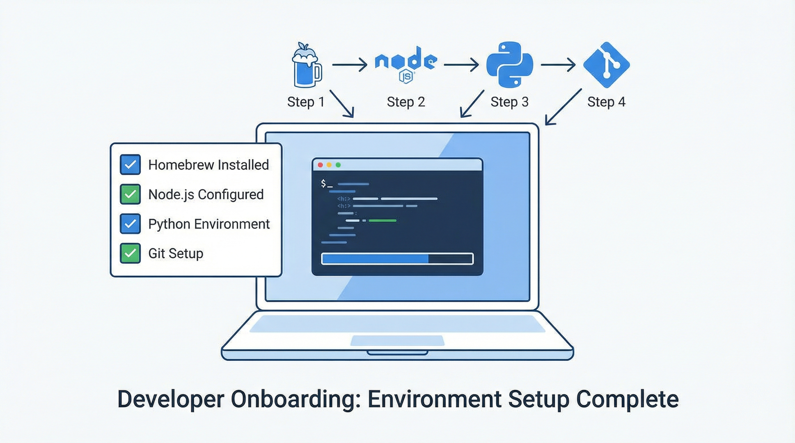

# 環境セットアップガイド



## macOS

### 1. Homebrew のインストール
```bash
/bin/bash -c "$(curl -fsSL https://raw.githubusercontent.com/Homebrew/install/HEAD/install.sh)"
```

### 2. Git のインストール・設定
```bash
# インストール（macOS は Xcode CLI tools に同梱）
xcode-select --install

# バージョン確認
git --version

# ユーザー設定
git config --global user.name "あなたの名前"
git config --global user.email "your.email@example.com"
```

### 3. Node.js のインストール
```bash
# Homebrew でインストール
brew install node

# バージョン確認
node --version
npm --version
```

### 4. Python のインストール
```bash
# Homebrew でインストール
brew install python

# バージョン確認
python3 --version
pip3 --version
```

### 5. Cursor のインストール
1. https://cursor.sh にアクセス
2. 「Download for Mac」をクリック
3. ダウンロードした .dmg を開き、Applications にドラッグ
4. 初回起動時に VS Code の設定をインポートするか聞かれる

### 6. Claude Code のインストール
```bash
# npm でグローバルインストール
npm install -g @anthropic-ai/claude-code

# バージョン確認
claude --version

# 初期起動
claude
```

### 7. FFmpeg のインストール（動画処理用）
```bash
brew install ffmpeg
ffmpeg -version
```

---

## Windows

### 1. Git のインストール
1. https://git-scm.com/download/win にアクセス
2. インストーラーをダウンロードして実行
3. 「Git Bash Here」オプションを有効にする
4. ターミナル設定は「Use Windows' default console window」を選択

```powershell
# 設定
git config --global user.name "あなたの名前"
git config --global user.email "your.email@example.com"
```

### 2. Node.js のインストール
1. https://nodejs.org にアクセス
2. LTS 版をダウンロードして実行
3. 「Add to PATH」にチェックが入っていることを確認

```powershell
node --version
npm --version
```

### 3. Python のインストール
1. https://www.python.org/downloads/ にアクセス
2. 最新版をダウンロード
3. **「Add Python to PATH」に必ずチェック**を入れてインストール

```powershell
python --version
pip --version
```

### 4. Cursor のインストール
1. https://cursor.sh にアクセス
2. 「Download for Windows」をクリック
3. インストーラーを実行

### 5. Claude Code のインストール
```powershell
npm install -g @anthropic-ai/claude-code
claude --version
```

### 6. FFmpeg のインストール
1. https://ffmpeg.org/download.html にアクセス
2. Windows builds をダウンロード
3. 展開して `bin/` フォルダを PATH に追加

---

## 共通: リポジトリのクローン

```bash
# リポジトリをクローン
git clone https://github.com/<organization>/aiagent-base.git
cd aiagent-base

# Python 依存関係をインストール
pip install -r requirements.txt

# Node.js 依存関係をインストール
npm install
```

## ツール別の開始方法

### Cursor
- ワークスペースを開く
- `/check-setup` を実行する
- `/start-0-1` でセットアップを開始する

### Claude Code
- `CLAUDE.md` を読む
- `docs/security-guardrails.md` を読む
- setup 確認後に lesson 導線へ進む

### Codex
- `AGENTS.md` を読む
- `docs/codex-guide.md` と `docs/codex-safety.md` を読む
- `bash scripts/install_hooks.sh` を実行する
- `aiagent-check-setup` skill で環境確認を行う
- `aiagent-lesson-runner` skill に `start-0-1` を渡して開始する
