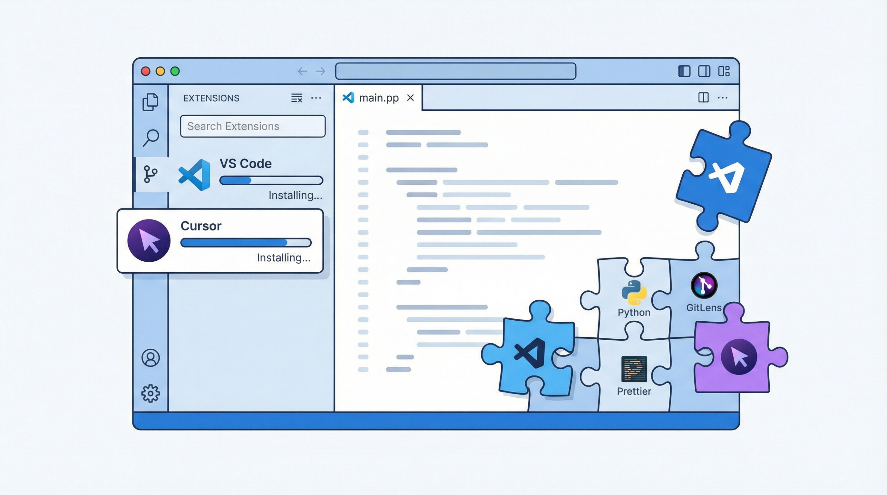

# 拡張機能インストールガイド



## VS Code / Cursor 拡張機能のインストール方法

### 方法 1: GUI からインストール

1. Cursor（または VS Code）を起動
2. 左サイドバーの「拡張機能」アイコン（四角形のアイコン）をクリック
3. 検索バーに拡張機能名を入力
4. 「インストール」ボタンをクリック

### 方法 2: コマンドパレットからインストール

1. `Cmd+Shift+P`（macOS）/ `Ctrl+Shift+P`（Windows）でコマンドパレットを開く
2. 「Extensions: Install Extensions」を入力
3. 拡張機能を検索してインストール

### 方法 3: CLI からインストール

```bash
# Cursor の場合
cursor --install-extension <extension-id>

# VS Code の場合
code --install-extension <extension-id>
```

### 方法 4: extensions.json で一括管理

`.vscode/extensions.json` にリストを定義し、チームで共有:

```json
{
  "recommendations": [
    "publisher.extension-id"
  ]
}
```

プロジェクトを開くと「推奨拡張機能をインストールしますか？」と表示されます。

## 拡張機能の管理

### インストール済み一覧
```bash
cursor --list-extensions
# または
code --list-extensions
```

### 拡張機能の無効化・アンインストール
- 拡張機能パネルで該当の拡張を右クリック
- 「無効にする」または「アンインストール」を選択

### 設定の同期
- Cursor: 「Settings Sync」でアカウント同期
- チーム共有: `.vscode/settings.json` をリポジトリに含める
