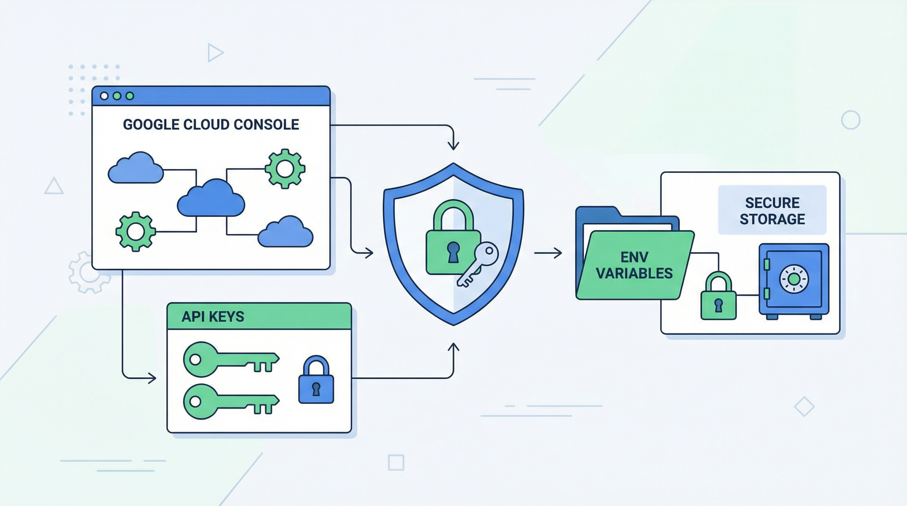

# API キー取得・設定ガイド



## 1. Google Gemini API キー

### 取得手順
1. https://aistudio.google.com/apikey にアクセス
2. Google アカウントでログイン
3. 「Create API key」をクリック
4. プロジェクトを選択（または新規作成）
5. 生成された API キーをコピー

### 設定
```bash
# .env.local に入力欄を作成
uv run python tools/credential_manager.py prepare-dotenv GEMINI_API_KEY

# 保存後に Credential Store へ移行
uv run python tools/credential_manager.py import-dotenv GEMINI_API_KEY --delete

# 確認
uv run python tools/credential_manager.py status
```

### テスト
```bash
curl "https://generativelanguage.googleapis.com/v1beta/models?key=$GEMINI_API_KEY" 2>/dev/null | head -5
```

### 料金
- 無料枠: 1分あたり15リクエスト、1日あたり1500リクエスト
- 画像生成（Imagen）: 有料プランが必要な場合あり

---

## 2. Anthropic API キー（Claude API）

### 取得手順
1. https://console.anthropic.com にアクセス
2. アカウント作成またはログイン
3. 左メニューの「API Keys」をクリック
4. 「Create Key」をクリック
5. キー名を入力して作成
6. 表示された `sk-ant-...` をコピー（この画面でのみ表示）

### 設定
```bash
uv run python tools/credential_manager.py prepare-dotenv ANTHROPIC_API_KEY
# 保存後:
uv run python tools/credential_manager.py import-dotenv ANTHROPIC_API_KEY --delete
```

### 料金
- 従量課金制（使用トークン数に応じた課金）
- Claude Code は別途サブスクリプション

---

## 3. OpenAI API キー（オプション）

### 取得手順
1. https://platform.openai.com にアクセス
2. アカウント作成またはログイン
3. 右上のプロフィール → 「API keys」
4. 「Create new secret key」をクリック
5. `sk-...` をコピー

### 設定
```bash
uv run python tools/credential_manager.py prepare-dotenv OPENAI_API_KEY
# 保存後:
uv run python tools/credential_manager.py import-dotenv OPENAI_API_KEY --delete
```

---

## 4. fal.ai API キー（動画生成用・オプション）

### 取得手順
1. https://fal.ai にアクセス
2. アカウント作成
3. Dashboard → 「API Keys」
4. 新しいキーを作成してコピー

### 設定
```bash
uv run python tools/credential_manager.py prepare-dotenv FAL_KEY
# 保存後:
uv run python tools/credential_manager.py import-dotenv FAL_KEY --delete
```

---

## 5. Slack Bot Token（Slack連携用・オプション）

### 取得手順
1. https://api.slack.com/apps にアクセス
2. 「Create New App」→「From scratch」
3. アプリ名とワークスペースを入力
4. 「OAuth & Permissions」→ 必要なスコープを追加
5. 「Install to Workspace」でインストール
6. 「Bot User OAuth Token」（`xoxb-...`）をコピー

### 設定
```bash
uv run python tools/credential_manager.py prepare-dotenv SLACK_BOT_TOKEN
# 保存後:
uv run python tools/credential_manager.py import-dotenv SLACK_BOT_TOKEN --delete
```

---

## 環境変数の読み込み

### Python（python-dotenv）
```python
from dotenv import load_dotenv
import os

load_dotenv()
api_key = os.environ.get("GEMINI_API_KEY")
```

### Bash
```bash
# 実行時に environment へ注入するか、
# runtime_env.py の env -> credential store -> .env.local -> .env の順で読む
```
