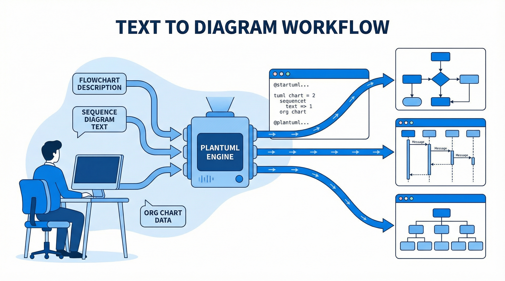

# 演習: 図表・フロー作成



## 概要

ビジネスで頻出する3種類の図表を作成する演習です。
PlantUML と Draw.io を使い、営業フロー、システムシーケンス図、組織図を作成します。
加えて `diagram-generator` スキルによる画像生成も体験します。

## 前提条件

- Gemini API キーが設定済みであること
- Python 3.8 以上がインストール済み
- PlantUML の基本記法を理解している（テンプレート参照可）

```bash
pip install google-genai Pillow python-dotenv
```

## タスク

### タスク1: 営業プロセスフロー図（PlantUML）

`data/business-process.md` の営業フローを PlantUML でフローチャートにしてください。

1. `templates/flowchart-template.puml` をコピーして編集
2. 5つのステップ（リード獲得→初回提案→ヒアリング→見積→受注）を表現
3. 各ステップに担当者とアクションを記載
4. 条件分岐（受注/失注）を含める

```bash
# diagram-generator で画像も生成
uv run python tools/generate_diagram.py \
  "営業プロセスフロー: リード獲得→初回提案→ヒアリング→見積→受注/失注の5ステップ" \
  --style minimalist \
  --output output/sales-flow.png
```

### タスク2: ECサイトシーケンス図（PlantUML）

`data/system-spec.md` のシステム構成をシーケンス図にしてください。

1. `templates/sequence-template.puml` をコピーして編集
2. ユーザー → フロントエンド → API → データベース → 外部サービスの通信フローを表現
3. 商品検索、カート追加、決済の3つのシナリオを含める

```bash
uv run python tools/generate_diagram.py \
  "ECサイトのシステムシーケンス図: ユーザー、フロントエンド、API、DB、決済サービスの通信フロー" \
  --style colorful_infographic \
  --output output/system-sequence.png
```

### タスク3: 組織図（Draw.io）

IT企業の組織図を Draw.io（XML形式）で作成してください。

1. `templates/blank.drawio` をベースに編集
2. 代表取締役 → 各部門長 → チームの3階層構造
3. エンジニアリング部、プロダクト部、マーケティング部、コーポレート部を含める

```bash
uv run python tools/generate_diagram.py \
  "IT企業の組織図: CEO、エンジニアリング部、プロダクト部、マーケティング部、コーポレート部の組織構造" \
  --style colorful_infographic \
  --output output/org-chart.png
```

## 完了条件

- [ ] 営業フローの PlantUML ソースが作成されている
- [ ] ECサイトのシーケンス図の PlantUML ソースが作成されている
- [ ] 組織図の Draw.io XML が作成されている
- [ ] diagram-generator で各図の画像が生成されている
- [ ] 各図が正しい記法で記述されている

## ヒント

- PlantUML 記法の詳細は `hints.md` を参照
- テンプレートファイルを編集して使うと効率的です
- diagram-generator は日本語のトピックにも対応しています
