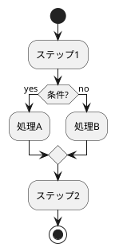
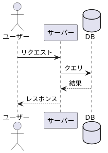

# PlantUML & 図表作成のヒント

## PlantUML 基本記法

### アクティビティ図（フローチャート）



### シーケンス図



### よく使う記法

| 記法 | 意味 |
|------|------|
| `->` | 同期メッセージ |
| `-->` | 戻り値（点線） |
| `->>` | 非同期メッセージ |
| `note right` | 右側にノート |
| `== セクション ==` | セクション区切り |
| `alt / else / end` | 条件分岐 |
| `loop / end` | ループ |
| `group` | グループ化 |

## skinparam による見た目調整

```plantuml
' 色の指定
skinparam backgroundColor #FEFEFE
skinparam activity {
    BackgroundColor #E3F2FD
    BorderColor #1565C0
}

' フォント
skinparam defaultFontName "Noto Sans JP"
skinparam defaultFontSize 12
```

## Draw.io のポイント

- `mxCell` の `value` 属性にラベルテキスト
- `style` 属性で色・角丸・フォントを指定
- `edge="1"` で接続線
- `source` と `target` で接続元・先を指定
- `mxGeometry` で位置とサイズを設定

## diagram-generator の活用

PlantUML でソースを書くのが難しい場合は、diagram-generator で概要画像を先に生成し、それを参考にしながら PlantUML を記述する方法も有効です。

```bash
# 日本語でトピックを指定して画像生成
uv run python tools/generate_diagram.py "営業プロセスの5ステップフロー" --style minimalist

# スタイルを変えて比較
uv run python tools/generate_diagram.py "営業プロセスの5ステップフロー" --style colorful_infographic
```
