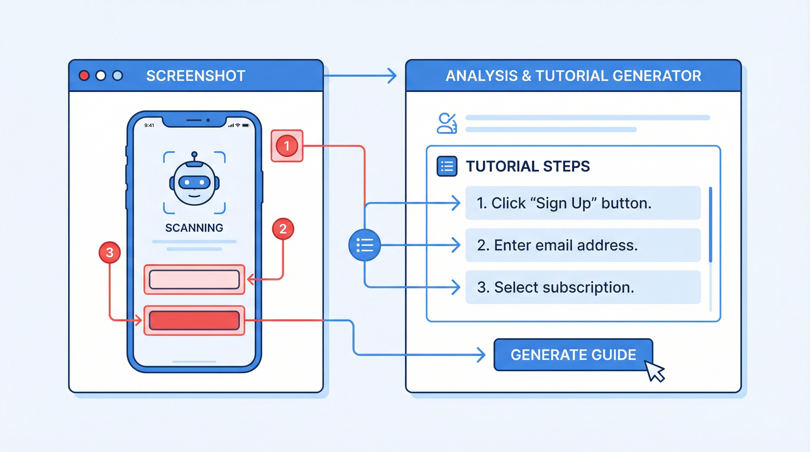

# 演習: スクリーンショット分析・注釈



## 概要

スクリーンショットを使った3つの演習を行います。
UI分析、注釈追加、チュートリアル生成の3つのスキルを実践的に学びます。

## 前提条件

- Gemini API キーが設定済みであること
- Python 3.8 以上がインストール済み
- Pillow パッケージがインストール済み

```bash
uv add google-genai Pillow python-dotenv
```

## タスク

### タスク1: UI分析

`data/screenshots/` にあるサンプルスクリーンショットを `screenshot-analyzer` で分析してください。

```bash
uv run python tools/screenshot_analyzer.py \
  data/screenshots/dashboard-mock.png
```

**分析項目:**
- 画面構成（レイアウト、ナビゲーション、コンテンツエリア）
- UI要素の洗い出し（ボタン、フォーム、テーブル、チャート等）
- ユーザビリティの改善ポイント
- アクセシビリティの問題点

**成果物:** 分析結果をMarkdownファイルにまとめる

### タスク2: 注釈追加

スクリーンショットに注釈（赤枠、矢印、コールアウト）を追加してください。

```bash
uv run python tools/annotate_screenshot.py \
  data/screenshots/dashboard-mock.png \
  --output output/annotated-dashboard.png
```

**注釈要件:**（`data/annotation-spec.md` 参照）
- 重要なUI要素に赤枠を追加
- 操作手順を矢印で示す
- 説明テキストをコールアウトで追加

### タスク3: チュートリアル生成

複数のスクリーンショットからステップバイステップのチュートリアルを生成してください。

```bash
uv run python tools/capture_tutorial.py \
  data/screenshots/ \
  --output output/tutorial/
```

**要件:**
- 3〜5ステップの操作手順を作成
- 各ステップに説明文を追加
- HTML または Markdown 形式で出力

## 完了条件

- [ ] UI分析レポートが作成されている
- [ ] 注釈付きスクリーンショットが生成されている
- [ ] チュートリアルが生成されている
- [ ] 分析レポートに具体的な改善提案が含まれている

## ヒント

- `hints.md` にスクリーンショット分析のコツを記載しています
- `data/annotation-spec.md` に注釈のスタイル仕様があります
- nanobanana でモックアップ画像を生成することもできます
