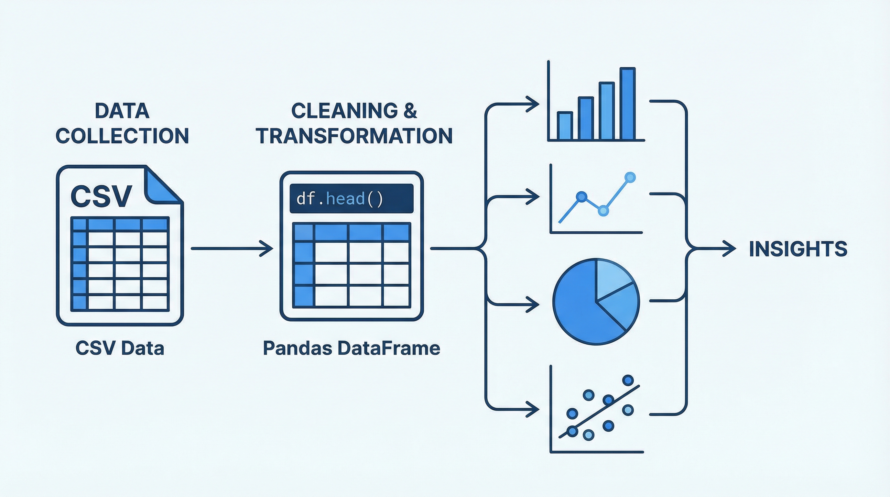

# 演習: データ分析（EDA）



## 概要

架空のECサイトの売上データを使って探索的データ分析（EDA）を行う演習です。
pandas、matplotlib、seaborn を使ってデータの傾向を読み解き、ビジネスに活かせるインサイトを抽出します。

## 前提条件

- Python 3.8 以上
- 必要パッケージ:

```bash
pip install pandas matplotlib seaborn
```

## データセット

| ファイル | 行数 | 内容 |
|----------|------|------|
| `data/sales-data.csv` | 500行 | 売上トランザクション（日付、商品、カテゴリ、金額、数量、地域、顧客） |
| `data/customer-data.csv` | 200行 | 顧客情報（年齢、性別、地域、会員ランク、登録日） |
| `data/product-master.json` | 50件 | 商品マスタ（商品名、カテゴリ、単価、在庫） |

## タスク

### 分析課題1: 月別売上推移

**問い**: 2025年の月別売上はどのように推移しているか？季節性はあるか？

**手順:**
1. `sales-data.csv` を読み込む
2. 日付カラムを datetime 型に変換
3. 月別に売上金額を集計
4. 折れ線グラフで可視化

```python
import pandas as pd
import matplotlib.pyplot as plt

df = pd.read_csv("data/sales-data.csv")
df["date"] = pd.to_datetime(df["date"])
monthly = df.groupby(df["date"].dt.month)["amount"].sum()
# グラフ作成は output/charts/ に保存
```

### 分析課題2: カテゴリ別売上構成

**問い**: どのカテゴリが売上の大部分を占めているか？

**手順:**
1. カテゴリ別の売上金額を集計
2. 円グラフまたは棒グラフで可視化
3. 上位3カテゴリの売上比率を算出

### 分析課題3: 地域別分析

**問い**: 地域ごとの売上にどんな差があるか？地域特性はあるか？

**手順:**
1. 地域別の売上金額と注文数を集計
2. 地域×カテゴリのクロス集計
3. 横棒グラフで可視化

### 分析課題4: 顧客セグメント分析

**問い**: 会員ランク別の購買行動にどんな違いがあるか？

**手順:**
1. `sales-data.csv` と `customer-data.csv` を顧客IDで結合
2. 会員ランク別の平均購入金額、購入頻度を算出
3. ランク別の年齢分布をボックスプロットで可視化

### 分析課題5: 商品ABC分析

**問い**: 売上の80%を占める商品群（Aランク）はどれか？

**手順:**
1. 商品別の売上金額を降順でソート
2. 累積売上比率を計算
3. A（〜80%）、B（80%〜95%）、C（95%〜100%）にランク分け
4. パレート図で可視化

## 完了条件

- [ ] 5つの分析課題に対する回答がある
- [ ] 各課題に対応するグラフが `output/charts/` に保存されている
- [ ] インサイト（発見した知見）が Markdown でまとめられている
- [ ] コードが再現可能である

## ヒント

- `hints.md` に pandas / matplotlib / seaborn のコード例があります
- `analysis-requirements.md` に分析の観点を詳しく記載しています
