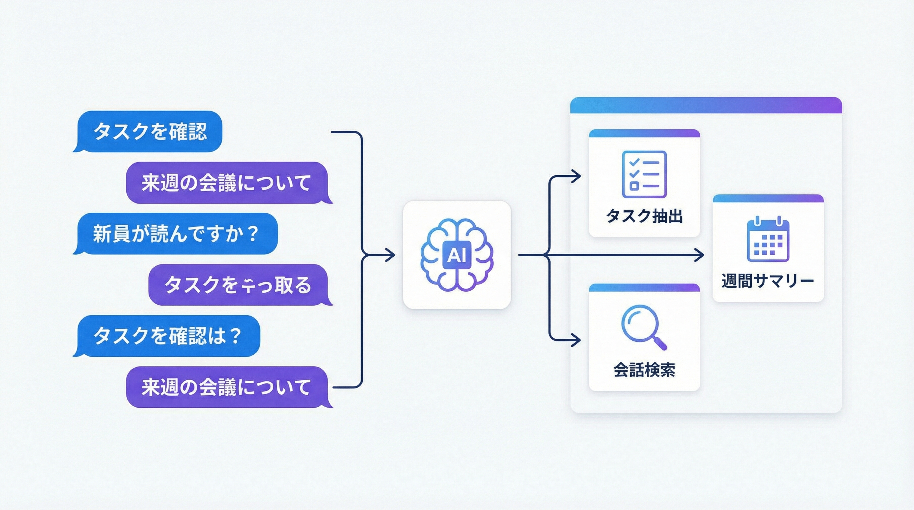

# 演習: Slack 検索・分析



## 概要

Slack のメッセージデータを検索・分析し、タスクの抽出や週次サマリーの作成を行う演習です。
サンプルの会話ログを使い、セマンティック検索とタスク管理の実践スキルを学びます。

## 前提条件

- Python 3.8 以上
- サンプルデータ: `data/sample-conversations.json`
- チャネル情報: `data/channels-list.json`

```bash
pip install python-dotenv
```

## タスク

### タスク1: キーワード検索

`data/sample-conversations.json` からキーワードベースでメッセージを検索してください。

`data/search-queries.md` に10個の検索クエリ例があります。それぞれのクエリで検索を実行し、ヒットしたメッセージの件数と内容をまとめてください。

```python
import json

with open("data/sample-conversations.json", encoding="utf-8") as f:
    conversations = json.load(f)

# キーワード検索
keyword = "デプロイ"
results = [msg for msg in conversations if keyword in msg.get("text", "")]
print(f"'{keyword}' の検索結果: {len(results)} 件")
```

**成果物:** 検索結果のJSONファイル

### タスク2: タスク抽出

会話ログからタスク（TODO、依頼、期限付き作業）を抽出してください。

**抽出ルール:**
- 「お願い」「してください」「〜まで」を含むメッセージ
- 「TODO」「タスク」「対応」を含むメッセージ
- 「期限」「締切」「〜日まで」を含むメッセージ

**成果物:** 抽出したタスクのMarkdownリスト（担当者、内容、期限、ステータス）

### タスク3: 週次サマリー作成

会話ログから1週間分のサマリーレポートを作成してください。

**サマリー項目:**
- チャネル別のメッセージ数
- 主要な決定事項
- アクションアイテム（未完了タスク）
- 活発だったトピック

**成果物:** 週次サマリーのMarkdownレポート

## 完了条件

- [ ] 10個のクエリで検索が実行されている
- [ ] タスクが20件以上抽出されている
- [ ] 週次サマリーレポートが作成されている
- [ ] 各成果物が指定のフォーマットに従っている

## ヒント

- `hints.md` に検索テクニックとタスク抽出のコツを記載しています
- `data/channels-list.json` でチャネルの全体像を把握できます
