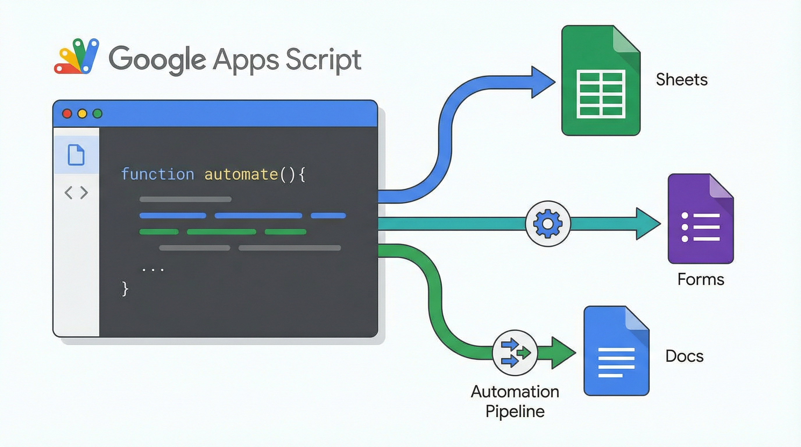

# 演習: Google Apps Script（GAS）自動化



## 概要

Google Sheets と Google Calendar を GAS で自動化する方法を学びます。勤怠データの集計スクリプトと、翌日の予定を Slack に通知するカレンダー連携スクリプトを作成します。

## 前提条件

- Google アカウントがあること
- clasp CLI がインストール済み（`npm install -g @google/clasp`）
- Google Apps Script API が有効化されていること
- Slack Webhook URL（通知テスト用、なくても開発は可能）

## タスク

### タスク 1: Google Sheets 勤怠集計スクリプト

`data/sample-spreadsheet.csv` のデータを使い、勤怠集計を自動化する GAS を作成します。

1. `data/sample-spreadsheet.csv` をスプレッドシートにインポートする
2. `templates/sheets-script.gs` のテンプレートを元に、以下の関数を実装する:
   - `calculateWorkHours()`: 各従業員の月間勤務時間を集計
   - `sendSummaryEmail()`: 集計結果をメールで送信
   - `formatSheet()`: シートの書式を自動整形（ヘッダー色、列幅、罫線）
3. スクリプトをテスト実行し、正しく集計されることを確認する

```bash
# clasp でプロジェクト作成
clasp create --type sheets --title "勤怠管理"

# スクリプトをプッシュ
clasp push

# ログ確認
clasp logs
```

### タスク 2: Google Calendar 連携スクリプト

翌日のカレンダー予定を取得し、Slack に通知する GAS を作成します。

1. `data/calendar-events.json` の形式を参考に、予定の取得処理を理解する
2. `templates/calendar-script.gs` のテンプレートを元に、以下の関数を実装する:
   - `getTomorrowEvents()`: 翌日の予定を取得
   - `formatEventMessage()`: 予定を見やすいテキストに整形
   - `sendToSlack()`: Slack Webhook で通知送信
3. トリガーを設定して毎日夕方に自動実行されるようにする

```bash
# 既存の GAS プロジェクトにファイル追加
clasp push

# ブラウザでエディタを開く
clasp open
```

## 完了条件

- [ ] タスク 1: 勤怠データの月間集計が正しく計算される
- [ ] タスク 1: 集計結果がメールで送信される（テスト送信で確認）
- [ ] タスク 1: シートの書式が自動整形される
- [ ] タスク 2: 翌日のカレンダー予定が正しく取得される
- [ ] タスク 2: Slack 通知のメッセージが見やすく整形されている
- [ ] タスク 2: 時間トリガーが設定されている

## ヒント

- 詳しくは `hints.md` を参照してください
- GAS のデバッグには `Logger.log()` と `console.log()` を活用しましょう
- Slack Webhook がない場合は `Logger.log()` で出力を確認するだけでもOK
