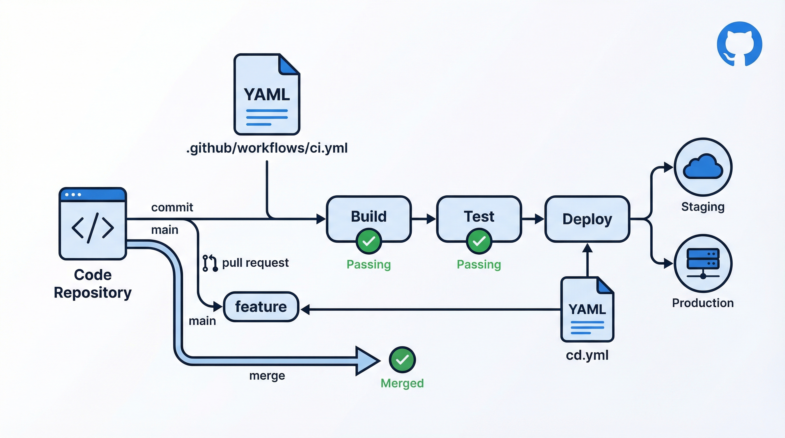

# 演習: GitHub Actions ワークフロー作成



## 概要

GitHub Actions を使って CI/CD パイプライン、定期実行ジョブ、PR 自動レビューの3種類のワークフローを作成します。YAML の書き方から実際のデプロイまで、GitHub Actions の基本を体験します。

## 前提条件

- GitHub アカウントがあり、リポジトリの作成・管理ができること
- Git の基本操作（push, pull, branch）が使えること
- YAML の基本文法を理解していること

## タスク

### タスク 1: CI/CD ワークフロー

Node.js プロジェクトのテスト・ビルド・デプロイを自動化するワークフローを作成します。

1. `data/workflow-requirements.md` の要件1を確認する
2. `templates/ci-template.yml` をベースに、以下の3ジョブを実装する:
   - **test**: `npm test` の実行（Node.js 18, 20 のマトリックス）
   - **build**: テスト成功後に `npm run build` を実行
   - **deploy**: main ブランチへの push 時のみデプロイ
3. `push` と `pull_request` の両方をトリガーに設定する

```yaml
# .github/workflows/ci.yml に配置
```

### タスク 2: 定期実行ワークフロー

毎日朝9時にデータ同期を行うワークフローを作成します。

1. `data/workflow-requirements.md` の要件2を確認する
2. `templates/scheduled-template.yml` をベースに、以下を実装する:
   - cron スケジュール（JST 9:00 = UTC 0:00）
   - 手動トリガー（`workflow_dispatch`）にも対応
   - データ同期スクリプトの実行
   - 実行結果の Slack 通知

### タスク 3: PR 自動レビューワークフロー

PR 作成時に自動でラベル付与とチェックを行うワークフローを作成します。

1. `data/workflow-requirements.md` の要件3を確認する
2. 以下の機能を実装する:
   - ファイル変更に基づくラベル自動付与（docs, frontend, backend 等）
   - PR 本文のテンプレートチェック
   - 変更行数が多い場合の警告コメント

## 完了条件

- [ ] タスク 1: CI/CD ワークフローが正しい YAML 構文で記述されている
- [ ] タスク 1: テスト→ビルド→デプロイの依存関係が設定されている
- [ ] タスク 2: cron 式が JST 9:00 に正しく設定されている
- [ ] タスク 2: 手動トリガーにも対応している
- [ ] タスク 3: ファイルパスに基づくラベル付与ロジックがある
- [ ] 全ワークフローが `.github/workflows/` に配置可能な形式

## ヒント

- 詳しくは `hints.md` を参照してください
- YAML のインデントは必ず半角スペース2つで統一
- `act` コマンドでローカルテストが可能（`brew install act`）
- Secrets は `${{ secrets.SECRET_NAME }}` で参照
