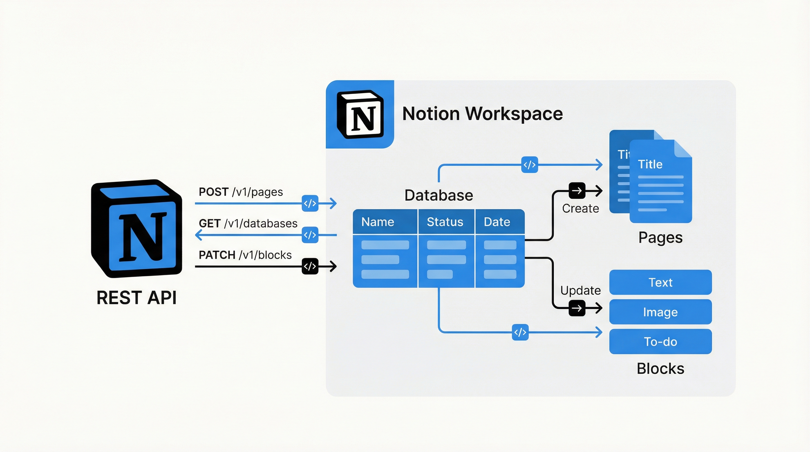

# 演習: Notion API 連携



## 概要

Notion API を使ったデータベース操作とページ管理を学びます。タスク管理データベースの作成、ページの CRUD 操作、フィルタ検索を行い、最終的に GitHub Issue と Notion を連携する自動化スクリプトを作成します。

## 前提条件

- Notion アカウントがあること
- Notion Integration が作成済み（Internal Integration）
- Integration の API キー（`NOTION_API_KEY`）が取得済み
- 連携先のワークスペースで Integration が接続済み
- Python 3.8+ と `requests` パッケージ

## タスク

### タスク 1: データベース作成

Notion にタスク管理データベースを API 経由で作成します。

1. `data/database-schema.json` のスキーマを確認する
2. Notion API の `POST /v1/databases` を使ってデータベースを作成する
3. 作成されたデータベースの ID を記録する

```bash
# API呼び出し例
curl -X POST https://api.notion.com/v1/databases \
  -H "Authorization: Bearer $NOTION_API_KEY" \
  -H "Content-Type: application/json" \
  -H "Notion-Version: 2022-06-28" \
  -d @data/database-schema.json
```

### タスク 2: ページ CRUD 操作

データベースにタスクページを追加・更新・検索・削除します。

1. `data/sample-pages.json` の10件のタスクをデータベースに追加する
2. 追加したページの1つを更新する（ステータス変更）
3. `data/sample-queries.md` のクエリ例を参考にフィルタ検索を実行する

```python
# Python での API 呼び出し例
import requests

headers = {
    "Authorization": f"Bearer {NOTION_API_KEY}",
    "Content-Type": "application/json",
    "Notion-Version": "2022-06-28"
}

# ページ作成
response = requests.post("https://api.notion.com/v1/pages", headers=headers, json=page_data)
```

### タスク 3: GitHub Issue → Notion 自動登録

GitHub Issue が作成されたときに自動で Notion データベースにタスクを登録するスクリプトを作成します。

1. GitHub API で Issue 情報を取得する処理を実装する
2. Issue の情報を Notion ページ形式に変換する
3. Notion API でページを作成する
4. 動作確認として、既存の Issue 情報を使ってテスト実行する

## 完了条件

- [ ] タスク 1: Notion にタスク管理データベースが作成される
- [ ] タスク 2: 10件のタスクが追加され、フィルタ検索が動作する
- [ ] タスク 3: GitHub Issue の情報が Notion に自動登録される
- [ ] 各タスクの API レスポンスを確認できる

## ヒント

- 詳しくは `hints.md` を参照してください
- Notion API のバージョンは `2022-06-28` を使用
- データベースの親ページ ID は事前に取得しておく必要があります
