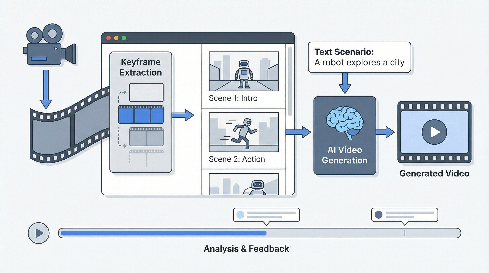

# 演習: 動画生成・解析



## 概要

動画ファイルのキーフレーム解析、絵コンテ（ストーリーボード）の作成、そして Image-to-Video 生成までの一連の動画制作ワークフローを体験します。Claude Code のスキルを使い、テキストから動画素材を作り出す方法を学びます。

## 前提条件

- FFmpeg がインストール済み（`ffmpeg -version` で確認）
- `GEMINI_API_KEY` が設定済み
- `FAL_KEY` が設定済み（動画生成用）
- Python パッケージ: `google-genai`, `Pillow`, `numpy`, `python-dotenv`

## タスク

### タスク 1: 動画キーフレーム解析（video-frame-reader）

既存の動画ファイルからキーフレームを自動抽出し、内容を分析します。

1. サンプル動画（MP4）を用意する（スクリーン録画やフリー素材でOK）
2. `video-frame-reader` スキルでキーフレームを抽出する
3. 抽出されたフレーム枚数、推定トークン数、コストを確認する
4. キーフレームの内容を分析し、動画の構成をまとめる

```bash
# キーフレーム抽出
python skills/video-frame-reader/extract_keyframes.py \
    "<動画ファイルパス>" \
    -t 0.85 -q 30 -s 0.3
```

**出力**: キーフレーム画像一覧、トークン数レポート

### タスク 2: 絵コンテ生成（storyboard-generator）

`data/storyboard-scenario.md` のシナリオをもとに、絵コンテを生成します。

1. `data/storyboard-scenario.md` のシナリオ内容を確認する
2. `data/character-spec.md` のキャラクター設定を確認する
3. `storyboard-generator` スキルのシートモードで絵コンテを生成する
4. 生成された `scenes.json` を確認し、各シーンの説明・ナレーション・動画化方式を確認する

```bash
# 絵コンテ生成（シートモード）
python skills/storyboard-generator/scripts/generate_storyboard.py \
    --scenario "$(cat data/storyboard-scenario.md)" \
    --character "$(cat data/character-spec.md)" \
    --aspect-ratio 9:16 \
    --num-frames 8 \
    --mode sheet \
    --session "promo_video"
```

**出力**: 絵コンテシート画像、個別フレーム画像、scenes.json

### タスク 3: Image-to-Video 生成

絵コンテのフレームから実際の動画クリップを生成します。

1. タスク 2 で生成した絵コンテフレームを確認する
2. `scenes.json` の `motion_type` が `i2v` のシーンを特定する
3. fal.ai の wan-i2v を使って動画クリップを生成する
4. 生成された動画の品質を確認する

```bash
# 動画生成（絵コンテのフレーム1-4を使用）
python skills/storyboard-generator/scripts/generate_storyboard.py \
    --storyboard-dir "output/storyboard/<セッションディレクトリ>" \
    --start-frame 1 \
    --end-frame 4 \
    --video-duration 5
```

**出力**: MP4 動画クリップ

## 完了条件

- [ ] タスク 1: キーフレームが正常に抽出され、トークン数レポートが表示される
- [ ] タスク 2: 8フレームの絵コンテが生成され、scenes.json に各シーンの情報が含まれる
- [ ] タスク 3: 少なくとも1つの動画クリップが正常に生成される
- [ ] 各タスクの出力物を `output/` ディレクトリで確認できる

## ヒント

- 詳しくは `hints.md` を参照してください
- 絵コンテ生成は `sheet` モードが推奨です（キャラクター一貫性が高い）
- 動画生成は API コストがかかるため、まず1シーンで試しましょう
- `data/narration-script.txt` にナレーション台本があります
