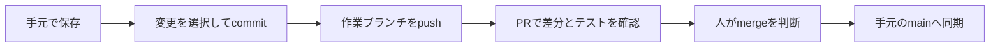

# 1. GitHubで変更をレビューする

[演習一覧・準備](README.md) → この演習 → [Skillsの再利用](02-skills.md)

目的は、AIが直した内容を人が差分とテストで確認できる状態にすることです。演習場所は自分の `camp-practice` です。

**AIが何を変え、なぜ変えたかを、あとから追えるようにします。** 変更履歴に理由と検査結果を添えると、別の人や次のAIも作業を引き継げます。これはコードだけでなく、資料を作るスクリプトやSkillの改善にも使える考え方です。

## まず6つの言葉を分ける

| 操作 | 何が変わるか | まだ変わらないもの |
| --- | --- | --- |
| 保存 | 手元のファイル | Gitの履歴、GitHub |
| add | 次のcommitに含める変更の選択 | Gitの履歴、GitHub |
| commit | 手元の履歴 | GitHub |
| push | GitHubの作業ブランチ | mainへの取り込み |
| PR（Pull Request） | 差分を相談する場所 | mainへの取り込み |
| merge | PRの変更をmainへ取り込む | 手元のmain。同期は別に必要 |



## 手順1：最初の記録を作る（10分）

操作場所はターミナルです。[準備](README.md)でコピーした直後のフォルダを使います。

```bash
git init -b main
git status --short
git add README.md .gitignore quote.py checks.py cases.json skills design
git diff --cached --stat
git commit -m "Add fictional practice starter"
git switch -c practice/quote-review
```

`git status` の一覧に自分の既存業務ファイルがある場合は作業先が違います。ここで止まってフォルダを選び直してください。commit時に本人情報の設定を求められたら、本人がこのリポジトリの名前とメール（非公開用メールでも可）を設定します。他人の情報はコピーしません。

成功条件：`git branch --show-current` が `practice/quote-review`。`git log -1 --oneline` に最初の記録がある。

## 手順2：わざと失敗するテストを読み、直す（15分）

ターミナルで実行します。配布の `quote.py` には演習用の不具合が2つあります。

```bash
python3 checks.py
```

初回の期待結果は **4テスト中2失敗**。最後の明細が小計に入らないことと、ちょうど10万円のときに値引きされないことを確認します。

AIへの依頼文：

```text
README.md の見積ルールと checks.py の失敗を読んでください。
quote.py の計算を直し、checks.py は変更せず4テストすべてを再実行してください。
変更理由、差分、実際のテスト結果を報告してください。commit・push・mergeはまだしません。
```

受講者は `git diff -- quote.py` で変更箇所を見ます。「全明細を合計」「10万円以上」という仕様が保たれているかを説明してください。AIの「完了」だけで判断せず、ターミナルの `Ran 4 tests` と `OK` を見ます。4テストは今回の仕様確認であり、あらゆる入力への品質保証ではありません。

```bash
git add quote.py
git diff --cached -- quote.py
git commit -m "Fix last item and discount boundary"
git diff main...HEAD -- quote.py
```

オンライン実習をしない場合は、ここで `evidence/pr-draft.md` に手順3のコードブロックにあるPR本文を保存します。ローカル差分確認まで完了、PRとActionsは未実施と記録してください。

## 手順3：自分のPrivateリポジトリでPRを開く（10分）

操作場所はGitHubの画面です。自分のアカウントで **New repository** を選び、名前を `camp-practice`、公開範囲を **Private** にします。READMEやライセンスの自動追加は選ばず、空のリポジトリを作ります。同名がある場合は既存を上書きせず別名を選びます。

作成画面の自分のリポジトリURLを使い、AIに次を依頼します。

```text
私が今作成したPrivateリポジトリのURLをoriginに設定する準備をしてください。
git remote -v で現在の宛先を確認し、既存originがあれば置き換えずに報告してください。
送るのはmainの初期教材とpractice/quote-reviewの修正です。
ファイル一覧と宛先を提示して送信前に止まってください。
```

宛先、Private表示、差分に秘密情報がないことを人が確認したあと、次の依頼を送ります。

```text
表示された私のPrivateリポジトリへmainとpractice/quote-reviewをpushしてください。
base=main、compare=practice/quote-reviewでPRを開くためのURLを示してください。mergeはしません。
```

GitHubで **Pull requests → New pull request** を開き、base/compareを照合して以下を本文にします。**Files changed** に `quote.py` の2か所の修正だけがあることを確認します。

```markdown
## 問題と変更
最後の明細が合計から外れ、10万円ちょうどで値引きされなかったため修正しました。

## 確認
python3 checks.py：修正前4件中2失敗、修正後4件成功。
テストの期待値は変更していません。

## 判断してほしいこと
全明細を含めること、10万円以上で5%引きにすることが仕様どおりか。

## 判断理由
見積ルールに合わせて合計範囲と境界条件を直しました。
値引き率と税率は仕様を満たしているため変更していません。
```

## 手順4：Checksと人のレビューを分ける（10分）

ローカル配布の [quote-check.yml](quote-check.yml) を読み、演習フォルダの `.github/workflows/quote-check.yml` へコピーします。AIへ「この1ファイルを作業ブランチに追加し、差分を見せて」と依頼し、確認後commit・pushします。PRの差分には、このYAMLも加わります。Camp本体の `.github/workflows/` には置きません。

| YAMLの場所 | 意味 | この演習での値 |
| --- | --- | --- |
| `on` | 実行のきっかけ | main宛てPRの作成・更新 |
| `jobs` | まとめて行う仕事 | `test` |
| `steps` / `uses` | 再利用する処理 | checkout、Python準備 |
| `steps` / `run` | 実行するコマンド | `python checks.py` |
| `permissions` | ワークフローの権限 | 内容の読み取りだけ |

GitHubの **Actions → 対象run → testジョブ → Run fixed checks** を開き、ログの4件成功を確認します。対象runのcommitが最新か、PRのChecksも成功かを照合します。

ここで覚えたいのは「変更したら、決めた検査を毎回実行する」という使い方です。検査で見つかった問題を次の修正へ渡し、同じ検査をもう一度通すと、改善の流れがつながります。この配布YAMLが行うのは検査までで、修正は手元のAIへ依頼します。

失敗時は「直して」だけでなく、対象commit・失敗したテスト・期待値と実測値を渡します。例えば次のように依頼してください。

```text
この実行結果の失敗について、README.mdの仕様と照合し、原因を説明してから修正してください。
変更してよいのはquote.pyです。checks.pyは変更せず全4件を再実行してください。
直した点に加え、すでに通っていた項目も引き続き成功するかを報告してください。
```

自動テストの成功とAIレビューの投稿は別です。このYAMLはテストだけを実行し、AIコメントは投稿しません。AIレビューを利用する発展課題では、Appの対象リポジトリ・認証・イベント条件を確認し、runのログとPR上の実際の投稿の両方が必要です。skipをレビュー済みとして扱いません。Secretsや自動デプロイの詳細は[Module 11](../../courses/aiagent/lesson03-core/module11-github-actions/practice/exercise.md)に進みます。

この演習の提出時はPRを未mergeで残します。授業後に人が承認・mergeした場合だけ、手元の変更がないことを `git status` で確認し、`git switch main`、`git pull --ff-only origin main` で同期します。競合や未保存変更があれば止まり、作業を保全してから相談します。

## つまずいたとき

| 症状 | 確認・再開する場所 |
| --- | --- |
| 初回から4成功 | すでに修正済みのコピーか確認。原本のstarterを別の新規フォルダへコピーする |
| 認証失敗 | GitHubの正規のサインインを本人が行う。トークンをチャットへ貼らない |
| PRの差分が多い | base/compare、送信先、選択したファイルを確認。まとめてaddし直さない |
| Actionsがない／実行待ち | YAMLの配置とpush、PRの宛先、Actions設定・利用枠を確認。ローカル結果と分けて未実施と記録 |
| テスト失敗 | 最初の失敗ログと対象commitを読み、同じコマンドを手元で再実行する |

- [ ] 保存・commit・push・mergeの違いを自分の言葉で説明できる
- [ ] `quote.py` の修正と4件の実行結果を示せる
- [ ] 変更理由と、変えずに守った仕様をPR本文またはローカルの下書きに残した
- [ ] オンライン実施時は、自分のPR・最新commitのChecks・ログを示せる
- [ ] 未実施・skip・成功を区別して記録した
