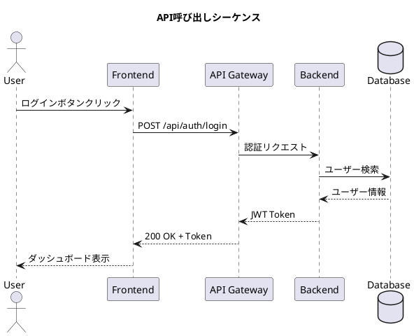
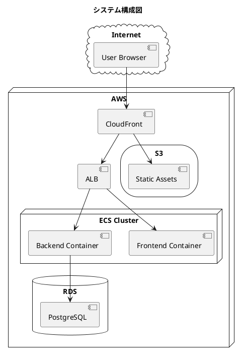

# Module 2: 図表・フロー作成 - 成果物（Final）

業務フロー図、インフォグラフィック、システム構成図の生成例です。

## 学習目標
- diagram-generatorスキルで業務フローを可視化できる
- PlantUMLでシーケンス図・クラス図を作成できる
- インフォグラフィックで数値データを視覚化できる

## 成果物一覧

| ファイル | 種類 | 内容 |
|---------|------|------|
| `flow-expense-approval.png` | フロー図 | 経費精算承認フロー |
| `flow-recruitment.png` | フロー図 | 採用選考フロー（条件分岐付き） |
| `flow-bug-fix.png` | フロー図 | バグ修正ワークフロー |
| `infographic-ai-adoption.png` | インフォグラフィック | AI導入統計 |
| `sequence-api-call.puml` | PlantUML | API呼び出しシーケンス |
| `architecture-system.puml` | PlantUML | システム構成図 |

## フロー図の基本要素

```
┌─────────────────────────────────────────────────────────┐
│  フローチャート記号                                       │
├─────────────────────────────────────────────────────────┤
│                                                         │
│   ┌─────────┐                                           │
│   │ 開始/終了 │  楕円形 - プロセスの開始と終了           │
│   └─────────┘                                           │
│                                                         │
│   ┌─────────┐                                           │
│   │  処理    │  長方形 - 処理・アクション                │
│   └─────────┘                                           │
│                                                         │
│       ◇                                                 │
│      / \       ひし形 - 判断・条件分岐                   │
│     /   \                                               │
│     -----                                               │
│                                                         │
│   ┌─────────┐                                           │
│   │   / /   │  平行四辺形 - データ入出力                │
│   └─────────┘                                           │
│                                                         │
│       →        矢印 - プロセスの流れ                    │
│                                                         │
└─────────────────────────────────────────────────────────┘
```

## 実行コマンド例

### 経費精算フロー
```bash
uv run python tools/generate_diagram.py \
  --topic "経費精算フロー: 申請者が申請 → 上司が確認 → 承認/却下の判断 → 経理部が処理 → 振込完了" \
  --style flowchart \
  --output examples/final/module-02-diagram/flow-expense-approval.png
```

### 採用選考フロー（条件分岐付き）
```bash
uv run python tools/generate_diagram.py \
  --topic "採用選考フロー: 書類審査 → 合格? → 一次面接 → 合格? → 二次面接 → 合格? → 内定 / 不合格の場合は見送り通知" \
  --style flowchart \
  --output examples/final/module-02-diagram/flow-recruitment.png
```

### インフォグラフィック
```bash
uv run python tools/generate_diagram.py \
  --topic "AI導入企業の統計: 導入済み45%, 検討中30%, 未検討25% / 導入効果: 業務効率30%向上, コスト20%削減" \
  --style infographic \
  --output examples/final/module-02-diagram/infographic-ai-adoption.png
```

## PlantUML例

### シーケンス図（API呼び出し）



### システム構成図



## プロンプトのコツ

### フロー図

```markdown
# 良いプロンプト ✅
「経費精算の承認フローを図解してください。
ステップ:
1. 申請者が経費申請を提出
2. 直属の上司が内容を確認
3. 10万円以上の場合は部長承認も必要
4. 経理部が最終確認
5. 承認されれば振込処理、却下なら差し戻し

判断分岐を明確に、各ステップの担当者も表示」

# 悪いプロンプト ❌
「経費精算のフロー図を作って」
```

### インフォグラフィック

```markdown
# 良いプロンプト ✅
「AI導入に関する統計インフォグラフィック:
- 導入済み企業: 45%
- 検討中: 30%
- 未検討: 25%

導入効果:
- 業務効率: 30%向上
- コスト: 20%削減
- 従業員満足度: 15%向上

円グラフと棒グラフを組み合わせて視覚的に」
```

## 生成される図の例

### 経費精算フロー（イメージ）

```
┌─────────┐
│  開始   │
└────┬────┘
     ▼
┌─────────┐
│申請作成 │
└────┬────┘
     ▼
┌─────────┐
│上司確認 │
└────┬────┘
     ▼
    ◇ 承認？
   / \
  /   \
Yes    No
 │      │
 ▼      ▼
┌────┐ ┌────┐
│経理│ │差戻│
└──┬─┘ └────┘
   ▼
┌─────────┐
│ 振込完了 │
└─────────┘
```

## チェックリスト

- [ ] フローの開始と終了が明確
- [ ] 判断分岐が適切に表現されている
- [ ] 各ステップの担当者/責任者が明確
- [ ] 矢印の方向が正しい
- [ ] 視覚的に見やすいレイアウト

## 関連レッスン

- `/start-2-1`: フロー図生成
- `/start-2-2`: インフォグラフィック作成
- `/start-2-3`: PlantUML活用

## 参考リンク

- [PlantUML公式](https://plantuml.com/)
- [フローチャート記号 JIS規格](https://www.jisc.go.jp/)
- [インフォグラフィックデザインの基本](https://www.canva.com/ja_jp/learn/infographic-design/)
